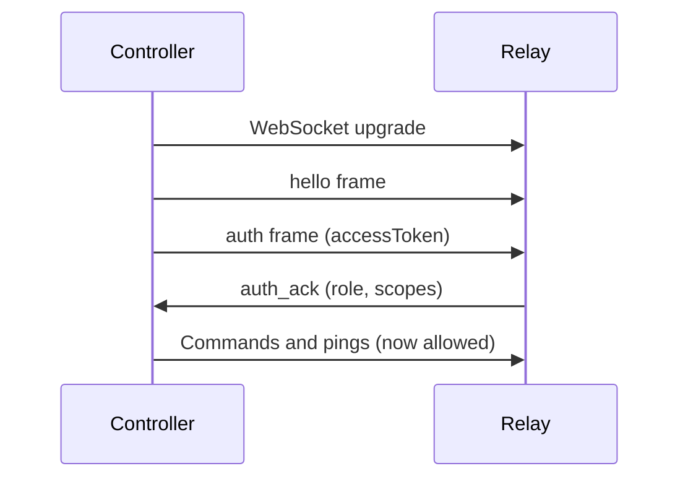

# Controller Implementation

This guide explains how to implement a custom controller client against the Otto relay protocol. After completing this guide, your controller will be able to authenticate, route commands to nodes, handle stream sessions, and manage token lifecycle correctly.

## Before you start

- Read [Architecture](./guides/architecture.md) to understand system roles and command lifecycle.
- Read [Pairing and Auth](./guides/pairing-auth.md) to understand the token flow.
- Have a running relay (`otto start`) to test against.

## Required capabilities

Your controller must handle:

1. **Token lifecycle** — register client, exchange credentials, refresh tokens before expiry.
2. **WebSocket auth sequencing** — `hello` → `auth` → wait for `auth_ack` before sending commands.
3. **Request correlation** — use unique `requestId` per envelope; correlate responses by that ID.
4. **Deterministic stream teardown** — unsubscribe explicitly; send `command_cancel` for in-flight stream commands.
5. **Heartbeat** — send `ping`/`pong` to keep long-lived sessions alive.

Missing any one of these typically causes flaky automation under reconnects or long-running streams.

## HTTP bootstrap

Establish controller identity and token state over HTTP before starting WebSocket traffic.

| Purpose | Endpoint |
|---|---|
| Register controller client | `POST /api/controller/register` |
| Exchange credentials for token pair | `POST /api/controller/token` |
| Discover connected nodes | `GET /api/nodes/connected` |
| Refresh token pair | `POST /api/auth/refresh` |

### Register a client

```http
POST /api/controller/register
Content-Type: application/json

{"name": "my-controller", "description": "automation worker"}
```

```json
{
  "clientId": "clt_abc123",
  "clientSecret": "cs_xxx",
  "createdAt": 1776162000000
}
```

:::warning
Store `clientSecret` securely. Relay stores only a salted hash — you cannot retrieve the secret after registration.
:::

### Issue an access token

```http
POST /api/controller/token
Content-Type: application/json

{"clientId": "clt_abc123", "clientSecret": "cs_xxx"}
```

```json
{
  "clientId": "clt_abc123",
  "controllerId": "ctl_123",
  "accessToken": "<jwt>",
  "refreshToken": "<refresh>"
}
```

### Discover connected nodes

```http
GET /api/nodes/connected
Authorization: Bearer <accessToken>
```

```json
{
  "nodes": [{"nodeId": "node_local_1"}]
}
```

### Refresh tokens

```http
POST /api/auth/refresh
Content-Type: application/json

{"refreshToken": "<refresh>"}
```

```json
{
  "accessToken": "<new-jwt>",
  "refreshToken": "<new-refresh>"
}
```

## WebSocket auth sequence

After HTTP bootstrap, the WebSocket handshake must follow this strict order:



**Hello frame:**

```json
{
  "protocolVersion": "1.0",
  "messageType": "hello",
  "requestId": "req_hello_1",
  "timestamp": "2026-04-14T13:10:00.000Z",
  "senderRole": "controller",
  "payload": {"role": "controller", "capabilities": ["commands", "logs"]}
}
```

**Auth frame:**

```json
{
  "protocolVersion": "1.0",
  "messageType": "auth",
  "requestId": "req_auth_1",
  "timestamp": "2026-04-14T13:10:00.020Z",
  "senderRole": "controller",
  "payload": {"accessToken": "<jwt>"}
}
```

**Ping frame (heartbeat, send every ~30s):**

```json
{
  "protocolVersion": "1.0",
  "messageType": "ping",
  "requestId": "req_ping_1",
  "timestamp": "2026-04-14T13:10:08.000Z",
  "senderRole": "controller",
  "payload": {"ts": 1776162608000}
}
```

Unauthenticated clients cannot send command, lock, or subscription frames.

## Command envelope

| Field | Required | Notes |
|---|---|---|
| `targetNodeId` | Yes | Relay routing key; never omit |
| `action` | Yes | Command action (for example `command.run`) |
| `payload` | Yes | Action payload |
| `replayNonce` | Yes | Replay protection; use a unique value per request |
| `tabSessionId` | Depends | Required for tab-scoped actions |
| `waitPolicy` | Optional | `fail_fast` or `wait_with_timeout` |
| `timeoutMs` | Optional | Command timeout in milliseconds |

## Listener and streaming

Streaming uses a two-phase flow:

1. **Command phase** — send `command.test`; receive a result envelope with `stream.listeners`.
2. **Listener phase** — subscribe per manifest entry; process async `listener_update` events correlated by subscribe `requestId`.

**Subscribe frame example:**

```json
{
  "protocolVersion": "1.0",
  "messageType": "command",
  "requestId": "req_subscribe_1",
  "senderRole": "controller",
  "payload": {
    "targetNodeId": "node_local_1",
    "action": "listener.subscribe",
    "payload": {
      "listener": "network.http_intercept",
      "options": { "tabSessionId": "ts_abc", "site": "reddit.com", "mode": "network" }
    }
  }
}
```

**Teardown** must be explicit:
- Send `listener.unsubscribe` with the original subscribe `requestId`.
- Send `command_cancel` targeting the original stream command `requestId` for in-flight stream commands.

:::tip
Keep the WebSocket heartbeat active throughout the stream session. Stale controllers are treated as disconnected and cleaned up by relay.
:::

## ACL and node targeting

`targetNodeId` is always required. Node owners control ACL grants per controller client. Missing grants fail deterministically with `acl_missing_node_grant`. Grant access through the relay ACL endpoint or via `otto client` CLI commands.

## Retry guidance

| Failure type | Retry strategy |
|---|---|
| `invalid_access_token` | Refresh token, then retry once |
| `lock_conflict` / `lock_timeout` | Bounded backoff, then retry |
| Validation errors | Do not retry; fix request |
| `acl_missing_node_grant` | Do not retry; request grant from node owner |

Use idempotency keys where applicable so safe retries return cached terminal outcomes instead of duplicating side effects.

## Next steps

- [Protocol Reference](./protocol.md) — full envelope contract, message families, and routing guarantees.
- [Relay API](./relay-api.md) — all HTTP endpoints.
- [Reusable Snippets](./snippets.md) — copy-paste curl and WebSocket examples.
- [Error Codes](./error-codes.md) — error code table with remediation.
