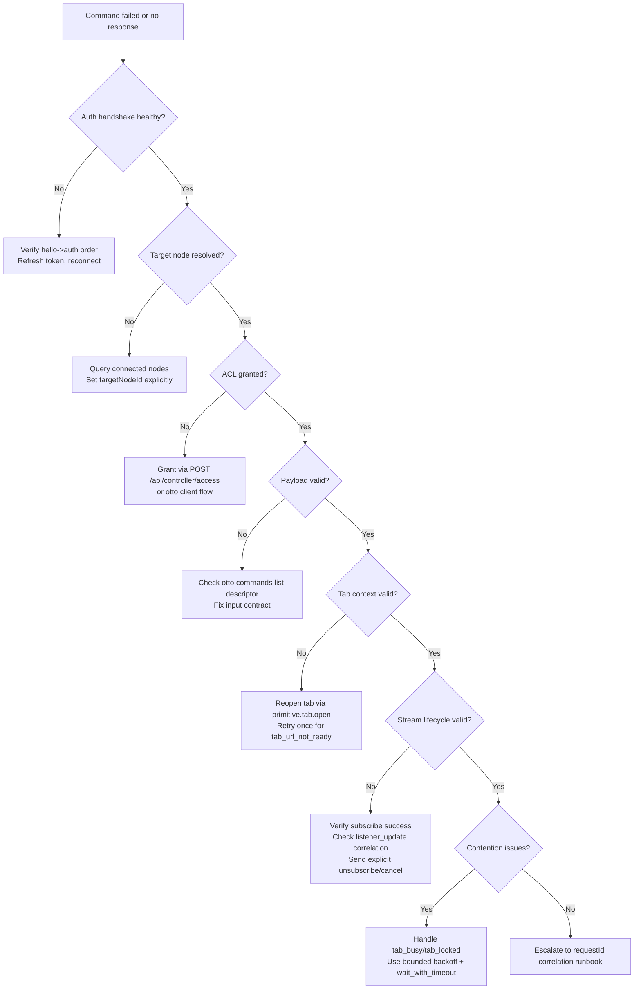

# Controller Troubleshooting Decision Tree

Use this decision tree when a command sent by a controller fails or produces no response. Work through each gate in order — most failures resolve at the first gate where the condition is not met.

## Decision gates

### 1. Auth handshake healthy?

- Expected: relay responds with `auth_ack` after `hello` and `auth` frames.
- If no `auth_ack`: verify `hello` → `auth` ordering; confirm `accessToken` is valid and not expired.
- On `invalid_access_token`: refresh tokens with `otto client login`, then reconnect.

### 2. Target node resolved?

- Expected: `targetNodeId` matches a connected node.
- Run `otto commands list` (or `GET /api/nodes/connected`) to see connected nodes.
- Ensure `targetNodeId` is set explicitly on every command envelope.

### 3. ACL granted?

- Expected: the controller client has an ACL grant for the target node.
- On `acl_missing_node_grant`: post to `POST /api/controller/access` with a node bearer token, or use the relay admin ACL flow.

### 4. Payload valid?

- Expected: action and payload match the command descriptor from `command.list`.
- Run `otto commands list --site <site>` to inspect the input contract.
- Fix unknown keys, missing required fields, or type mismatches.

### 5. Tab context valid?

- Expected: `tabSessionId` references a live managed tab with a committed URL matching the command site.
- If stale: run `otto cmd --action primitive.tab.open` to mint a fresh session.
- On `tab_url_not_ready`: retry once after a short delay.

### 6. Stream lifecycle valid?

- Expected: `command.test` returns `stream.listeners`; subscribe command returns terminal result; `listener_update` events correlate to subscribe `requestId`.
- Verify unsubscribe or `command_cancel` teardown is explicit.

### 7. Contention issues?

- Expected: tab lock acquired without conflict.
- On `tab_busy` or `tab_locked`: retry with bounded backoff, or set `waitPolicy: wait_with_timeout`.

## Next steps

- [requestId Correlation Runbook](./requestid-correlation-runbook.md) — trace across components when the tree doesn't resolve the failure.
- [Error Codes](./error-codes.md) — full error code reference.
- [Reusable Snippets](./snippets.md) — curl commands for each HTTP gate.
