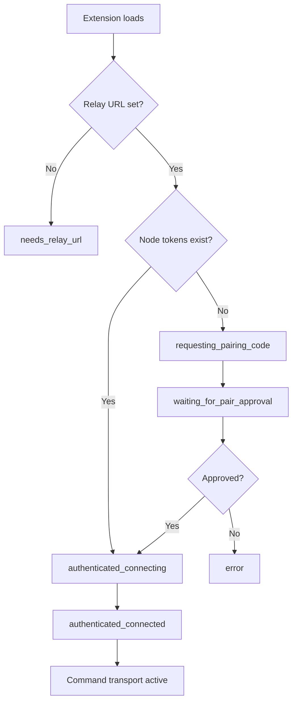

# Extension Runtime

This page explains how the extension keeps command execution deterministic under MV3 constraints. Read it when you need to reason about pairing state, transport behavior, listener routing, and command-runtime guarantees.

## Source-of-truth code paths

| Concern | Source |
|---|---|
| Background orchestration | `extension/entrypoints/background.ts`, `extension/src/runtime/background-bootstrap.ts` |
| WebSocket transport | `extension/src/runtime/offscreen-client.ts` |
| Command execution | `extension/src/runtime/command-executor.ts`, `extension/src/runtime/command-runtime.ts` |
| Listener runtime | `extension/src/runtime/network-intercept/listener.ts`, `extension/src/runtime/listener-managers.ts` |
| Popup onboarding UI | `extension/src/runtime/popup-ui.ts`, `extension/src/runtime/onboarding/ui.ts` |

## Runtime composition

Otto uses a split runtime to separate durable transport concerns from command execution concerns.

| Area | Files | Responsibility |
|---|---|---|
| Background orchestration | `background.ts`, `background-bootstrap.ts` | Startup, maintenance, dispatch, replay safety |
| Transport | `offscreen-client.ts` | Relay WebSocket auth, heartbeat, reconnect, outbound queueing |
| Command execution | `command-executor.ts`, `command-runtime.ts` | Primitive actions, site command resolution, auth preflight |
| Listener runtime | `network-intercept/listener.ts`, `listener-managers.ts` | Interception lifecycle and shared per-tab debugger state |
| DOM script helpers | `page-dom-query.ts` | Deep Shadow DOM query helper install |

## Pairing and authentication flow

Background ensures a persistent node identity in extension storage, acquires pairing challenges when node credentials are missing, and keeps onboarding status synchronized for popup and options surfaces. Once pairing is approved by a controller workflow, node tokens are stored and offscreen authenticates the WebSocket session to relay.

| Status | Meaning |
|---|---|
| `needs_relay_url` | Relay URL is missing or invalid |
| `requesting_pairing_code` | Waiting to obtain challenge |
| `waiting_for_pair_approval` | Challenge exists, waiting for CLI approval |
| `authenticated_disconnected` | Node token exists, waiting for explicit Connect action |
| `authenticated_connecting` | Tokens exist, WebSocket not fully ready |
| `authenticated_connected` | Auth acknowledged, command transport active |
| `error` | Latest auth or socket failure surfaced for recovery |

Popup/options onboarding now uses an explicit connection control:

- **Connect** saves relay URL and triggers setup refresh plus offscreen reconnect.
- **Disconnect** closes the offscreen socket and suppresses reconnect attempts until Connect is requested again.
- Relay URL input normalization no longer injects query parameters while typing or saving; `role=node` is appended only at WebSocket connect time when missing.

Connect actions in popup or options wait for keep-warm maintenance completion before reporting success. That maintenance includes pairing reconciliation, offscreen ensure, and badge sync. Stale tokens are automatically cleared when refresh is rejected.

## Command execution path

When relay sends a `command` frame, offscreen forwards it to background, background executes, and a terminal envelope returns through offscreen back to relay. If WebSocket connectivity drops mid-flight, offscreen buffers outbound terminal envelopes and flushes after reconnect authentication.

Replay safety is enforced by background-level deduplication keyed by `idempotencyKey` (or `requestId` fallback), so retried frames return cached terminal results instead of rerunning side effects.

### Site command orchestration

Commands fail at the earliest possible point so failures stay deterministic:

1. Resolve site bundle and command metadata.
2. Wait briefly for committed tab URL, then validate site match.
3. Validate and sanitize declared input metadata (`inputFields`, `inputAtLeastOneOf`) when present.
4. Run auth preflight when command requires auth and `authMode` allows checks.
5. If unauthenticated in auto mode, run login navigation handoff and return `manual_login_required`.
6. Enforce `preloadHost` before execute path when configured.
7. Wait for bounded page readiness (`document.readyState === complete`).
8. Execute `command.run` (`execute`) or `command.test` (`test`, with execute fallback).

`tab_url_not_ready`, `site_mismatch`, and `preload_host_mismatch` are deliberate early-failure signals that protect command handlers from running against invalid page context.

### Content extraction primitives

`primitive.dom.extract_distilled_html` and `primitive.dom.extract_markdown` load distillation libraries as packaged extension assets via `chrome.scripting.executeScript({ files: [...] })`. This avoids scope instability between script executions and keeps library loading deterministic across tabs.

`primitive.page.screenshot` supports `mode=viewport` (tab capture APIs) and `mode=full_page` (CDP `Page.captureScreenshot`). Both modes return terminal base64 payload plus dimensions and byte metadata. Oversized captures run bounded quality reduction before returning a deterministic `screenshot_too_large` error.

## Listener infrastructure

Listener lifecycle is generic: subscribe and unsubscribe behave like terminal commands, while asynchronous updates are emitted later and correlated by the original subscribe `requestId`. Runtime ships `network.http_intercept` backed by `chrome.debugger` CDP domains.

Network interception supports `network`, `fetch`, and `hybrid` capture modes. Hybrid mode includes bounded cross-source duplicate suppression. Sensitive headers are redacted before update emission. Paused Fetch requests are always continued by runtime to avoid deadlocking tab traffic.

Command modules own stream parsing policy. Runtime can route raw listener updates through command-owned adapters (for example `streamAdapter=reddit.chat.v1`) before forwarding updates to relay, keeping site-specific logic out of transport infrastructure.

Command-started interceptions use `ctx.startNetworkInterception(options?)`. These handles are command-scoped, not relay-streamed, and are always torn down in `finally` to keep lifecycle deterministic even when command execution throws.

## MV3 resilience and transport behavior

MV3 service-worker lifetime is inherently intermittent. Otto relies on offscreen WebSocket ownership plus keep-warm maintenance:

- Offscreen creation is single-flight guarded and tolerates benign duplicate-create races.
- Reconnect uses bounded exponential backoff with jitter.
- Background maintenance work is serialized to prevent overlapping startup and keep-warm jobs.
- Outbound queues are bounded so temporary relay outages do not cause unbounded memory growth.

## Focus emulation

Commands opt in to debugger focus emulation via `requiresDebuggerFocus: true`. Runtime enables focus emulation only after site validation succeeds. Certain command flows stall in background tabs when callback cadence is throttled; focus emulation is a targeted mitigation that improves progress reliability without forcing all commands into debugger mode.

Activation errors: `debugger_focus_unavailable`, `debugger_focus_conflict`, `debugger_focus_permission_denied`, `debugger_focus_attach_failed`, `debugger_focus_command_failed`.

When interception is active on the same tab, runtime reuses existing debugger attachment rather than requiring a second attach. Detach is owner-scoped so shared paths do not break sibling features. If external DevTools owns attachment, activation fails with a deterministic conflict-style error.

## Local development log streaming

When `localDevLogStreamingEnabled` is set in extension storage, extension events are queued as structured node logs, flushed after WebSocket auth, and streamed live through relay log APIs as `source=node`. Sensitive values remain subject to ingress redaction; extension emitters must not include credentials.

Debug-log transport is intentionally separated from listener-update transport. Under backpressure, debug flushing can throttle or drop while listener updates continue on the data-plane path.

## Storage and ownership boundaries

| Storage scope | Runtime data |
|---|---|
| `chrome.storage.local` | Durable node state across browser restarts: `nodeId`, relay URL, node tokens, pairing metadata |
| `chrome.storage.session` | Reconstructable runtime state: `tabSessions`, `tabSessionOwners`, automation group id, replay ledger — reconciled during bootstrap |

Managed tab mappings are persisted by `tabSessionId`. Controller ownership metadata for relay-created tabs is tracked in session storage for deterministic owner-scoped cleanup. Automation group initialization is single-flight guarded to avoid duplicate group creation under concurrent `primitive.tab.open` calls.

Compatibility behavior: runtime accepts `tabSessionId` from command top-level field or nested payload field, prunes stale mappings when tab lookup fails, and ensures `primitive.tab.close_owned` only closes sessions owned by the provided `controllerClientId`.

## Next steps

- [Commands Reference](./commands.md) — action surface and execution contract.
- [Listener Development](./guides/listener-development.md) — stream-capable command integration.
- [Pairing and Auth](./guides/pairing-auth.md) — node identity and token lifecycle.
