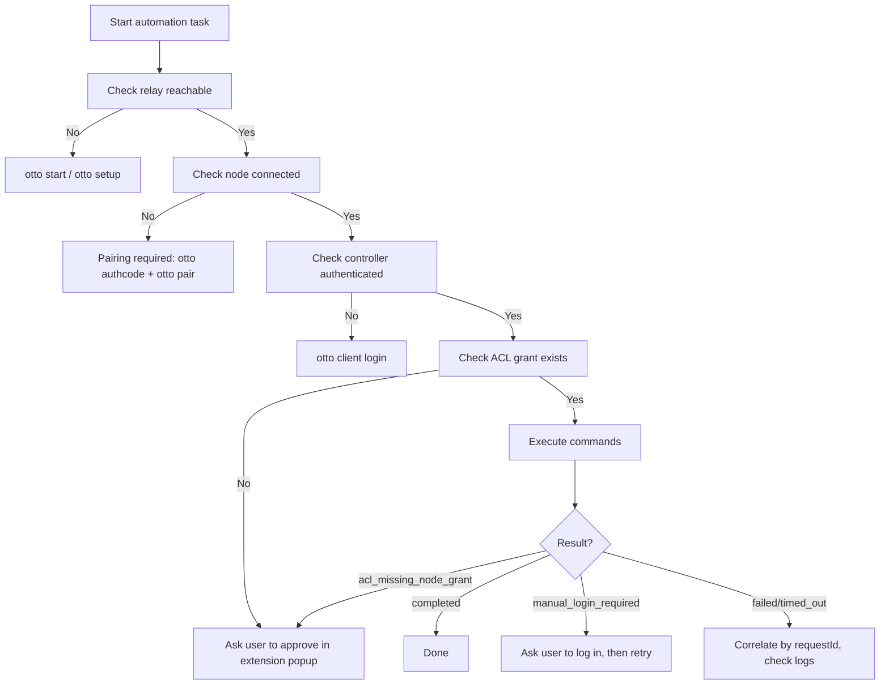

# For Agents

This section is written for AI agents, LLMs, and automation systems operating Otto programmatically. If you are a human developer, start with the [Quickstart](../quickstart.md).

## Scope

This section covers:

- How to verify Otto's capabilities before acting
- Which sources are canonical
- What constraints apply during automation
- How to handle failures deterministically
- How to use the MCP server for programmatic access
- How to register Otto with agent frameworks
- How to use Otto skill packages

For the end-to-end automation runbook, see the [Automation Guide](./automation-guide.md).

## Canonical sources

| Topic | Source |
|---|---|
| Protocol contracts | `packages/shared-protocol/src/index.ts` |
| Relay routing and auth | `packages/relay/src/index.ts` |
| CLI command structure | `packages/cli/src/index.ts`, `packages/cli/src/cli/*.ts` |
| Extension runtime | `extension/entrypoints/background.ts`, `extension/src/runtime/` |
| Available commands | `extension/src/commands/` |

Documentation canonical URLs:

- Protocol reference: `/protocol`
- CLI reference: `/cli`
- Commands reference: `/commands`
- Error codes: `/error-codes`

## Decision flow



## Constraints

The following behaviors are invariants; do not attempt to work around them:

- **Never automate credential submission.** When a site requires login, return `manual_login_required` and ask the human to authenticate in the browser.
- **Never bypass ACL.** If `acl_missing_node_grant` is returned, ask the human to approve controller access in the extension popup. Do not attempt to inject ACL grants.
- **Always use `targetNodeId`.** If only one node is connected, CLI auto-selects it. With multiple nodes, pass `--node-id` explicitly.
- **Never expose secrets in logs.** Do not print `OTTO_TOKEN_SECRET`, controller client secrets, or node tokens in any output surface.
- **Keep payloads bounded.** Do not attempt unbounded page scraping loops or unlimited stream sessions.

## Command health check

Before any automation task, verify the full stack is reachable:

```bash
otto commands list --json
```

A successful response confirms: relay is running, node is connected, controller is authenticated, and ACL grants are active. If this fails, follow the [decision flow](#decision-flow) above.

## Failure handling

| Error code | Recommended action |
|---|---|
| `manual_login_required` | Pause and ask the human to log in to the site in the browser, then retry |
| `acl_missing_node_grant` | Pause and ask the human to approve controller access in extension popup, then retry |
| `node_offline` | Wait for node to reconnect or re-pair; do not loop indefinitely |
| `tab_url_not_ready` | Retry after a brief delay (2–5 seconds) |
| `site_mismatch` | Open a fresh tab to the correct URL with `primitive.tab.open`, then retry |
| `replay_rejected` | Do not replay; generate a new command with a fresh `replayNonce` |
| `forbidden_action` | Verify controller token scopes; escalate if scopes cannot be widened |
| `rate_limited` | Back off and retry; do not increase `OTTO_RATE_LIMIT_PER_MIN` without operator approval |

For all failures: correlate by `requestId` first using `otto logs list --request-id <id> --source all`.

## Machine-readable output

All Otto CLI commands that support `--json` emit deterministic, structured output. Use `--json` for all automation workflows:

```bash
otto commands list --json
otto test reddit.com getPosts --json
otto logs list --source all --latest 100 --json
otto setup --non-interactive
```

`otto setup --non-interactive` always emits JSON without TTY formatting.

## Related pages

- [Automation Guide](./automation-guide.md) — end-to-end agent runbook with code examples.
- [MCP Server](./mcp-server.md) — MCP server documentation and tool list.
- [Agent Setup](./agent-setup.md) — register Otto with agent frameworks.
- [Skills](./skills.md) — Otto skill packages for agent workflows.
- [Error Codes](../error-codes.md) — complete error code catalog.
- [Snippets](../snippets.md) — runnable code examples for common agent patterns.
- [llms.txt](/llms.txt) — machine-readable project summary for LLM context windows.
