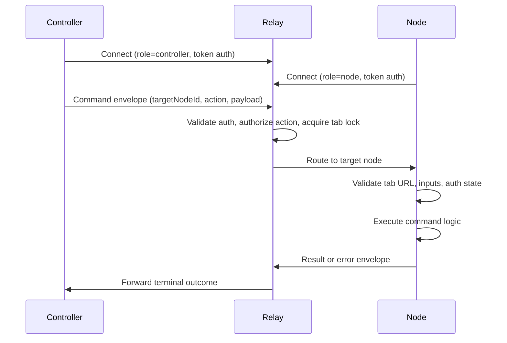

# Otto Architecture

Otto is a remote browser automation system with a clear role boundary: controllers issue commands, relay brokers trust and routing, and extension nodes execute browser work. This page explains how those pieces cooperate, what guarantees the platform provides, and where implementation authority lives.

## System roles

| Component | Primary responsibility | Why it exists |
|---|---|---|
| **Controller** | Command creation and user workflows | Keeps automation intent outside browser runtime |
| **Relay** | Auth, routing, locking, redaction, terminalization | Central policy enforcement point |
| **Node (Extension)** | Site-aware execution and listener capture | Executes browser actions close to the target tab |

The split is intentional. Control-plane concerns (auth, routing, audit) stay in relay. Execution-plane concerns (tab access, DOM, network) stay in the extension node.

## Command lifecycle

For site commands, the node runtime runs this sequence before invoking command logic:

1. Resolve site bundle and command metadata.
2. Validate active tab URL against the declared site scope.
3. Validate and sanitize declared input metadata (`inputFields`, optional `inputAtLeastOneOf`).
4. If `requiresAuth`, run `checkLogin` and optional `gotoLogin` (no credential automation).
5. Ensure `preloadHost` via auto-navigation when needed.
6. Invoke command `execute` and return structured output.

This sequence exists to fail early with explicit error codes and prevent command handlers from running in ambiguous page state.

## Runtime model (MV3)

The extension uses a Chrome MV3 split runtime so WebSocket continuity does not depend on service worker uptime.

| Component | File | Responsibility |
|---|---|---|
| Background script | `background.ts` | Command orchestration and browser API access |
| Offscreen client | `offscreen-client.ts` | Persistent relay WebSocket and heartbeat |

Stream handling is also split by responsibility:

- **Listener transport** — generic, site-agnostic. Captures raw network events.
- **Site command adapters** — parse raw payloads into shared domain objects.
- **Transport deduplication** — suppresses equivalent hybrid cross-source response duplicates.
- **Adapter deduplication** — suppresses semantic replay duplicates from site payloads.

## Platform guarantees

| Guarantee | Effect |
|---|---|
| `targetNodeId` required | Commands route intentionally, never by implicit default |
| Terminal outcomes preserved | Every command ends as `completed`, `failed`, `timed_out`, or `cancelled` |
| Per-tab serial / cross-tab parallel | Prevents conflicting tab mutations without sacrificing throughput |
| Pre-ingress redaction | Sensitive values masked before persistence and stream fan-out |
| Site-scoped execution | Command logic cannot run against the wrong domain |
| No credential automation | `requiresAuth` commands use `manual_login_required` handoff |

## Setup and ownership boundaries

`otto setup` configures the controller side. Controller preferences and tokens are stored in `~/.otto/config.json`.

Extension relay URL, pairing code state, and node credentials are stored in `chrome.storage.*` and are extension-owned. These stores may point at the same relay host, but they remain role-scoped (`controller` vs `node`).

Setup is release-driven for end users: extension artifacts come from release assets with checksum verification. Non-interactive mode emits machine-readable JSON; interactive TTY mode provides human-oriented onboarding output.

## Source of truth

| Concern | Path |
|---|---|
| Protocol contracts | `packages/shared-protocol/src/index.ts` |
| Relay routing and locks | `packages/relay/src/index.ts` |
| CLI UX and envelopes | `packages/cli/src/index.ts` |
| Extension background orchestration | `extension/entrypoints/background.ts` |
| Offscreen transport lifecycle | `extension/src/runtime/offscreen-client.ts` |

## Next steps

- [Pairing and Auth](./pairing-auth.md) — the token and pairing lifecycle in detail.
- [Extension Runtime](../extension-runtime.md) — MV3 runtime composition and command execution path.
- [Protocol Reference](../protocol.md) — envelope contract, message families, routing guarantees.
