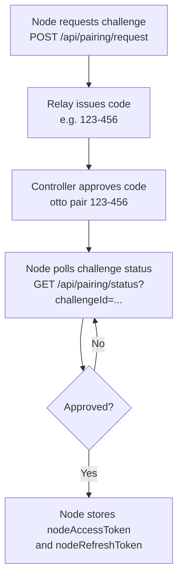

# Pairing and Auth

Otto uses two separate trust flows: a **node pairing flow** that establishes a trusted relationship between the extension node and the relay, and a **controller client flow** for long-lived controller identities. Both flows end in access/refresh token pairs that authenticate WebSocket sessions.

## Source of truth

| Concern | Path |
|---|---|
| Pairing, token, refresh, and revoke endpoints | `packages/relay/src/index.ts` |
| CLI auth, pair, revoke, and client commands | `packages/cli/src/index.ts` |
| Extension pairing poll and token hydration | `extension/src/runtime/background-bootstrap.ts` |

## Node pairing flow

Pairing establishes a trusted node-controller relationship without sharing raw credentials. The node requests a challenge, relay issues a short approval code, the controller approves that code, and the node polls challenge state until approved token material is available.

In the extension onboarding UI, relay transport is now user-driven: entering a relay URL does not auto-connect. Use **Connect** to start transport and pairing status refresh, and use **Disconnect** to close transport without clearing stored node tokens.



| Step | Endpoint | Notes |
|---|---|---|
| Node requests challenge | `POST /api/pairing/request` | Payload: `{ nodeId }` |
| Controller inspects pending | `GET /api/pairing/pending` | Optional visibility step |
| Controller approves code | `POST /api/pairing/approve` | Payload: `{ code }` |
| Node checks status | `GET /api/pairing/status?challengeId=...` | On approval, node stores tokens |

CLI commands for this flow:

```bash
# List pending auth codes from connected nodes
otto authcode

# Approve a code and store controller tokens locally
otto pair 123-456

# Revoke refresh token and clear local controller auth
otto revoke
```

The CLI auto-attempts access token refresh when relay returns `invalid_access_token`. Manual re-pair is only needed when the refresh token also fails or has been revoked.

### Challenge recovery semantics

The extension handles orphaned or expired challenge state automatically on bootstrap:

- **Orphaned metadata** — `pairingChallengeId` exists without `pairingCode`: clears stale keys and requests a fresh challenge.
- **Expired by local clock** — `pairingExpiresAt <= now`: clears stale keys and reissues a challenge immediately.
- **Challenge not found at relay** — `GET /api/pairing/status` returns `404`: treats as stale and reissues.
- **Transient relay errors** — `5xx` responses: retries with bounded backoff, then resets and reissues.
- **`expired` status from relay** — immediately triggers challenge reissue.

This keeps onboarding from getting stuck at "waiting for challenge" after browser or relay restarts.

## Controller client flow

Controller clients can register independently of node pairing. This is the recommended model for long-lived controller identities.

| Phase | Endpoint | Notes |
|---|---|---|
| Register client | `POST /api/controller/register` | Returns one-time `clientSecret` and stable `clientId` |
| Exchange credentials | `POST /api/controller/token` | Payload: `{ clientId, clientSecret }`; returns access/refresh tokens |
| Grant node access | `POST /api/controller/access` | Node bearer token required; node-owned ACL decision |

```bash
# Register a new controller client
otto client register --name "my-laptop" --description "Primary workstation controller"

# Exchange credentials for tokens
otto client login

# Check current client state and secret resolution source
otto client status

# Remove a specific client from relay
otto client remove --client-id <id>

# Remove all registered clients
otto client remove --all

# Clear local credentials without removing from relay
otto client forget
```

### Secret handling

- CLI stores client secrets in OS keychain when available (cross-platform via keytar).
- Fallback environment variable: `OTTO_CONTROLLER_CLIENT_SECRET`.
- `OTTO_CONTROLLER_CLIENT_SECRET` takes precedence over keychain lookup.
- Relay stores only salted client-secret hashes at rest — never plaintext secrets.

### Controller removal behavior

- `POST /api/controller/remove` with `{ clientId }` revokes the controller record and immediately removes ACL grants, refresh sessions, and active controller sockets.
- `POST /api/controller/remove-all` applies the same semantics to every registered client.
- Repeating bulk removal after a full purge is idempotent (`removedCount: 0`).

Newly registered controller clients start with no node grants (least-privilege default). Relay enforces ACL on every node-targeted command and returns `acl_missing_node_grant` when access is denied.

### Test flow self-registration

`otto test` auto self-registers a controller when no local identity or tokens are present:

- Default name: `otto-tester`; description: `Auto-registered controller for otto test flows.`
- No interactive prompts when defaults are used.
- Auto-registered controller is retained by default after the run.
- Use `--cleanup-test-controller` to remove it after completion.

## WebSocket auth flow

After `hello`, each client sends an `auth` frame with `{ accessToken }`. Relay verifies signature and claims (`iss`, `aud`, role, optional node binding), then responds with `auth_ack` containing effective role and scopes.

Unauthenticated clients cannot send command, lock, or subscription frames.

## Refresh flow

Refresh can be performed over HTTP or WebSocket:

- HTTP: `POST /api/auth/refresh` with `{ refreshToken }` — returns new access token and rotates refresh token.
- WebSocket: `refresh` frame with the same token payload.

Relay persists refresh sessions in runtime storage so valid sessions survive relay restarts.

| Token | Default lifetime | Config env var |
|---|---|---|
| Access token | 15 minutes | `OTTO_TOKEN_TTL_MINUTES` |
| Refresh token | 30 days | `OTTO_REFRESH_TTL_DAYS` |

## Revoke flow

`POST /api/auth/revoke` with `{ refreshToken }` returns `{ revoked: boolean }`. After revocation, that refresh token can no longer mint access tokens. `otto revoke` wraps this and also clears local controller credentials.

## Claims and rotation

Access tokens include issuer, audience, role, identity bindings, and action scopes. Relay validates issuer and audience on every verification. Secret rotation uses dual-key verification with `OTTO_TOKEN_SECRET` and optional `OTTO_TOKEN_PREVIOUS_SECRET` for controlled key rollover without immediate session invalidation.

:::note
Relay auth controls API access. Command `requiresAuth` controls website session prerequisites. These are independent — a valid relay token does not mean the extension is logged into the target website.
:::

## Next steps

- [Controller Implementation](./controller-implementation.md) — build a custom controller over the relay protocol.
- [Error Codes](../error-codes.md) — auth error codes and remediation.
- [Relay API](../relay-api.md) — full endpoint reference.

