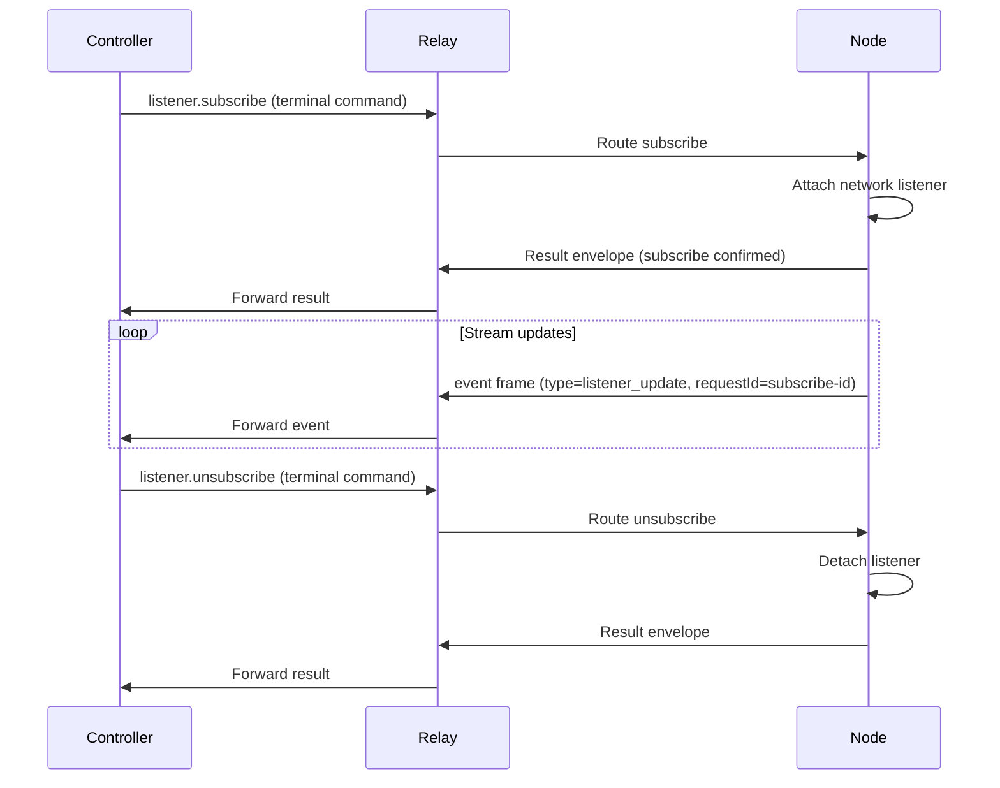

# Listener Development

This guide covers listener-based stream integrations for command modules. The key design rule is separation of concerns: the runtime owns transport lifecycle and safety, while command modules own site-specific payload parsing and stream shaping.

## Core invariant

Keep runtime listener infrastructure generic and site-agnostic. Keep command adapter logic site-specific.

## Before you start

- Familiarity with [Command Authoring](./command-authoring.md) and the `test(ctx, input, helpers)` hook.
- Understanding of the target site's network request patterns (URLs, MIME types, host).

## Listener lifecycle



`listener.subscribe` and `listener.unsubscribe` are terminal commands that return normal result or error envelopes. Stream data is emitted asynchronously as `event` frames with `payload.type=listener_update`, correlated by the original subscribe `requestId`.

## network.http_intercept options

| Option | Required | Description |
|---|---|---|
| `tabSessionId` | Yes | Managed session target |
| `site` | Yes | Site scope for the listener |
| `mode` | No | `network` \| `fetch` \| `hybrid` (default: `network`) |
| `urlPatterns` | No | URL glob patterns to capture |
| `requestHostAllowlist` | No | Allowlist of request hosts |
| `includeBody` | No | Include response body in updates |
| `includeHeaders` | No | Include redacted request/response headers |
| `maxBodyBytes` | No | Max response body bytes per update (default: `256000`) |
| `mimeTypes` | No | MIME type prefix allowlist |
| `streamAdapter` | No | Adapter hint for command-side parsing |

:::tip
Use `--mode hybrid` when the target site may use either `fetch` or `XMLHttpRequest` for the same API. Hybrid mode captures from both surfaces with transport-level deduplication.
:::

## Stream adapter guidance

Adapter modules map raw transport payloads into shared-domain objects (for example `chat.message`, `content.post`):

- Map raw payloads to shared domain types.
- Attach `originalEntity` only when it is safe and operationally useful.
- Keep objects compact to avoid cross-context serialization pressure during sustained streams.
- Use `streamAdapter` hint in subscribe options to identify the adapter to use.

## Deduplication

Duplicate suppression is intentionally layered:

1. **Transport deduplication** — runtime suppresses equivalent hybrid cross-surface response duplicates (same response captured via both `fetch` and `network`).
2. **Adapter deduplication** — command adapters suppress semantic duplicates from replayed site payloads.

Do not skip either layer: transport duplicates and semantic duplicates are distinct failure modes.

## Fallback strategy

If a bounded stream probe cannot confirm traffic, return fallback metadata and use execute fallback helpers rather than leaving stream state ambiguous:

```typescript
// In test() hook: probe failed
const bufferedResult = await helpers.execute(input);
return {
  ready: false,
  fallback: { strategy: 'command_poll', reason: 'intercept_probe_unavailable' },
  bufferedResult
};
```

## Verify success

Use `otto listener subscribe-network` to validate raw network capture before debugging command stream plumbing:

```bash
otto listener subscribe-network \
  --tab-session <tabSessionId> \
  --site example.com \
  --pattern 'https://api.example.com/events*' \
  --mode network \
  --max-body-bytes 200000
```

Expected output: streamed JSON `listener_update` events from the target API.

## Next steps

- [Command Authoring Templates](./command-authoring-templates.md) — stream command test hook template.
- [Logging and Debugging](./logging-debugging.md) — stream diagnostics and failure playbook.
- [otto listener CLI reference](./cli/listener.md) — full subscribe-network options.
