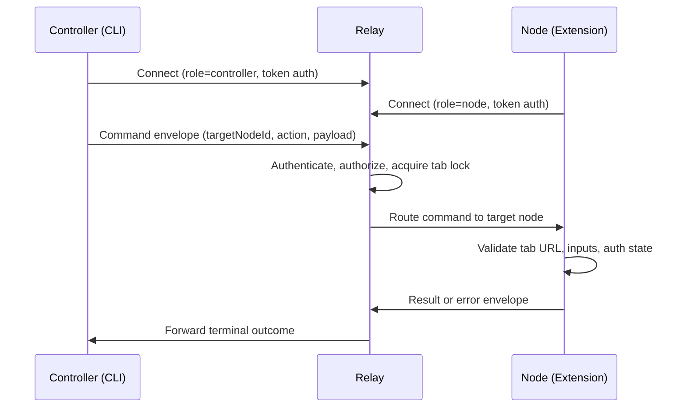

# Otto Overview

Otto is a remote browser automation platform for running CLI-driven commands against a browser on another machine. Commands travel from a controller CLI through a central relay daemon to a browser extension node that executes them.

## How the three components work together

| Component | Package | Role |
|---|---|---|
| **Controller** | `@telepat/otto` | Issues commands and receives results over WebSocket |
| **Relay** | `@telepat/otto-relay` | Authenticates, routes, serializes per-tab, persists logs |
| **Browser node** | `@telepat/otto-extension` | Chrome MV3 extension that executes browser operations |

## What Otto can do

- **Primitive browser actions** — `primitive.tab.*` for tab lifecycle, `primitive.dom.extract_text` for content extraction.
- **Site-scoped command execution** — `command.run` and `command.test` with runtime discovery via `command.list`.
- **Stream outputs** — Command-native network interception and live update delivery.
- **Onboarding** — `otto setup` handles relay daemon readiness, extension artifact download with checksum verification, and Chrome import handoff.
- **Deterministic outcomes** — Every command produces one of `completed`, `failed`, `timed_out`, or `cancelled`.

## Runtime topology

1. Controller connects to relay over WebSocket as `role=controller`.
2. Extension node connects to relay over WebSocket as `role=node`.
3. Relay enforces token auth and routes commands by `targetNodeId`.
4. Node executes the command and returns a result or error.
5. Relay forwards the terminal outcome back to the originating controller.

## Extension runtime model

Otto uses a Chrome MV3 split runtime:

| Component | File | Responsibility |
|---|---|---|
| Background script | `background.ts` | Command execution and browser API access |
| Offscreen client | `offscreen-client.ts` | Persistent relay WebSocket and heartbeat |

Stream ownership: transport listeners are generic and site-agnostic. Site command modules parse raw listener payloads into domain objects. Duplicate suppression runs at both the transport layer (cross-source hybrid responses) and the command adapter layer (semantic duplicates).

## Key invariants

- `targetNodeId` is required for all command routing.
- Terminal command outcomes are guaranteed: `completed`, `failed`, `timed_out`, or `cancelled`.
- Per-tab operations are serialized (FIFO queue); cross-tab operations are parallelizable.
- Sensitive values are redacted before logs are persisted or streamed.
- Commands run only on a tab whose URL matches the declared site scope.
- Declared command input metadata is validated before execution.
- `requiresAuth` commands never automate credential submission; manual login handoff uses `manual_login_required`.

## Setup and settings ownership

`otto setup` is controller-oriented onboarding. It stores preferences and tokens in `~/.otto/config.json`, retrieves extension artifacts from release assets with checksum verification, and ensures relay daemon readiness before completing.

Extension settings are extension-owned. Node relay URL, pairing challenge, and node tokens are persisted in `chrome.storage.*` and are independent of the CLI config file.

The controller and extension may point to the same relay host but use different WebSocket roles (`controller` vs `node`). This boundary is intentional.

## Source of truth

| Area | Path |
|---|---|
| Protocol contracts | `packages/shared-protocol/src/index.ts` |
| Relay routing and locks | `packages/relay/src/index.ts` |
| CLI entry point | `packages/cli/src/index.ts` |
| Extension background | `extension/entrypoints/background.ts` |
| Extension offscreen | `extension/src/runtime/offscreen-client.ts` |
| Command bundles | `extension/src/commands/` |

## Next steps

- [Install Otto](./installation.md) — global install or monorepo dev path.
- [Quickstart](./quickstart.md) — relay up, pair node, run your first command.
- [Architecture](./guides/architecture.md) — deeper look at system roles and command lifecycle.
