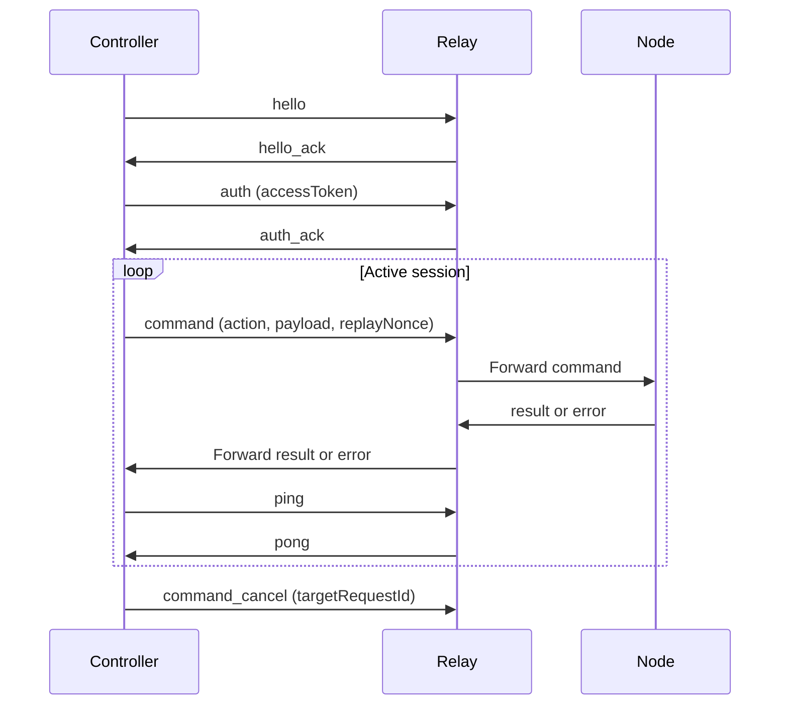

# Protocol Reference

This page covers wire-level behavior and command-routing guarantees. If you are implementing product workflows, start with [Architecture](./guides/architecture.md) and the [Controller Implementation Guide](./guides/controller-implementation.md) first, then use this page as the strict contract reference.

Current protocol types are defined in `packages/shared-protocol/src/index.ts`.

## Source-of-truth code paths

| Concern | Source |
|---|---|
| Shared envelope and payload contracts | `packages/shared-protocol/src/index.ts` |
| Relay protocol handling and routing | `packages/relay/src/index.ts` |
| Controller envelope emission | `packages/cli/src/index.ts` |

## Message flow

## Envelope contract

Every WebSocket frame uses one envelope shape for stable cross-component correlation.

| Field | Description |
|---|---|
| `protocolVersion` | Currently `1.0` |
| `messageType` | Frame family: `hello`, `auth`, `command`, `result`, `event`, etc. |
| `requestId` | Primary correlation key across controller, relay, and node |
| `timestamp` | ISO-8601; enforced against replay skew windows |
| `senderRole` | `controller`, `relay`, or `node` |
| `payload` | Message-specific object |

## Message families

| Family | Purpose |
|---|---|
| `hello` / `hello_ack` | Role and capability negotiation |
| `auth` / `auth_ack` | Access-token authentication |
| `refresh` / `refresh_ack` | Access-token renewal |
| `command` | Controller-issued actions |
| `result` / `error` | Terminal outcomes |
| `event` | Progress and listener updates |
| `ping` / `pong` | Session liveness |
| `tab_lock` / `tab_unlock` | Lock lifecycle signals |
| `command_cancel` | Explicit stream or command cancellation |

## Listener lifecycle

`listener.subscribe` and `listener.unsubscribe` each return normal terminal outcomes (`result` or `error`). Streaming data is delivered later as `event` frames tied to the original subscribe `requestId`.

| Action | Required payload | Terminal behavior |
|---|---|---|
| `listener.subscribe` | `listener`, optional `options` | Immediate `result` or `error` |
| `listener.unsubscribe` | `targetRequestId` | Immediate `result` or `error` |

After successful unsubscribe, further updates for that subscribe `requestId` are rejected with `listener_not_found`.

### network.http_intercept options

| Option | Required | Description |
|---|---|---|
| `tabSessionId` | Yes | Must resolve to an active managed session |
| `site` | Yes | Normalized to lowercase; validated against tab URL |
| `urlPatterns` | No | Glob filters |
| `requestHostAllowlist` | No | Explicit cross-host allowlist |
| `mode` | No | `network`, `fetch`, or `hybrid` (default `network`) |
| `includeBody` | No | Default `true` |
| `includeHeaders` | No | Default `false`; sensitive headers are redacted |
| `maxBodyBytes` | No | Default `256000`; positive numeric only |
| `mimeTypes` | No | MIME prefix allowlist |
| `streamAdapter` | No | Command-owned adapter hint |
| `selfUserId` | No | Command-owned context value |

### Listener update shape

Listener updates are `messageType=event` frames with `payload.type=listener_update` and `requestId` equal to the original subscribe request. `payload.data` carries either raw transport payloads or command-owned shared-domain objects.

Shared object discriminators: `chat.message`, `chat.typing`, `chat.participant`, `chat.message_deleted`, `content.article`, `content.post`, `content.post_comment`.

## Command contract

Every `command` payload must identify a target node and include replay protection fields.

| Field | Required | Description |
|---|---|---|
| `targetNodeId` | Yes | Required by protocol invariant |
| `tabSessionId` | Conditional | Required for tab-scoped actions |
| `action` | Yes | Action ID including command and listener actions |
| `payload` | Yes | Action-specific data |
| `timeoutMs` | No | Relay timeout budget |
| `waitPolicy` | No | `fail_fast` or `wait_with_timeout` |
| `idempotencyKey` | No | Replay dedupe key at runtime |
| `replayNonce` | Yes | Required for acceptance |

### Command actions

| Action | Description |
|---|---|
| `command.list` | Advertise site command metadata |
| `command.run` | Execute command logic |
| `command.test` | Execute test hook; falls back to `execute` when none declared |
| `command.reddit_feed` | Legacy alias for `command.run` with `site=reddit.com, command=getFeed` |
| `primitive.tab.open` | Open a managed tab |
| `primitive.tab.close` | Close a managed tab |
| `primitive.tab.navigate` | Navigate a managed tab |
| `primitive.tab.query` | Query managed tab state |
| `primitive.dom.extract_text` | Extract visible text from tab |
| `primitive.dom.extract_html` | Extract page HTML |
| `primitive.dom.extract_clean_html` | Extract DOM with semantic attributes, scripts/styles removed |
| `primitive.dom.extract_distilled_html` | Extract distilled HTML (readability) |
| `primitive.dom.extract_markdown` | Extract Markdown representation |
| `primitive.page.screenshot` | Screenshot the tab or a URL |

### command.list descriptor metadata

`command.list` returns command descriptors that include command metadata used by controllers for validation, preload behavior, and timeout planning.

| Field | Required | Description |
|---|---|---|
| `site` | Yes | Site scope the command is valid for |
| `id` | Yes | Command id within the site scope |
| `displayName` | Yes | Human-readable command name |
| `description` | Yes | Command summary |
| `requiresAuth` | No | Indicates manual-login handoff may be required |
| `preloadHost` | No | Preferred URL host for auto-open flows |
| `inputFields` | No | Input schema used for command input validation |
| `timeoutPolicy` | No | Command timeout hints for controllers |

When provided, `timeoutPolicy` supports both fixed and input-scaled timeout guidance:

| `timeoutPolicy` field | Required | Description |
|---|---|---|
| `defaultMs` | No | Suggested default timeout for this command |
| `scaling.inputField` | No | Input field name used for scaling |
| `scaling.baseMs` | No | Base timeout budget before scaling |
| `scaling.perUnitMs` | No | Additional timeout budget per input unit |
| `scaling.minMs` | No | Lower clamp for resolved timeout |
| `scaling.maxMs` | No | Upper clamp for resolved timeout |

Controllers may use this metadata to compute effective timeout budgets while preserving explicit user-provided timeout overrides.

Content extraction is also exposed through first-class controller interfaces:

- CLI: `otto extract-content [url] --format markdown|distilled_html|clean_html|raw_html|text` (defaults to markdown)
- MCP: `otto_extract_content` tool with `format` selector and shared targeting (`url` or `tabSession`)

These interfaces map to the primitive DOM actions above and provide one consolidated surface for agents and CLI users.

`command.test` may return a `stream` manifest in `result.payload.data`. Controllers should keep follow-up subscribe traffic on the same authenticated WebSocket, maintain heartbeat (`ping`/`pong`) for long sessions, and use `command_cancel` against the original test `requestId` when shutting down active stream tests.

## Routing, queueing, and reliability

- Relay routes each command to exactly one node session and tracks `requestId` ownership so results always return to the originating controller.
- Same-tab work (`targetNodeId:tabSessionId`) is FIFO; cross-tab work is parallel.
- Queue depth limits are enforced per tab and per controller.
- Commands waiting under `wait_with_timeout` can terminate as `queue_wait_timed_out`.
- Timeout windows produce terminal timeout outcomes; node disconnects produce `node_disconnected`; lock contention produces `lock_conflict`.
- Replay nonces and timestamp skew windows are enforced on ingress.
- Controller disconnect cleanup purges owned queued work and triggers owner-scoped tab cleanup.

## Tab ownership and cleanup

- Relay injects internal tab ownership metadata when forwarding controller-created tab-open commands.
- Node stores ownership by `tabSessionId`.
- On controller disconnect or heartbeat timeout, relay dispatches `primitive.tab.close_owned` to close only tabs owned by that controller identity.
- Lock keys are `targetNodeId:tabSessionId`; only one controller can hold a lock at a time.
- Lease expiration auto-releases locks. Lock events include lease metadata (`lockOwnerControllerId`, `lockLeaseMs`, `lockExpiresAt`) for observability.

## Versioning

Current version: `1.0`. Additive changes are preferred; breaking changes require a new major version.

`command.reddit_feed` alias is maintained during migration to `command.run`.

## Next steps

- [Relay API Reference](./relay-api.md) — HTTP endpoint contracts.
- [Reusable Snippets](./snippets.md) — runnable frame examples.
- [Controller Implementation Guide](./guides/controller-implementation.md) — full bootstrap and command flow.

