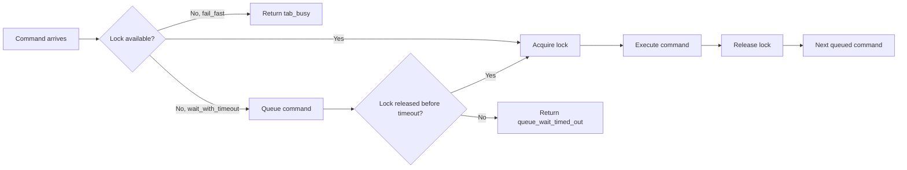

# Tab Lock Model

Otto serializes command execution per tab session and allows parallel execution across distinct tab sessions. This model gives each tab a FIFO execution queue while avoiding unnecessary blocking between independent sites.

## Core guarantees

- Same-tab commands execute in FIFO order (keyed on `targetNodeId:tabSessionId`).
- Cross-tab commands execute in parallel.
- Every accepted command produces a deterministic terminal outcome (`result` or `error`).

## Lock lifecycle



Lock keys are `targetNodeId:tabSessionId`. Only one controller can hold a lock on a given key at a time. Lease expiration auto-releases locks; lock events include lease metadata (`lockOwnerControllerId`, `lockLeaseMs`, `lockExpiresAt`) for observability.

## Wait policies

| Policy | Behavior |
|---|---|
| `fail_fast` (default) | Returns `tab_busy` immediately if the lock is held |
| `wait_with_timeout` | Queues the command; executes when lock is released or times out with `queue_wait_timed_out` |

Set the policy in the command envelope:

```json
{
  "payload": {
    "targetNodeId": "node_local_1",
    "tabSessionId": "ts_abc",
    "action": "command.run",
    "waitPolicy": "wait_with_timeout",
    "timeoutMs": 30000
  }
}
```

## Queue limits

| Limit | Description |
|---|---|
| `OTTO_TAB_QUEUE_LIMIT` | Max commands queued per tab session |
| `OTTO_CONTROLLER_QUEUE_LIMIT` | Max commands queued per controller session |

Exceeding either limit returns `tab_queue_limit_exceeded`.

## Conflict and timeout codes

| Code | Cause | Resolution |
|---|---|---|
| `tab_busy` | Lock held, `fail_fast` policy | Retry with bounded backoff or switch to `wait_with_timeout` |
| `tab_locked` | Lock held by contending controller | Retry after lease expires |
| `queue_wait_timed_out` | Lock not released before `timeoutMs` | Increase timeout or reduce concurrent command volume |
| `command_timed_out` | Command execution exceeded time budget | Increase `timeoutMs` or narrow operation scope |
| `tab_queue_limit_exceeded` | Per-tab queue full | Reduce concurrent commands on this tab session |
| `lock_conflict` | Contention event signal | Observe and back off; emitted as `event` frame alongside error |

## Next steps

- [Tab Management](./tab-management.md) — managed tab session lifecycle and owner-scoped cleanup.
- [Protocol Reference](./protocol.md) — command envelope fields including `waitPolicy` and `timeoutMs`.
- [Error Codes](./error-codes.md) — full error catalog with retryability.
