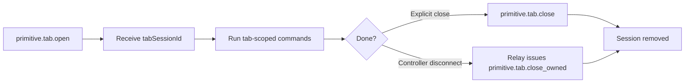

# Tab Management

Otto tracks browser tabs as managed sessions identified by `tabSessionId`. Ownership metadata on each session enables safe cleanup when a controller disconnects.

## Tab session lifecycle

## Primitive tab actions

| Action | Description |
|---|---|
| `primitive.tab.open` | Open a new managed tab; returns `tabSessionId` |
| `primitive.tab.close` | Explicitly close a managed tab by `tabSessionId` |
| `primitive.tab.navigate` | Navigate a managed tab to a new URL |
| `primitive.tab.query` | Query managed tab state |
| `primitive.tab.close_owned` | Internal relay action: close all tabs owned by a controller identity |

## Ownership rules

- Relay injects internal owner metadata when forwarding `primitive.tab.open` from a controller.
- Owner metadata is relay-owned and not modifiable by the controller.
- When a controller disconnects or heartbeat times out, relay dispatches `primitive.tab.close_owned` to connected nodes with the disconnected controller's `clientId`.
- Node runtime closes only tabs owned by that controller identity. Tabs owned by other controllers are not affected.

## Stale session causes and recovery

| Cause | Recovery |
|---|---|
| Manual tab close in browser | Open a new managed tab with `primitive.tab.open` |
| Extension reload or restart | Open a new managed tab; previous sessions are invalid |
| Cached `tabSessionId` after reconnect | Discard cached value; open a fresh session |
| Controller disconnect and cleanup | Open a new managed tab after reconnecting |

After opening a new tab, always use the new `tabSessionId` for subsequent commands.

## MV3 URL commit race

Chrome MV3 service-worker tabs may not expose a committed URL immediately after `primitive.tab.open` completes. Otto runtime uses bounded polling before strict site matching to avoid false `site_mismatch` or `tab_url_not_ready` outcomes.

If `tab_url_not_ready` is returned, retry after a short delay.

## Tab automation groups

Otto tracks tabs opened through automation workflows in a Chrome tab group (`automationGroupId`). Initialization is single-flight guarded to prevent duplicate group creation under concurrent `primitive.tab.open` calls.

## Next steps

- [Tab Lock Model](./tab-lock-model.md) — per-tab FIFO execution and wait policies.
- [Protocol Reference](./protocol.md) — tab ownership and cleanup semantics.
- [Advanced Troubleshooting](./troubleshooting-advanced.md) — stale session error resolution.
