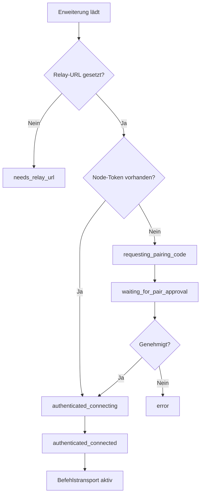

# Erweiterungslaufzeit

Diese Seite erklärt, wie die Erweiterung die Befehlsausführung unter MV3-Einschränkungen deterministisch hält. Lesen Sie sie, wenn Sie über Kopplungszustand, Transportverhalten, Listener-Routing und Befehlslaufzeitgarantien nachdenken müssen.

## Wahrheitsquelle Codepfade

| Anliegen | Quelle |
|---|---|
| Hintergrundorchestrierung | `extension/entrypoints/background.ts`, `extension/src/runtime/background-bootstrap.ts` |
| WebSocket-Transport | `extension/src/runtime/offscreen-client.ts` |
| Befehlsausführung | `extension/src/runtime/command-executor.ts`, `extension/src/runtime/command-runtime.ts` |
| Listener-Laufzeit | `extension/src/runtime/network-intercept/listener.ts`, `extension/src/runtime/listener-managers.ts` |
| Popup-Onboarding-UI | `extension/src/runtime/popup-ui.ts`, `extension/src/runtime/onboarding/ui.ts` |

## Laufzeitzusammensetzung

Otto verwendet eine aufgeteilte Laufzeit, um dauerhafte Transportanliegen von Befehlsausführungsanliegen zu trennen.

| Bereich | Dateien | Verantwortung |
|---|---|---|
| Hintergrundorchestrierung | `background.ts`, `background-bootstrap.ts` | Start, Wartung, Dispatch, Replay-Sicherheit |
| Transport | `offscreen-client.ts` | Relay WebSocket Auth, Heartbeat, Wiederverbindung, ausgehende Warteschlange |
| Befehlsausführung | `command-executor.ts`, `command-runtime.ts` | Primitive Aktionen, Seitenbefehlsauflösung, Auth-Vorabprüfung |
| Listener-Laufzeit | `network-intercept/listener.ts`, `listener-managers.ts` | Interceptions-Lebenszyklus und geteilter pro-Tab-Debugger-Zustand |
| DOM-Skript-Helfer | `page-dom-query.ts` | Deep Shadow DOM Query-Helfer-Installation |

## Kopplungs- und Authentifizierungsablauf

Hintergrund stellt eine dauerhafte Node-Identität in Erweiterungsspeicher sicher, erlangt Kopplungsherausforderungen, wenn Node-Anmeldeinformationen fehlen, und hält den Onboarding-Status für Popup- und Optionsoberflächen synchronisiert. Wenn die Kopplung durch einen Controller-Workflow genehmigt wurde, werden Node-Token gespeichert und Offscreen authentifiziert die WebSocket-Sitzung zum Relay.

| Status | Bedeutung |
|---|---|
| `needs_relay_url` | Relay-URL fehlt oder ist ungültig |
| `requesting_pairing_code` | Wartet auf Herausforderung |
| `waiting_for_pair_approval` | Herausforderung vorhanden, wartet auf CLI-Genehmigung |
| `authenticated_disconnected` | Node-Token vorhanden, wartet auf explizite Verbindungsaktion |
| `authenticated_connecting` | Token vorhanden, WebSocket nicht vollständig bereit |
| `authenticated_connected` | Auth bestätigt, Befehlstransport aktiv |
| `error` | Neuester Auth- oder Socketfehler für Wiederherstellung sichtbar |

Popup/Options-Onboarding verwendet jetzt eine explizite Verbindungssteuerung:

- **Verbinden** speichert die Relay-URL und löst Setup-Aktualisierung plus Offscreen-Wiederverbindung aus.
- **Trennen** schließt den Offscreen-Socket und unterdrückt Wiederverbindungsversuche, bis erneut „Verbinden" angefordert wird.
- Die Eingabenormalisierung der Relay-URL injiziert keine Abfrageparameter mehr beim Tippen oder Speichern; `role=node` wird nur bei der WebSocket-Verbindung angehängt, wenn es fehlt.

Verbindungsaktionen in Popup oder Optionen warten auf die Abschluss der Keep-Warm-Wartung, bevor sie Erfolg melden. Diese Wartung umfasst Kopplungsabgleich, Offscreen-Sicherstellung und Badge-Synchronisation. Veraltete Token werden automatisch bereinigt, wenn die Aktualisierung abgelehnt wird.

## Befehlsausführungspfad

Wenn Relay einen `command`-Frame sendet, leitet Offscreen ihn an Hintergrund weiter, Hintergrund führt aus und eine terminale Hülle kehrt über Offscreen zum Relay zurück. Wenn die WebSocket-Konnektivität in der Mitte des Fluges abbricht, puffert Offscreen ausgehende terminale Hüllen und flusht sie nach der Authentifizierung der Wiederverbindung.

Replay-Sicherheit wird durch Deduplizierung auf HintergrundEbene durchgesetzt, die nach `idempotencyKey` (oder `requestId`-Fallback) geschlüsselt ist, sodass erneut gesendete Frames zwischengespeicherte terminale Ergebnisse zurückgeben, anstatt Nebenwirkungen erneut auszuführen.

### Seitenbefehlssorchestrierung

Befehle schlagen an dem frühestmöglichen Punkt fehl, sodass Fehler deterministisch bleiben:

1. Seitenbundle und Befehlsmetadaten auflösen.
2. Kurz auf festgeschriebene Tab-URL warten, dann Seitenabgleich validieren.
3. Deklarierte Eingabemetadaten (`inputFields`, `inputAtLeastOneOf`) validieren und bereinigen, wenn vorhanden.
4. Auth-Vorabprüfung ausführen, wenn der Befehl Auth erfordert und `authMode` Prüfungen erlaubt.
5. Wenn in automatischem Modus nicht authentifiziert, Anmelde-Navigationsübergabe ausführen und `manual_login_required` zurückgeben.
6. `preloadHost` vor dem Ausführungspfad durchsetzen, wenn konfiguriert.
7. Auf begrenzte Seitenbereitschaft warten (`document.readyState === complete`).
8. `command.run` (`execute`) oder `command.test` (`test`, mit execute-Fallback) ausführen.

`tab_url_not_ready`, `site_mismatch` und `preload_host_mismatch` sind bewusste Frühfehlersignale, die Befehlshandler davor schützen, gegen ungültigen Seitenkontext zu laufen.

### Inhaltsextraktionsprimitive

`primitive.dom.extract_distilled_html` und `primitive.dom.extract_markdown` laden Destillationsbibliotheken als gepackte Erweiterungsartefakte über `chrome.scripting.executeScript({ files: [...] })`. Dies vermeidet Bereichsinstabilität zwischen Skriptausführungen und hält das Bibliotheksladen über Tabs hinweg deterministisch.

`primitive.page.screenshot` unterstützt `mode=viewport` (Tab-Erfassungs-APIs) und `mode=full_page` (CDP `Page.captureScreenshot`). Beide Modi geben terminale base64-Payloads plus Abmessungen und Byte-Metadaten zurück. Übermäßig große Erführungen führen begrenzte Qualitätsreduzierung durch, bevor sie einen deterministischen `screenshot_too_large`-Fehler zurückgeben.

## Listener-Infrastruktur

Listener-Lebenszyklus ist generisch: Subscribe und Unsubscribe verhalten sich wie terminale Befehle, während asynchrone Updates später ausgesendet und durch die ursprüngliche Subscribe-`requestId` korreliert werden. Laufzeit liefert `network.http_intercept`, das durch `chrome.debugger` CDP-Domains unterstützt wird.

Netzwerkinterception unterstützt `network`, `fetch` und `hybrid` Erfassungsmodi. Hybrid-Modus beinhaltet begrenzte cross-source Duplikatunterdrückung. Sensible Header werden vor der Update-Emission geschwärzt. Pausierte Fetch-Anfragen werden immer von der Laufzeit fortgesetzt, um Totblockierung von Tab-Verkehr zu vermeiden.

Befehlsmodule besitzen Stream-Parsing-Strategie. Laufzeit kann rohe Listener-Updates durch befehlseigene Adapter (z.B. `streamAdapter=reddit.chat.v1`) leiten, bevor Updates an Relay weitergeleitet werden, und hält seitenlogische Logik von der Transportinfrastruktur fern.

Befehlsinitiierte Interceptions verwenden `ctx.startNetworkInterception(options?)`. Diese Handles sind befehlsbereichsspezifisch, nicht relay-gestreamt und werden immer in `finally` abgebaut, um den Lebenszyklus deterministisch zu halten, selbst wenn die Befehlsausführung wirft.

## MV3-Resilienz und Transportverhalten

MV3 Service-Worker-Lebensdauer ist von Natur aus intermittierend. Otto verlässt sich auf Offscreen WebSocket-Eigentum plus Keep-Warm-Wartung:

- Offscreen-Erstellung ist gegen Einmalflug geschützt und toleriert gutartige doppelte Erstellungswettbewerbe.
- Wiederverbindung verwendet begrenzten exponentiellen Backoff mit Jitter.
- Hintergrundwartungsarbeiten werden serialisiert, um überlappende Start- und Keep-Warm-Jobs zu verhindern.
- Ausgehende Warteschlangen sind begrenzt, sodass vorübergehende Relay-Ausfälle kein unbegrenztes Speicherwachstum verursachen.

## Fokus-Emulation

Befehle optieren für Debugger-Fokus-Emulation über `requiresDebuggerFocus: true`. Laufzeit aktiviert die Fokus-Emulation erst nach erfolgreicher Seitenvalidierung. Bestimmte Befehlsabläufe blockieren in Hintergrund-Tabs, wenn die Callback-Frequenz gedrosselt wird; Fokus-Emulation ist eine gezielte Abhilfe, die die Fortschrittszuverlässigkeit verbessert, ohne alle Befehle in den Debugger-Modus zu zwingen.

Aktivierungsfehler: `debugger_focus_unavailable`, `debugger_focus_conflict`, `debugger_focus_permission_denied`, `debugger_focus_attach_failed`, `debugger_focus_command_failed`.

Wenn Interception auf demselben Tab aktiv ist, verwendet die Laufzeit die vorhandene Debugger-Verbindung wieder, anstatt eine zweite Verbindung zu erfordern. Trennung ist eigentumsbereichsbezogene, sodass gemeinsame Pfade Geschwisterfunktionen nicht unterbrechen. Wenn externes DevTools die Verbindung besitzt, schlägt die Aktivierung mit einem deterministischen konfliktartigen Fehler fehl.

## Lokale Entwicklung Protokollstreaming

Wenn `localDevLogStreamingEnabled` im Erweiterungsspeicher gesetzt ist, werden Erweiterungsereignisse als strukturierte Node-Protokolle in die Warteschlange gestellt, nach WebSocket-Auth geflusht und live über Relay-Protokoll-APIs als `source=node` gestreamt. Sensible Werte unterliegen weiterhin der Eingangsschwärzung; Erweiterungsemitter dürfen keine Anmeldeinformationen enthalten.

Debug-Log-Transport ist bewusst vom Listener-Update-Transport getrennt. Bei Druckausgleich kann Debug-Flushing gedrosselt werden, während Listener-Updates auf dem Datenpfad weiterlaufen.

## Speicher- und Eigentumsgrenzen

| Speicherbereich | Laufzeitdaten |
|---|---|
| `chrome.storage.local` | Dauerhafter Node-Zustand über Browser-Neustarts: `nodeId`, Relay-URL, Node-Token, Kopplungsmetadaten |
| `chrome.storage.session` | Rekonstruierbarer Laufzeit-Zustand: `tabSessions`, `tabSessionOwners`, Automatisierungsgruppen-ID, Replay-Buch — wird beim Bootstrap abgeglichen |

Verwaltete Tab-Zuordnungen werden durch `tabSessionId` persistiert. Controller-Eigentumsmetadaten für relay-erstellte Tabs werden im Sitzungsspeicher verfolgt, um eigentumsbereichsbezogene Bereinigung deterministisch zu machen. Automatisierungsgruppeninitialisierung ist gegen Einmalflug geschützt, um doppelte Gruppenerstellung bei gleichzeitigen `primitive.tab.open`-Aufrufen zu verhindern.

Kompatibilitätsverhalten: Laufzeit akzeptiert `tabSessionId` aus Befehls-Oberfeld oder verschachteltem Payload-Feld, bereinigt veraltete Zuordnungen, wenn die Tab-Nachschlaufig fehlschlägt, und stellt sicher, dass `primitive.tab.close_owned` nur Sitzungen schließt, die der angegebenen `controllerClientId` gehören.

## Nächste Schritte

- [Befehlsreferenz](./commands.md) — Aktionsoberfläche und Ausführungsvertrag.
- [Listener-Entwicklung](./guides/listener-development.md) — streamfähige Befehlsintegration.
- [Kopplung und Authentifizierung](./guides/pairing-auth.md) — Node-Identität und Token-Lebenszyklus.