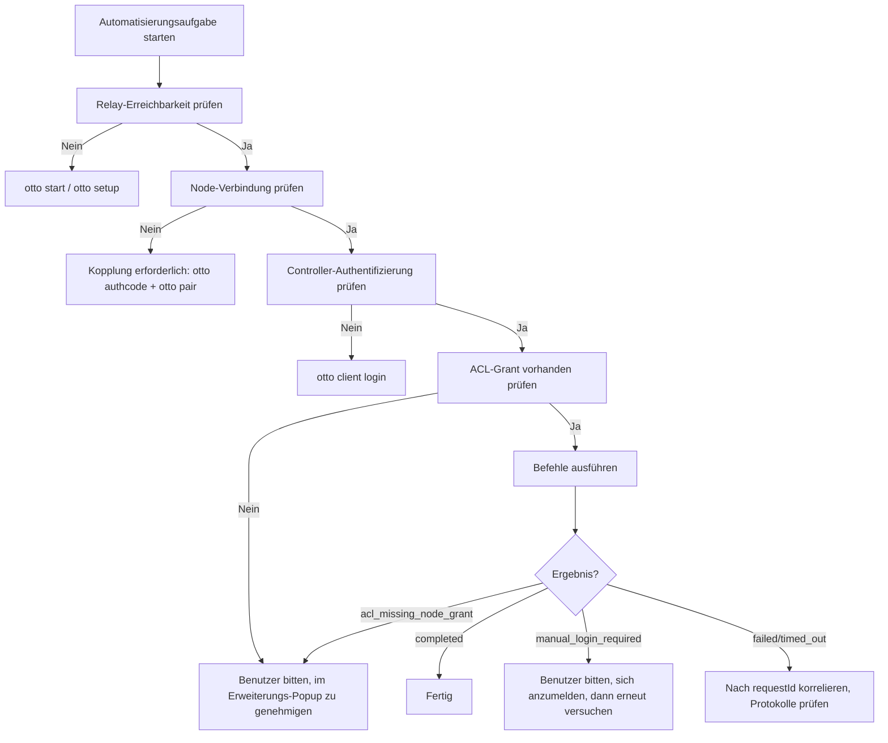

# Für Agenten

Dieser Abschnitt richtet sich an KI-Agenten, LLMs und Automatisierungssysteme, die Otto programmatisch bedienen. Wenn Sie ein menschlicher Entwickler sind, beginnen Sie mit dem [Schnellstart](../quickstart.md).

## Umfang

Dieser Abschnitt behandelt:

- Wie man Ottos Fähigkeiten vor dem Handeln überprüft
- Welche Quellen kanonisch sind
- Welche Einschränkungen während der Automatisierung gelten
- Wie man Fehler deterministisch behandelt
- Wie man den MCP-Server für programmatischen Zugriff verwendet
- Wie man Otto bei Agent-Frameworks registriert
- Wie man Otto-Skill-Pakete verwendet

Für das vollständige Automatisierungs-Runbook siehe den [Automatisierungsleitfaden](./automation-guide.md).

## Kanonische Quellen

| Thema | Quelle |
|---|---|
| Protokollverträge | `packages/shared-protocol/src/index.ts` |
| Relay-Routing und Auth | `packages/relay/src/index.ts` |
| CLI-Befehlsstruktur | `packages/cli/src/index.ts`, `packages/cli/src/cli/*.ts` |
| Erweiterungslaufzeit | `extension/entrypoints/background.ts`, `extension/src/runtime/` |
| Verfügbare Befehle | `extension/src/commands/` |

Kanonische Dokumentations-URLs:

- Protokollreferenz: `/protocol`
- CLI-Referenz: `/cli`
- Befehlsreferenz: `/commands`
- Fehlercodes: `/error-codes`

## Entscheidungsfluss



## Einschränkungen

Die folgenden Verhaltensweisen sind Invarianten; versuchen Sie nicht, sie zu umgehen:

- **Niemals Anmeldeinformationen automatisieren.** Wenn eine Site eine Anmeldung erfordert, geben Sie `manual_login_required` zurück und bitten Sie den Menschen, sich im Browser zu authentifizieren.
- **Niemals ACL umgehen.** Wenn `acl_missing_node_grant` zurückgegeben wird, bitten Sie den Menschen, den Controller-Zugriff im Erweiterungs-Popup zu genehmigen. Versuchen Sie nicht, ACL-Grants zu injizieren.
- **Immer `targetNodeId` verwenden.** Wenn nur ein Node verbunden ist, wählt die CLI ihn automatisch aus. Bei mehreren Nodes übergeben Sie `--node-id` explizit.
- **Niemals Secrets in Protokollen offenlegen.** Geben Sie `OTTO_TOKEN_SECRET`, Controller-Client-Secrets oder Node-Token in keiner Ausgabeoberfläche aus.
- **Payloads begrenzt halten.** Versuchen Sie keine unbegrenzten Seiten-Scraping-Schleifen oder unbegrenzte Stream-Sessions.

## Befehls-Gesundheitscheck

Überprüfen Sie vor jeder Automatisierungsaufgabe, ob der gesamte Stack erreichbar ist:

```bash
otto commands list --json
```

Eine erfolgreiche Antwort bestätigt: Relay läuft, Node ist verbunden, Controller ist authentifiziert und ACL-Grants sind aktiv. Wenn dies fehlschlägt, folgen Sie dem [Entscheidungsfluss](#entscheidungsfluss) oben.

## Fehlerbehandlung

| Fehlercode | Empfohlene Aktion |
|---|---|
| `manual_login_required` | Pausieren und den Menschen bitten, sich auf der Site im Browser anzumelden, dann erneut versuchen |
| `acl_missing_node_grant` | Pausieren und den Menschen bitten, den Controller-Zugriff im Erweiterungs-Popup zu genehmigen, dann erneut versuchen |
| `node_offline` | Auf Wiederverbindung des Nodes warten oder erneut koppeln; nicht endlos schleifen |
| `tab_url_not_ready` | Nach kurzer Verzögerung (2–5 Sekunden) erneut versuchen |
| `site_mismatch` | Frischen Tab mit der korrekten URL über `primitive.tab.open` öffnen, dann erneut versuchen |
| `replay_rejected` | Nicht erneut abspielen; neuen Befehl mit frischer `replayNonce` generieren |
| `forbidden_action` | Controller-Token-Scopes überprüfen; eskalieren, wenn Scopes nicht erweitert werden können |
| `rate_limited` | Zurückweichen und erneut versuchen; `OTTO_RATE_LIMIT_PER_MIN` nicht ohne Betreibergenehmigung erhöhen |

Bei allen Fehlern: zuerst nach `requestId` korrelieren mit `otto logs list --request-id <id> --source all`.

## Maschinenlesbare Ausgabe

Alle Otto-CLI-Befehle, die `--json` unterstützen, geben deterministische, strukturierte Ausgabe aus. Verwenden Sie `--json` für alle Automatisierungs-Workflows:

```bash
otto commands list --json
otto test reddit.com getPosts --json
otto logs list --source all --latest 100 --json
otto setup --non-interactive
```

`otto setup --non-interactive` gibt immer JSON ohne TTY-Formatierung aus.

## Verwandte Seiten

- [Automatisierungsleitfaden](./automation-guide.md) — vollständiges Agenten-Runbook mit Codebeispielen.
- [MCP-Server](./mcp-server.md) — MCP-Server-Dokumentation und Werkzeugliste.
- [Agent-Setup](./agent-setup.md) — Otto bei Agent-Frameworks registrieren.
- [Skills](./skills.md) — Otto-Skill-Pakete für Agent-Workflows.
- [Fehlercodes](../error-codes.md) — vollständiger Fehlercode-Katalog.
- [Snippets](../snippets.md) — ausführbare Codebeispiele für gängige Agent-Muster.
- [llms.txt](/llms.txt) — maschinenlesbare Projektzusammenfassung für LLM-Kontextfenster.
