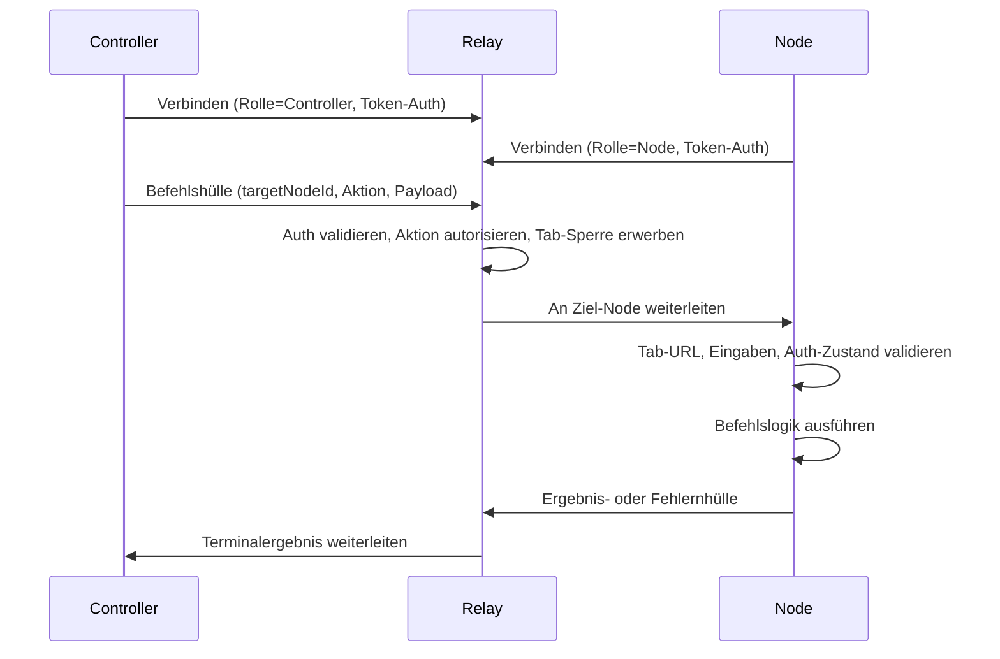

# Otto-Architektur

Otto ist ein Fernbrowser-Automatisierungssystem mit klarer Rollenabgrenzung: Controller geben Befehle aus, Relay vermittelt Vertrauen und Routing, und Erweiterungs-Nodes führen Browser-Arbeit aus. Diese Seite erklärt, wie diese Teile zusammenarbeiten, welche Garantien die Plattform bietet und wo die Implementierungsbefugnis liegt.

## Systemrollen

| Komponente | Hauptverantwortung | Warum sie existiert |
|---|---|---|
| **Controller** | Befehlserstellung und Benutzer-Workflows | Hält Automatisierungsabsicht außerhalb der Browser-Laufzeit |
| **Relay** | Auth, Routing, Sperren, Schwärzung, Terminalisierung | Zentraler Richtlinien-Durchsetzungspunkt |
| **Node (Erweiterung)** | Seitenbewusste Ausführung und Listener-Erfassung | Führt Browser-Aktionen in der Nähe des Ziel-Tabs aus |

Die Aufteilung ist beabsichtigt. Control-Plane-Anliegen (Auth, Routing, Audit) bleiben im Relay. Execution-Plane-Anliegen (Tab-Zugriff, DOM, Netzwerk) bleiben im Erweiterungs-Node.

## Befehlslebenszyklus

Für Seitenbefehle führt die Node-Laufzeit diese Sequenz aus, bevor die Befehlslogik aufgerufen wird:

1. Seitenbundle und Befehlsmetadaten auflösen.
2. Aktive Tab-URL gegen deklarierten Seitenbereich validieren.
3. Deklarierte Eingabemetadaten (`inputFields`, optionale `inputAtLeastOneOf`) validieren und bereinigen.
4. Wenn `requiresAuth`, `checkLogin` und optionales `gotoLogin` ausführen (keine Anmeldeinformationen-Automatisierung).
5. `preloadHost` bei Bedarf über Auto-Navigation sicherstellen.
6. Befehl `execute` aufrufen und strukturierte Ausgabe zurückgeben.

Diese Sequenz existiert, um früh mit expliziten Fehlercodes zu scheitern und zu verhindern, dass Befehlshandler in mehrdeutigem Seitenzustand laufen.

## Laufzeitmodell (MV3)

Die Erweiterung verwendet eine Chrome MV3-aufgeteilte Laufzeit, sodass die WebSocket-Kontinuität nicht von der Service-Worker-Verfügbarkeit abhängt.

| Komponente | Datei | Verantwortung |
|---|---|---|
| Hintergrundskript | `background.ts` | Befehlsorchestrierung und Browser-API-Zugriff |
| Offscreen-Client | `offscreen-client.ts` | Persistentes Relay-WebSocket und Heartbeat |

Stream-Handling ist ebenfalls nach Verantwortung aufgeteilt:

- **Listener-Transport** — generisch, seitenunabhängig. Erfasst rohe Netzwerkereignisse.
- **Seitenbefehlsadapter** — parsen rohe Payloads in Shared-Domain-Objekte.
- **Transport-Deduplizierung** — unterdrückt äquivalente hybride cross-source Antwortduplikate.
- **Adapter-Deduplizierung** — unterdrückt semantische Replay-Duplikate aus Seiten-Payloads.

## Plattformgarantien

| Garantie | Wirkung |
|---|---|
| `targetNodeId` erforderlich | Befehle werden beabsichtigt geroutet, niemals implizit als Standard |
| Terminalergebnisse erhalten | Jeder Befehl endet als `completed`, `failed`, `timed_out` oder `cancelled` |
| Pro-Tab serial / cross-Tab parallel | Verhindert widersprüchliche Tab-Mutationen ohne Durchsatz zu opfern |
| Pre-Ingress-Schwärzung | Sensible Werte werden vor Persistenz und Stream-Fan-out maskiert |
| Seitenbereichsspezifische Ausführung | Befehlslogik kann nicht gegen die falsche Domain laufen |
| Keine Anmeldeinformationsautomatisierung | `requiresAuth`-Befehle verwenden `manual_login_required`-Übergabe |

## Setup und Eigentumsgrenzen

`otto setup` konfiguriert die Controller-Seite. Controller-Einstellungen und Token werden in `~/.otto/config.json` gespeichert.

Erweiterungs-Relay-URL, Kopplungscode-Zustand und Node-Anmeldeinformationen werden in `chrome.storage.*` gespeichert und sind erweiterungseigen. Diese Speicher können auf denselben Relay-Host zeigen, aber sie bleiben rollenbereichsspezifisch (`controller` vs. `node`).

Setup ist für Endbenutzer release-getrieben: Erweiterungsartefakte stammen von Release-Assets mit Prüfsummenverifizierung. Nicht-interaktiver Modus erzeugt maschinenlesbares JSON; interaktiver TTY-Modus bietet menschenorientierte Onboarding-Ausgabe.

## Wahrheitsquelle

| Anliegen | Pfad |
|---|---|
| Protokollverträge | `packages/shared-protocol/src/index.ts` |
| Relay-Routing und Sperren | `packages/relay/src/index.ts` |
| CLI-UX und Hüllen | `packages/cli/src/index.ts` |
| Erweiterungshintergrund-Orchestrierung | `extension/entrypoints/background.ts` |
| Offscreen-Transport-Lebenszyklus | `extension/src/runtime/offscreen-client.ts` |

## Nächste Schritte

- [Kopplung und Authentifizierung](./pairing-auth.md) — Token- und Kopplungslebenszyklus im Detail.
- [Erweiterungslaufzeit](../extension-runtime.md) — MV3-Laufzeitzusammensetzung und Befehlsausführungspfad.
- [Protokollreferenz](../protocol.md) — Hüllenvertrag, Nachrichtenfamilien, Routinggarantien.