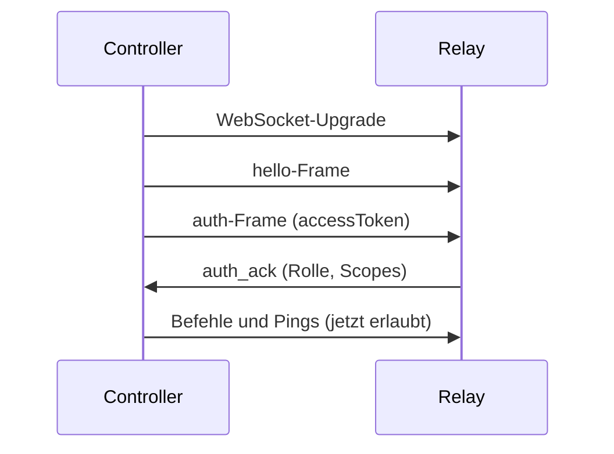

# Controller-Implementierung

Dieser Leitfaden erklärt, wie Sie einen benutzerdefinierten Controller-Client für das Otto-Relay-Protokoll implementieren. Nach Abschluss dieses Leitfadens kann Ihr Controller authentifizieren, Befehle an Nodes weiterleiten, Stream-Sessions behandeln und den Token-Lebenszyklus korrekt verwalten.

## Bevor Sie beginnen

- Lesen Sie [Architektur](./architecture.md), um Systemrollen und Befehlslebenszyklus zu verstehen.
- Lesen Sie [Kopplung und Auth](./pairing-auth.md), um den Token-Ablauf zu verstehen.
- Stellen Sie sicher, dass ein Relay läuft (`otto start`), gegen das Sie testen können.

## Erforderliche Fähigkeiten

Ihr Controller muss folgendes beherrschen:

1. **Token-Lebenszyklus** — Client registrieren, Anmeldeinformationen austauschen, Token vor Ablauf aktualisieren.
2. **WebSocket-Auth-Sequenzierung** — `hello` → `auth` → auf `auth_ack` warten, bevor Befehle gesendet werden.
3. **Anfragekorrelation** — eindeutige `requestId` pro Envelope verwenden; Antworten nach dieser ID korrelieren.
4. **Deterministische Stream-Beendigung** — explizit deabonnieren; `command_cancel` für laufende Stream-Befehle senden.
5. **Heartbeat** — `ping`/`pong` senden, um langlebige Sessions am Leben zu halten.

Das Fehlen auch nur einer dieser Fähigkeiten verursacht typischerweise unzuverlässige Automatisierung bei Wiederverbindungen oder langlaufenden Streams.

## HTTP-Bootstrap

Controller-Identität und Token-Status über HTTP herstellen, bevor WebSocket-Verkehr beginnt.

| Zweck | Endpunkt |
|---|---|
| Controller-Client registrieren | `POST /api/controller/register` |
| Anmeldeinformationen gegen Token-Paar eintauschen | `POST /api/controller/token` |
| Verbundene Nodes ermitteln | `GET /api/nodes/connected` |
| Token-Paar aktualisieren | `POST /api/auth/refresh` |

### Client registrieren

```http
POST /api/controller/register
Content-Type: application/json

{"name": "my-controller", "description": "Automatisierungs-Worker"}
```

```json
{
  "clientId": "clt_abc123",
  "clientSecret": "cs_xxx",
  "createdAt": 1776162000000
}
```

:::warning
Bewahren Sie `clientSecret` sicher auf. Das Relay speichert nur einen gesalzenen Hash — Sie können das Secret nach der Registrierung nicht wiederherstellen.
:::

### Access-Token ausstellen

```http
POST /api/controller/token
Content-Type: application/json

{"clientId": "clt_abc123", "clientSecret": "cs_xxx"}
```

```json
{
  "clientId": "clt_abc123",
  "controllerId": "ctl_123",
  "accessToken": "<jwt>",
  "refreshToken": "<refresh>"
}
```

### Verbundene Nodes ermitteln

```http
GET /api/nodes/connected
Authorization: Bearer <accessToken>
```

```json
{
  "nodes": [{"nodeId": "node_local_1"}]
}
```

### Token aktualisieren

```http
POST /api/auth/refresh
Content-Type: application/json

{"refreshToken": "<refresh>"}
```

```json
{
  "accessToken": "<new-jwt>",
  "refreshToken": "<new-refresh>"
}
```

## WebSocket-Auth-Sequenz

Nach dem HTTP-Bootstrap muss der WebSocket-Handshake dieser strikten Reihenfolge folgen:



**Hello-Frame:**

```json
{
  "protocolVersion": "1.0",
  "messageType": "hello",
  "requestId": "req_hello_1",
  "timestamp": "2026-04-14T13:10:00.000Z",
  "senderRole": "controller",
  "payload": {"role": "controller", "capabilities": ["commands", "logs"]}
}
```

**Auth-Frame:**

```json
{
  "protocolVersion": "1.0",
  "messageType": "auth",
  "requestId": "req_auth_1",
  "timestamp": "2026-04-14T13:10:00.020Z",
  "senderRole": "controller",
  "payload": {"accessToken": "<jwt>"}
}
```

**Ping-Frame (Heartbeat, ca. alle 30s senden):**

```json
{
  "protocolVersion": "1.0",
  "messageType": "ping",
  "requestId": "req_ping_1",
  "timestamp": "2026-04-14T13:10:08.000Z",
  "senderRole": "controller",
  "payload": {"ts": 1776162608000}
}
```

Nicht authentifizierte Clients können keine Befehls-, Sperr- oder Abonnement-Frames senden.

## Befehls-Envelope

| Feld | Erforderlich | Hinweise |
|---|---|---|
| `targetNodeId` | Ja | Relay-Routing-Schlüssel; niemals weglassen |
| `action` | Ja | Befehlsaktion (z. B. `command.run`) |
| `payload` | Ja | Aktions-Payload |
| `replayNonce` | Ja | Replay-Schutz; eindeutigen Wert pro Anfrage verwenden |
| `tabSessionId` | Abhängig | Erforderlich für tab-bezogene Aktionen |
| `waitPolicy` | Optional | `fail_fast` oder `wait_with_timeout` |
| `timeoutMs` | Optional | Befehls-Timeout in Millisekunden |

## Listener und Streaming

Streaming verwendet einen zweiphasigen Ablauf:

1. **Befehlsphase** — `command.test` senden; Ergebnis-Envelope mit `stream.listeners` erhalten.
2. **Listener-Phase** — pro Manifest-Eintrag abonnieren; asynchrone `listener_update`-Ereignisse verarbeiten, korreliert nach subscribe-`requestId`.

**Subscribe-Frame-Beispiel:**

```json
{
  "protocolVersion": "1.0",
  "messageType": "command",
  "requestId": "req_subscribe_1",
  "senderRole": "controller",
  "payload": {
    "targetNodeId": "node_local_1",
    "action": "listener.subscribe",
    "payload": {
      "listener": "network.http_intercept",
      "options": { "tabSessionId": "ts_abc", "site": "reddit.com", "mode": "network" }
    }
  }
}
```

**Beendigung** muss explizit sein:
- `listener.unsubscribe` mit der ursprünglichen subscribe-`requestId` senden.
- `command_cancel` senden, das auf die ursprüngliche Stream-Befehls-`requestId` abzielt, für laufende Stream-Befehle.

:::tip
Halten Sie den WebSocket-Heartbeat während der gesamten Stream-Session aktiv. Veraltete Controller werden als getrennt behandelt und vom Relay bereinigt.
:::

## ACL und Node-Auswahl

`targetNodeId` ist immer erforderlich. Node-Besitzer kontrollieren ACL-Grants pro Controller-Client. Fehlende Grants schlagen deterministisch mit `acl_missing_node_grant` fehl. Gewähren Sie Zugriff über den Relay-ACL-Endpunkt oder über `otto client`-CLI-Befehle.

## Wiederholungsrichtlinien

| Fehlertyp | Wiederholungsstrategie |
|---|---|
| `invalid_access_token` | Token aktualisieren, dann einmal wiederholen |
| `lock_conflict` / `lock_timeout` | Begrenztes Backoff, dann wiederholen |
| Validierungsfehler | Nicht wiederholen; Anfrage korrigieren |
| `acl_missing_node_grant` | Nicht wiederholen; Grant vom Node-Besitzer anfordern |

Verwenden Sie Idempotenzschlüssel, wo anwendbar, damit sichere Wiederholungen zwischengespeicherte Endergebnisse zurückgeben, anstatt Seiteneffekte zu duplizieren.

## Nächste Schritte

- [Protokollreferenz](../protocol.md) — vollständiger Envelope-Vertrag, Nachrichtenfamilien, Routing-Garantien.
- [Relay-API](../relay-api.md) — alle HTTP-Endpunkte.
- [Wiederverwendbare Snippets](../snippets.md) — kopierbare curl- und WebSocket-Beispiele.
- [Fehlercodes](../error-codes.md) — Fehlercode-Tabelle mit Behebung.
