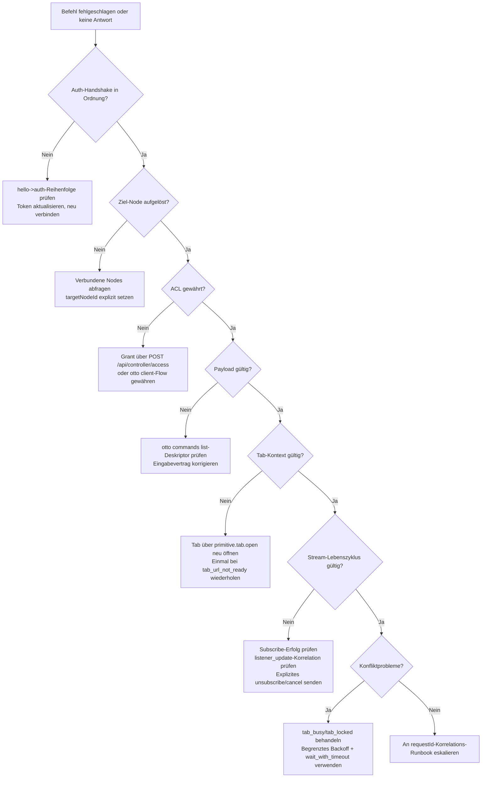

# Controller-Fehlerbehebung Entscheidungsbaum

Verwenden Sie diesen Entscheidungsbaum, wenn ein von einem Controller gesendeter Befehl fehlschlägt oder keine Antwort erzeugt. Arbeiten Sie jedes Tor der Reihe nach durch — die meisten Fehler lösen sich am ersten Tor, an dem die Bedingung nicht erfüllt ist.

## Entscheidungstore

### 1. Auth-Handshake in Ordnung?

- Erwartet: Relay antwortet mit `auth_ack` nach `hello`- und `auth`-Frames.
- Wenn kein `auth_ack`: `hello` → `auth`-Reihenfolge prüfen; bestätigen, dass `accessToken` gültig und nicht abgelaufen ist.
- Bei `invalid_access_token`: Token mit `otto client login` aktualisieren, dann neu verbinden.

### 2. Ziel-Node aufgelöst?

- Erwartet: `targetNodeId` stimmt mit einem verbundenen Node überein.
- Führen Sie `otto commands list` (oder `GET /api/nodes/connected`) aus, um verbundene Nodes zu sehen.
- Stellen Sie sicher, dass `targetNodeId` in jedem Befehls-Envelope explizit gesetzt ist.

### 3. ACL gewährt?

- Erwartet: Der Controller-Client hat einen ACL-Grant für den Ziel-Node.
- Bei `acl_missing_node_grant`: Mit Node-Bearer-Token an `POST /api/controller/access` senden oder den Relay-Admin-ACL-Flow verwenden.

### 4. Payload gültig?

- Erwartet: Aktion und Payload stimmen mit dem Befehlsdeskriptor aus `command.list` überein.
- Führen Sie `otto commands list --site <site>` aus, um den Eingabevertrag zu inspizieren.
- Unbekannte Schlüssel, fehlende erforderliche Felder oder Typinkongruenzen korrigieren.

### 5. Tab-Kontext gültig?

- Erwartet: `tabSessionId` verweist auf einen aktiven verwalteten Tab mit einer festgeschriebenen URL, die mit der Befehls-Site übereinstimmt.
- Wenn veraltet: `otto cmd --action primitive.tab.open` ausführen, um eine frische Session zu erstellen.
- Bei `tab_url_not_ready`: einmal nach kurzer Verzögerung wiederholen.

### 6. Stream-Lebenszyklus gültig?

- Erwartet: `command.test` gibt `stream.listeners` zurück; Subscribe-Befehl gibt terminales Ergebnis zurück; `listener_update`-Ereignisse korrelieren zur subscribe-`requestId`.
- Sicherstellen, dass unsubscribe- oder `command_cancel`-Beendigung explizit ist.

### 7. Konfliktprobleme?

- Erwartet: Tab-Sperre ohne Konflikt erworben.
- Bei `tab_busy` oder `tab_locked`: mit begrenztem Backoff wiederholen oder `waitPolicy: wait_with_timeout` setzen.

## Nächste Schritte

- [requestId-Korrelations-Runbook](./requestid-correlation-runbook.md) — komponentenübergreifend verfolgen, wenn der Baum den Fehler nicht auflöst.
- [Fehlercodes](../error-codes.md) — vollständige Fehlercode-Referenz.
- [Wiederverwendbare Snippets](../snippets.md) — curl-Befehle für jedes HTTP-Tor.
