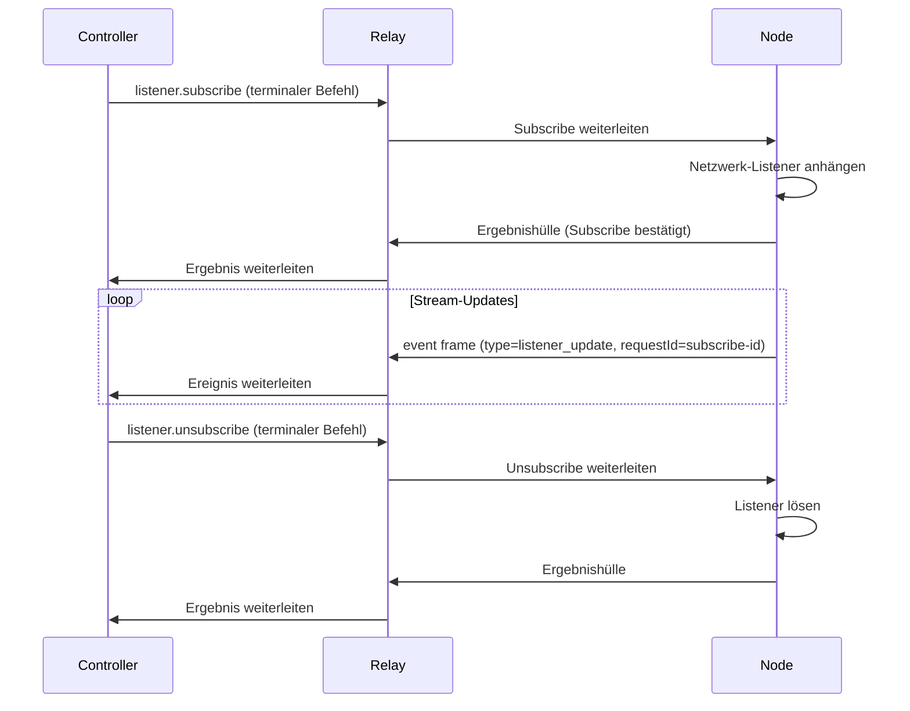

# Listener-Entwicklung

Diese Anleitung behandelt listener-basierte Stream-Integrationen für Befehlsmodule. Die Kerndesignregel ist Trennung der Verantwortlichkeiten: Die Laufzeit besitzt Transport-Lebenszyklus und Sicherheit, während Befehlsmodule seitenpezifische Payload-Parsing und Stream-Gestaltung besitzen.

## Kerneinvariante

Halten Sie die Listener-Infrastruktur der Laufzeit generisch und seitenunabhängig. Halten Sie die Befehlsadapterlogik seitenpezifisch.

## Bevor Sie beginnen

- Vertrautheit mit [Befehlsautorenschaft](./command-authoring.md) und dem `test(ctx, input, helpers)`-Hook.
- Verständnis der Netzwerkanforderungsmuster der Zielseite (URLs, MIME-Typen, Host).

## Listener-Lebenszyklus



`listener.subscribe` und `listener.unsubscribe` sind terminale Befehle, die normale Ergebnis- oder Fehlerhüllen zurückgeben. Stream-Daten werden asynchron als `event`-Frames mit `payload.type=listener_update` ausgesendet, die durch die ursprüngliche Subscribe-`requestId` korreliert sind.

## network.http_intercept Optionen

| Option | Erforderlich | Beschreibung |
|---|---|---|
| `tabSessionId` | Ja | Verwaltetes Sitzungsziel |
| `site` | Ja | Seitenbereich für den Listener |
| `mode` | Nein | `network` \| `fetch` \| `hybrid` (Standard: `network`) |
| `urlPatterns` | Nein | URL-Glob-Muster zum Erfassen |
| `requestHostAllowlist` | Nein | Erlaubnisliste der Anfrage-Hosts |
| `includeBody` | Nein | Antwort-Body in Updates einschließen |
| `includeHeaders` | Nein | Geschwärzte Anfrage/Antwort-Header einschließen |
| `maxBodyBytes` | Nein | Maximale Antwort-Body-Bytes pro Update (Standard: `256000`) |
| `mimeTypes` | Nein | MIME-Typ-Präfix-Erlaubnisliste |
| `streamAdapter` | Nein | Adapterhinweis für befehlsseitiges Parsen |

:::tip
Verwenden Sie `--mode hybrid`, wenn die Zielseite möglicherweise `fetch` oder `XMLHttpRequest` für dieselbe API verwendet. Hybrid-Modus erfasst von beiden Oberflächen mit Transport-Level-Deduplizierung.
:::

## Stream-Adapter-Richtlinien

Adapter-Module ordnen rohe Transport-Payloads in Shared-Domain-Objekte zu (z.B. `chat.message`, `content.post`):

- Ordnen Sie rohe Payloads Shared-Domain-Typen zu.
- Fügen Sie `originalEntity` nur bei, wenn es sicher und betrieblich nützlich ist.
- Halten Sie Objekte kompakt, um Cross-Kontext-Serialisierungsdruck bei anhaltenden Streams zu vermeiden.
- Verwenden Sie `streamAdapter`-Hinweis in Subscribe-Optionen, um den zu verwendenden Adapter zu identifizieren.

## Deduplizierung

Duplikatunterdrückung ist absichtlich geschichtet:

1. **Transport-Deduplizierung** — Laufzeit unterdrückt äquivalente hybride cross-surface Antwortduplikate (gleiche Antwort erfasst über `fetch` und `network`).
2. **Adapter-Deduplizierung** — Befehlsadapter unterdrücken semantische Duplikate von wiedergegebenen Seiten-Payloads.

Überspringen Sie keine der beiden Schichten: Transport-Duplikate und semantische Duplikate sind unterschiedliche Fehlermodi.

## Fallback-Strategie

Wenn ein begrenzter Stream-Probe den Verkehr nicht bestätigen kann, geben Sie Fallback-Metadaten zurück und verwenden Sie Execute-Fallback-Helfer, anstatt den Stream-Zustand mehrdeutig zu lassen:

```typescript
// In test() Hook: Probe fehlgeschlagen
const bufferedResult = await helpers.execute(input);
return {
  ready: false,
  fallback: { strategy: 'command_poll', reason: 'intercept_probe_unavailable' },
  bufferedResult
};
```

## Erfolg überprüfen

Verwenden Sie `otto listener subscribe-network`, um rohe Netzwerkerfassung zu validieren, bevor Sie die Befehlsstream-Verrohrung debuggen:

```bash
otto listener subscribe-network \
  --tab-session <tabSessionId> \
  --site example.com \
  --pattern 'https://api.example.com/events*' \
  --mode network \
  --max-body-bytes 200000
```

Erwartete Ausgabe: gestreamte JSON `listener_update`-Ereignisse von der Ziel-API.

## Nächste Schritte

- [Befehlsautorenschaft-Vorlagen](./command-authoring-templates.md) — Stream-Befehl-Test-Hook-Vorlage.
- [Protokollierung und Debugging](../logging-debugging.md) — Stream-Diagnose und Fehler-Handbuch.
- [otto listener CLI-Referenz](../cli/listener.md) — vollständige subscribe-network-Optionen.