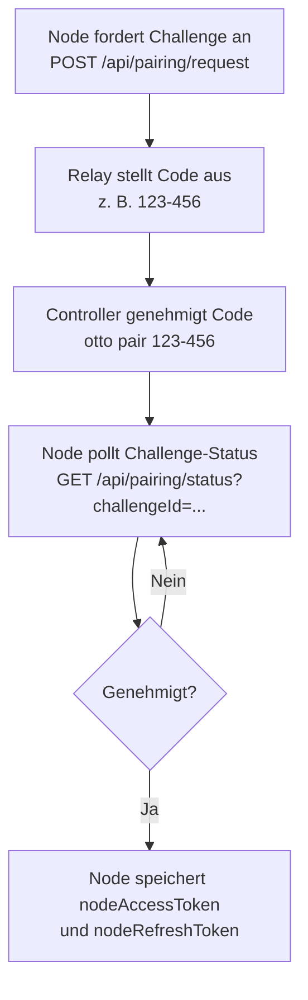

# Kopplung und Authentifizierung

Otto verwendet zwei separate Vertrauensabläufe: einen **Node-Kopplungsablauf**, der eine vertrauenswürdige Beziehung zwischen dem Erweiterungs-Node und dem Relay herstellt, und einen **Controller-Client-Ablauf** für langlebige Controller-Identitäten. Beide Abläufe enden in Access/Refresh-Token-Paaren, die WebSocket-Sessions authentifizieren.

## Wahrheitsquelle

| Anliegen | Pfad |
|---|---|
| Kopplungs-, Token-, Refresh- und Revoke-Endpunkte | `packages/relay/src/index.ts` |
| CLI-Auth, Pair, Revoke und Client-Befehle | `packages/cli/src/index.ts` |
| Erweiterungs-Kopplungs-Polling und Token-Hydratisierung | `extension/src/runtime/background-bootstrap.ts` |

## Node-Kopplungsablauf

Die Kopplung stellt eine vertrauenswürdige Node-Controller-Beziehung her, ohne rohe Anmeldeinformationen zu teilen. Der Node fordert eine Challenge an, das Relay stellt einen kurzen Genehmigungscode aus, der Controller genehmigt diesen Code, und der Node pollt den Challenge-Status, bis genehmigtes Token-Material verfügbar ist.

In der Erweiterungs-Onboarding-UI ist der Relay-Transport jetzt benutzergesteuert: Die Eingabe einer Relay-URL verbindet nicht automatisch. Verwenden Sie **Verbinden**, um den Transport und die Kopplungsstatus-Aktualisierung zu starten, und **Trennen**, um den Transport zu schließen, ohne gespeicherte Node-Token zu löschen.



| Schritt | Endpunkt | Hinweise |
|---|---|---|
| Node fordert Challenge an | `POST /api/pairing/request` | Payload: `{ nodeId }` |
| Controller inspiziert ausstehende | `GET /api/pairing/pending` | Optionaler Sichtbarkeitsschritt |
| Controller genehmigt Code | `POST /api/pairing/approve` | Payload: `{ code }` |
| Node prüft Status | `GET /api/pairing/status?challengeId=...` | Bei Genehmigung speichert Node Token |

CLI-Befehle für diesen Ablauf:

```bash
# Ausstehende Auth-Codes von verbundenen Nodes auflisten
otto authcode

# Code genehmigen und Controller-Token lokal speichern
otto pair 123-456

# Refresh-Token widerrufen und lokale Controller-Auth löschen
otto revoke
```

Die CLI versucht automatisch die Access-Token-Aktualisierung, wenn das Relay `invalid_access_token` zurückgibt. Eine manuelle erneute Kopplung ist nur erforderlich, wenn auch das Refresh-Token fehlschlägt oder widerrufen wurde.

### Challenge-Wiederherstellungssemantik

Die Erweiterung behandelt verwaisten oder abgelaufenen Challenge-Status automatisch beim Bootstrap:

- **Verwaiste Metadaten** — `pairingChallengeId` existiert ohne `pairingCode`: löscht veraltete Schlüssel und fordert eine frische Challenge an.
- **Abgelaufen nach lokaler Uhr** — `pairingExpiresAt <= now`: löscht veraltete Schlüssel und stellt sofort eine neue Challenge aus.
- **Challenge beim Relay nicht gefunden** — `GET /api/pairing/status` gibt `404` zurück: behandelt als veraltet und stellt neu aus.
- **Vorübergehende Relay-Fehler** — `5xx`-Antworten: wiederholt mit begrenztem Backoff, setzt dann zurück und stellt neu aus.
- **`expired`-Status vom Relay** — löst sofort Challenge-Neuausstellung aus.

Dies verhindert, dass das Onboarding nach Browser- oder Relay-Neustarts bei "Warten auf Challenge" hängen bleibt.

## Controller-Client-Ablauf

Controller-Clients können unabhängig von der Node-Kopplung registriert werden. Dies ist das empfohlene Modell für langlebige Controller-Identitäten.

| Phase | Endpunkt | Hinweise |
|---|---|---|
| Client registrieren | `POST /api/controller/register` | Gibt einmaliges `clientSecret` und stabile `clientId` zurück |
| Anmeldeinformationen austauschen | `POST /api/controller/token` | Payload: `{ clientId, clientSecret }`; gibt Access/Refresh-Token zurück |
| Node-Zugriff gewähren | `POST /api/controller/access` | Node-Bearer-Token erforderlich; node-eigene ACL-Entscheidung |

```bash
# Neuen Controller-Client registrieren
otto client register --name "my-laptop" --description "Primärer Workstation-Controller"

# Anmeldeinformationen gegen Token eintauschen
otto client login

# Aktuellen Client-Status und Secret-Auflösungsquelle prüfen
otto client status

# Bestimmten Client vom Relay entfernen
otto client remove --client-id <id>

# Alle registrierten Clients entfernen
otto client remove --all

# Lokale Anmeldeinformationen löschen, ohne vom Relay zu entfernen
otto client forget
```

### Secret-Behandlung

- CLI speichert Client-Secrets im OS-Schlüsselbund, wenn verfügbar (plattformübergreifend via keytar).
- Fallback-Umgebungsvariable: `OTTO_CONTROLLER_CLIENT_SECRET`.
- `OTTO_CONTROLLER_CLIENT_SECRET` hat Vorrang vor der Schlüsselbund-Abfrage.
- Relay speichert nur gesalzene Client-Secret-Hashes im Ruhezustand — niemals Klartext-Secrets.

### Controller-Entfernungsverhalten

- `POST /api/controller/remove` mit `{ clientId }` widerruft den Controller-Datensatz und entfernt sofort ACL-Grants, Refresh-Sessions und aktive Controller-Sockets.
- `POST /api/controller/remove-all` wendet dieselbe Semantik auf jeden registrierten Client an.
- Wiederholte Massenentfernung nach vollständiger Bereinigung ist idempotent (`removedCount: 0`).

Neu registrierte Controller-Clients starten ohne Node-Grants (Least-Privilege-Standard). Das Relay erzwingt ACL bei jedem node-gerichteten Befehl und gibt `acl_missing_node_grant` zurück, wenn der Zugriff verweigert wird.

### Testablauf-Selbstregistrierung

`otto test` registriert automatisch einen Controller selbst, wenn keine lokale Identität oder Token vorhanden sind:

- Standardname: `otto-tester`; Beschreibung: `Automatisch registrierter Controller für otto test-Abläufe.`
- Keine interaktiven Eingabeaufforderungen, wenn Standardwerte verwendet werden.
- Automatisch registrierter Controller wird standardmäßig nach dem Durchlauf beibehalten.
- Verwenden Sie `--cleanup-test-controller`, um ihn nach Abschluss zu entfernen.

## WebSocket-Auth-Ablauf

Nach `hello` sendet jeder Client einen `auth`-Frame mit `{ accessToken }`. Das Relay verifiziert Signatur und Claims (`iss`, `aud`, Rolle, optionale Node-Bindung) und antwortet dann mit `auth_ack`, das effektive Rolle und Scopes enthält.

Nicht authentifizierte Clients können keine Befehls-, Sperr- oder Abonnement-Frames senden.

## Refresh-Ablauf

Refresh kann über HTTP oder WebSocket durchgeführt werden:

- HTTP: `POST /api/auth/refresh` mit `{ refreshToken }` — gibt neues Access-Token zurück und rotiert Refresh-Token.
- WebSocket: `refresh`-Frame mit demselben Token-Payload.

Das Relay persistiert Refresh-Sessions im Laufzeitspeicher, sodass gültige Sessions Relay-Neustarts überstehen.

| Token | Standard-Lebensdauer | Konfigurations-Umgebungsvariable |
|---|---|---|
| Access-Token | 15 Minuten | `OTTO_TOKEN_TTL_MINUTES` |
| Refresh-Token | 30 Tage | `OTTO_REFRESH_TTL_DAYS` |

## Revoke-Ablauf

`POST /api/auth/revoke` mit `{ refreshToken }` gibt `{ revoked: boolean }` zurück. Nach dem Widerruf kann dieses Refresh-Token keine Access-Token mehr ausstellen. `otto revoke` wrappt dies und löscht auch lokale Controller-Anmeldeinformationen.

## Claims und Rotation

Access-Token enthalten Aussteller, Zielgruppe, Rolle, Identitätsbindungen und Aktions-Scopes. Das Relay validiert Aussteller und Zielgruppe bei jeder Verifikation. Die Secret-Rotation verwendet Dual-Key-Verifikation mit `OTTO_TOKEN_SECRET` und optionalem `OTTO_TOKEN_PREVIOUS_SECRET` für kontrollierten Schlüsselwechsel ohne sofortige Session-Invalidierung.

:::note
Die Relay-Auth kontrolliert den API-Zugriff. Das Befehls-`requiresAuth` kontrolliert die Website-Session-Voraussetzungen. Diese sind unabhängig — ein gültiges Relay-Token bedeutet nicht, dass die Erweiterung bei der Ziel-Website angemeldet ist.
:::

## Nächste Schritte

- [Controller-Implementierung](./controller-implementation.md) — benutzerdefinierten Controller über das Relay-Protokoll erstellen.
- [Fehlercodes](../error-codes.md) — Auth-Fehlercodes und Behebung.
- [Relay-API](../relay-api.md) — vollständige Endpunkt-Referenz.
