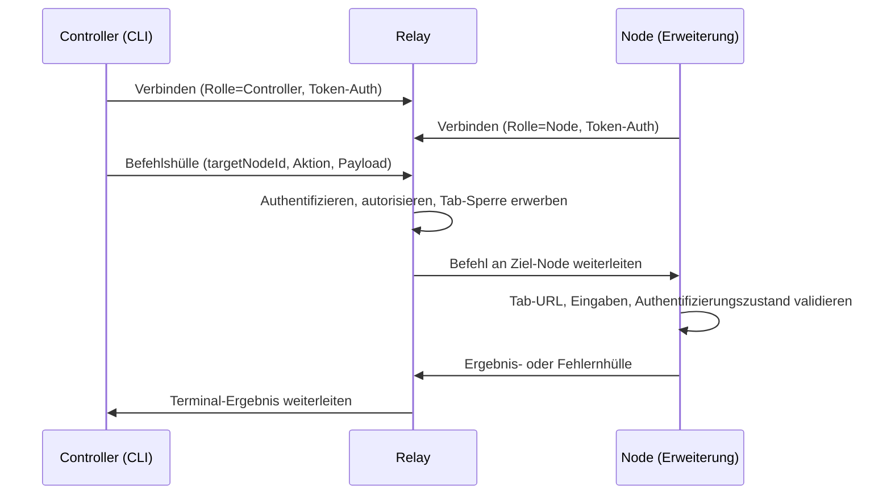

# Otto Überblick

Otto ist eine Plattforme für automatisierte Fernsteuerung von Browsern zum Ausführen von CLI-gesteuerten Befehlen gegen einen Browser auf einem anderen Computer. Befehle wandern von einer Controller-CLI über einen zentralen Relay-Daemon zu einer Browser-Erweiterung, die sie ausführt.

## Wie die drei Komponenten zusammenarbeiten

| Komponente | Paket | Rolle |
|---|---|---|
| **Controller** | `@telepat/otto` | Sendet Befehle und empfängt Ergebnisse über WebSocket |
| **Relay** | `@telepat/otto-relay` | Authentifiziert, routet, serialisiert pro Tab, speichert Protokolle |
| **Browser-Node** | `@telepat/otto-extension` | Chrome MV3-Erweiterung, die Browser-Operationen ausführt |

## Was Otto kann

- **Primitive Browser-Aktionen** — `primitive.tab.*` für Tab-Lebenszyklus, `primitive.dom.extract_text` für Inhaltsextraktion.
- **Seitenbereichsspezifische Befehlsausführung** — `command.run` und `command.test` mit Laufzeitdiscovery über `command.list`.
- **Stream-Ausgaben** — Befehlsnative Netzwerkinterception und Live-Update-Bereitstellung.
- **Onboarding** — `otto setup` kümmert sich um Relay-Daemon-Bereitschaft, Erweiterungsartefakt-Download mit Prüfsummenverifizierung und Chrome-Importübergabe.
- **Deterministische Ergebnisse** — Jeder Befehl erzeugt eines von `completed`, `failed`, `timed_out` oder `cancelled`.

## Laufzeit-Topologie

1. Controller verbindet sich über WebSocket mit dem Relay als `Rolle=Controller`.
2. Erweiterungs-Node verbindet sich über WebSocket mit dem Relay als `Rolle=Node`.
3. Relay erzwingt Token-Authentifizierung und routet Befehle nach `targetNodeId`.
4. Node führt den Befehl aus und gibt ein Ergebnis oder einen Fehler zurück.
5. Relay leitet das Terminal-Ergebnis an den ursprünglichen Controller zurück.

## Erweiterungs-Laufzeitmodell

Otto verwendet ein Chrome MV3-aufgeteiltes Laufzeitmodell:

| Komponente | Datei | Verantwortung |
|---|---|---|
| Hintergrundskript | `background.ts` | Befehlsausführung und Browser-API-Zugriff |
| Offscreen-Client | `offscreen-client.ts` | Persistentes Relay-WebSocket und Heartbeat |

Stream-Inhaberschaft: Transport-Listener sind generisch und seitenunabhängig. Seitenbefehlsmodule parsen rohe Listener-Payloads in Domänenobjekte. Duplikatunterdrückung läuft sowohl auf Transportschicht (cross-source hybride Antworten) als auch auf Befehlsadapterschicht (semantische Duplikate).

## Wichtige Invarianten

- `targetNodeId` ist für alle Befehlsrouting erforderlich.
- Terminal-Befehlsergebnisse sind garantiert: `completed`, `failed`, `timed_out` oder `cancelled`.
- Pro-Tab-Operationen sind serialisiert (FIFO-Warteschlange); cross-Tab-Operationen sind parallelisierbar.
- Sensible Werte werden geschwärzt, bevor Protokolle gespeichert oder gestreamt werden.
- Befehle laufen nur auf einem Tab, dessen URL mit dem deklarierten Seitenbereich übereinstimmt.
- Deklarierte Befehlseingabemetadaten werden vor der Ausführung validiert.
- `requiresAuth`-Befehle automatisieren niemals Anmeldeübermittlung; manuelle Anmeldeübergabe verwendet `manual_login_required`.

## Setup und Einstellungsinhaberschaft

`otto setup` ist controllerorientiertes Onboarding. Es speichert Einstellungen und Token in `~/.otto/config.json`, ruft Erweiterungsartefakte von Release-Assets mit Prüfsummenverifizierung ab und stellt die Relay-Daemon-Bereitschaft sicher, bevor es abschließt.

Erweiterungseinstellungen sind erweiterungseigen. Node-Relay-URL, Kopplungsherausforderung und Node-Token werden in `chrome.storage.*` gespeichert und sind unabhängig von der CLI-Konfigurationsdatei.

Controller und Erweiterung können auf denselben Relay-Host zeigen, aber verschiedene WebSocket-Rollen verwenden (`controller` vs. `node`). Diese Abgrenzung ist beabsichtigt.

## Wahrheitsquelle

| Bereich | Pfad |
|---|---|
| Protokollverträge | `packages/shared-protocol/src/index.ts` |
| Relay-Routing und Sperren | `packages/relay/src/index.ts` |
| CLI-Einstiegspunkt | `packages/cli/src/index.ts` |
| Erweiterungshintergrund | `extension/entrypoints/background.ts` |
| Erweiterung Offscreen | `extension/src/runtime/offscreen-client.ts` |
| Befehlsbündel | `extension/src/commands/` |

## Nächste Schritte

- [Otto installieren](./installation.md) — globale Installation oder Monorepo-Entwicklungspfad.
- [Schnellstart](./quickstart.md) — Relay hochfahren, Node koppeln, ersten Befehl ausführen.
- [Architektur](./guides/architecture.md) — eingehender Blick auf Systemrollen und Befehlslebenszyklus.