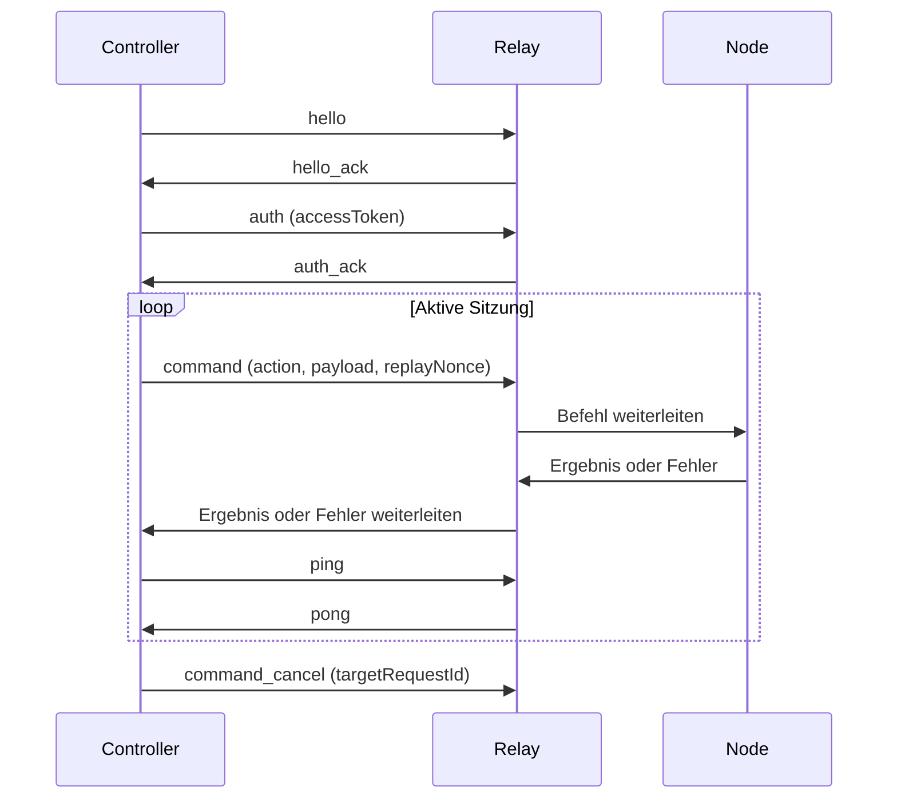

# Protokollreferenz

Diese Seite behandelt Leitungsverhalten und Befehlsroutinggarantien. Wenn Sie Produktworkflows implementieren, beginnen Sie zuerst mit [Architektur](./guides/architecture.md) und der [Controller-Implementierungsanleitung](./guides/controller-implementation.md), und verwenden Sie dann diese Seite als strikte Vertragsreferenz.

Aktuelle Protokolltypen sind in `packages/shared-protocol/src/index.ts` definiert.

## Wahrheitsquelle Codepfade

| Anliegen | Quelle |
|---|---|
| Geteilte Hüllen- und Payload-Verträge | `packages/shared-protocol/src/index.ts` |
| Relay-Protokollbehandlung und Routing | `packages/relay/src/index.ts` |
| Controller-Hüllenerzeugung | `packages/cli/src/index.ts` |

## Nachrichtenfluss

## Hüllenvertrag

Jeder WebSocket-Frame verwendet eine Hüllenform für stabile cross-component-Korrelation.

| Feld | Beschreibung |
|---|---|
| `protocolVersion` | Derzeit `1.0` |
| `messageType` | Frame-Familie: `hello`, `auth`, `command`, `result`, `event` usw. |
| `requestId` | Primärer Korrelationsschlüssel über Controller, Relay und Node |
| `timestamp` | ISO-8601; durchgesetzt gegen Replay-Abweichungsfenster |
| `senderRole` | `controller`, `relay` oder `node` |
| `payload` | Nachrichtenspezifisches Objekt |

## Nachrichtenfamilien

| Familie | Zweck |
|---|---|
| `hello` / `hello_ack` | Rollen- und Fähigkeitsverhandlung |
| `auth` / `auth_ack` | Zugriffstoken-Authentifizierung |
| `refresh` / `refresh_ack` | Zugriffstoken-Erneuerung |
| `command` | Controller-gesteuerte Aktionen |
| `result` / `error` | Terminalergebnisse |
| `event` | Fortschritt und Listener-Updates |
| `ping` / `pong` | Sitzungsaktivität |
| `tab_lock` / `tab_unlock` | Sperrlebenszyklussignale |
| `command_cancel` | Explizite Stream- oder Befehlsabbruch |

## Listener-Lebenszyklus

`listener.subscribe` und `listener.unsubscribe` geben jeweils normale Terminalergebnisse zurück (`result` oder `error`). Streaming-Daten werden später als `event`-Frames geliefert, die mit der ursprünglichen Subscribe-`requestId` verbunden sind.

| Aktion | Erforderliches Payload | Terminalverhalten |
|---|---|---|
| `listener.subscribe` | `listener`, optionale `options` | Sofortiges `result` oder `error` |
| `listener.unsubscribe` | `targetRequestId` | Sofortiges `result` oder `error` |

Nach erfolgreichem Unsubscribe werden weitere Updates für diese Subscribe-`requestId` mit `listener_not_found` abgelehnt.

### network.http_intercept Optionen

| Option | Erforderlich | Beschreibung |
|---|---|---|
| `tabSessionId` | Ja | Muss auf eine aktive verwaltete Sitzung auflösen |
| `site` | Ja | Normalisiert zu Kleinbuchstaben; wird gegen Tab-URL validiert |
| `urlPatterns` | Nein | Glob-Filter |
| `requestHostAllowlist` | Nein | Explizite cross-host-Erlaubnisliste |
| `mode` | Nein | `network`, `fetch` oder `hybrid` (Standard `network`) |
| `includeBody` | Nein | Standard `true` |
| `includeHeaders` | Nein | Standard `false`; sensible Header werden geschwärzt |
| `maxBodyBytes` | Nein | Standard `256000`; nur positive numerische Werte |
| `mimeTypes` | Nein | MIME-Präfix-Erlaubnisliste |
| `streamAdapter` | Nein | Befehlseigener Adapterhinweis |
| `selfUserId` | Nein | Befehlseigener Kontextwert |

### Listener-Update-Form

Listener-Updates sind `messageType=event`-Frames mit `payload.type=listener_update` und `requestId` gleich der ursprünglichen Subscribe-Anfrage. `payload.data` trägt entweder rohe Transport-Payloads oder befehlseigene Shared-Domain-Objekte.

Shared-Objekt-Diskriminatoren: `chat.message`, `chat.typing`, `chat.participant`, `chat.message_deleted`, `content.article`, `content.post`, `content.post_comment`.

## Befehlsvertrag

Jede `command`-Payload muss einen Ziel-Node identifizieren und Replay-Schutzfelder enthalten.

| Feld | Erforderlich | Beschreibung |
|---|---|---|
| `targetNodeId` | Ja | Erforderlich durch Protokollinvariante |
| `tabSessionId` | Bedingt | Erforderlich für tab-bereichsspezifische Aktionen |
| `action` | Ja | Aktions-ID inklusive Befehls- und Listener-Aktionen |
| `payload` | Ja | Aktionsspezifische Daten |
| `timeoutMs` | Nein | Relay-Timeout-Budget |
| `waitPolicy` | Nein | `fail_fast` oder `wait_with_timeout` |
| `idempotencyKey` | Nein | Replay-Dedupe-Schlüssel zur Laufzeit |
| `replayNonce` | Ja | Erforderlich für Annahme |

### Befehlsaktionen

| Aktion | Beschreibung |
|---|---|
| `command.list` | Seitenbefehlsmetadaten bewerben |
| `command.run` | Befehlslogik ausführen |
| `command.test` | Test-Hook ausführen; greift auf `execute` zurück, wenn keiner deklariert ist |
| `command.reddit_posts` | Legacy-Alias für `command.run` mit `site=reddit.com, command=getPosts` |
| `primitive.tab.open` | Verwalteten Tab öffnen |
| `primitive.tab.close` | Verwalteten Tab schließen |
| `primitive.tab.navigate` | Verwalteten Tab navigieren |
| `primitive.tab.query` | Verwalteten Tab-Zustand abfragen |
| `primitive.dom.extract_text` | Sichtbaren Text aus Tab extrahieren |
| `primitive.dom.extract_html` | Seiten-HTML extrahieren |
| `primitive.dom.extract_clean_html` | DOM mit semantischen Attributen extrahieren, Skripte/Styles entfernt |
| `primitive.dom.extract_distilled_html` | Destilliertes HTML extrahieren (Lesbarkeit) |
| `primitive.dom.extract_markdown` | Markdown-Darstellung extrahieren |
| `primitive.page.screenshot` | Screenshot des Tabs oder einer URL |

### command.list Deskriptormetadaten

`command.list` gibt Befehlsdeskriptoren zurück, die Befehlsmetadaten enthalten, die von Controllern für Validierung, Preload-Verhalten und Timeout-Planung verwendet werden.

| Feld | Erforderlich | Beschreibung |
|---|---|---|
| `site` | Ja | Seitenbereich, für den der Befehl gültig ist |
| `id` | Ja | Befehls-ID innerhalb des Seitenbereichs |
| `displayName` | Ja | Menschlich lesbarer Befehlsname |
| `description` | Ja | Befehlszusammenfassung |
| `requiresAuth` | Nein | Gibt an, dass eine manuelle Anmeldeübergabe erforderlich sein kann |
| `preloadHost` | Nein | Bevorzugter URL-Host für Auto-Open-Workflows |
| `inputFields` | Nein | Eingabeschema für Befehlseingabevalidierung |
| `timeoutPolicy` | Nein | Timeout-Hinweise für Controller |

Wenn angegeben, unterstützt `timeoutPolicy` sowohl feste als auch eingabeskalier Timeout-Hinweise:

| `timeoutPolicy` Feld | Erforderlich | Beschreibung |
|---|---|---|
| `defaultMs` | Nein | Vorgeschlagenes Standard-Timeout für diesen Befehl |
| `scaling.inputField` | Nein | Eingabefeldname für die Skalierung |
| `scaling.baseMs` | Nein | Basistimeout-Budget vor Skalierung |
| `scaling.perUnitMs` | Nein | Zusätzliches Timeout-Budget pro Eingabeeinheit |
| `scaling.minMs` | Nein | Untere Klemme für aufgelöstes Timeout |
| `scaling.maxMs` | Nein | Obere Klemme für aufgelöstes Timeout |

Controller können diese Metadaten verwenden, um effektive Timeout-Budgets zu berechnen, während explizite benutzerdefinierte Timeout-Overrides beibehalten werden.

Inhaltsextraktion wird auch über erstklassige Controllerschnittstellen bereitgestellt:

- CLI: `otto extract-content [url] --format markdown|distilled_html|clean_html|raw_html|text` (Standard ist Markdown)
- MCP: `otto_extract_content`-Tool mit `format`-Auswahl und gemeinsamer Zielsetzung (`url` oder `tabSession`)

Diese Schnittstellen ordnen die obigen primitiven DOM-Aktionen zu und bieten eine konsolidierte Oberfläche für Agenten und CLI-Benutzer.

`command.test` kann ein `stream`-Manifest in `result.payload.data` zurückgeben. Controller sollten Folge-Subscribe-Verkehr auf demselben authentifizierten WebSocket beibehalten, Heartbeat (`ping`/`pong`) für lange Sitzungen aufrechterhalten und `command_cancel` gegen die ursprüngliche Test-`requestId` verwenden, wenn aktive Stream-Tests beendet werden.

## Routing, Warteschlangen und Zuverlässigkeit

- Relay routet jeden Befehl an genau eine Node-Sitzung und verfolgt `requestId`-Eigentum, sodass Ergebnisse immer an den ursprünglichen Controller zurückkehren.
- Gleiche Tab-Arbeit (`targetNodeId:tabSessionId`) ist FIFO; cross-Tab-Arbeit ist parallel.
- Warteschlangentiefenlimits werden pro Tab und pro Controller durchgesetzt.
- Befehle, die unter `wait_with_timeout` warten, können als `queue_wait_timed_out` beendet werden.
- Timeout-Fenster erzeugen Terminal-Timeout-Ergebnisse; Node-Trennungen erzeugen `node_disconnected`; Sperrkonflikte erzeugen `lock_conflict`.
- Replay-Nonces und Zeitstempel-Abweichungsfenster werden am Eingang durchgesetzt.
- Controller-Trennungsaufräumung bereinigt besitzte wartende Arbeit und löst eigentumsbereichsbezogene Tab-Bereinigung aus.

## Tab-Eigentum und Bereinigung

- Relay injiziert interne Tab-Eigentumsmetadaten beim Weiterleiten von Controller-erstellten Tab-Open-Befehlen.
- Node speichert Eigentum nach `tabSessionId`.
- Bei Controller-Trennung oder Heartbeat-Timeout schickt Relay `primitive.tab.close_owned`, um nur Tabs zu schließen, die dieser Controller-Identität gehören.
- Sperrschlüssel sind `targetNodeId:tabSessionId`; nur ein Controller kann zu einer Zeit eine Sperre halten.
- Leasing-Ablauf gibt Sperren automatisch frei. Sperrereignisse enthalten Leasing-Metadaten (`lockOwnerControllerId`, `lockLeaseMs`, `lockExpiresAt`) für Beobachtbarkeit.

## Versionierung

Aktuelle Version: `1.0`. additive Änderungen werden bevorzugt; Breaking Changes erfordern eine neue Hauptversion.

`command.reddit_posts`-Alias wird während der Migration zu `command.run` beibehalten.

## Nächste Schritte

- [Relay-API-Referenz](./relay-api.md) — HTTP-Endpunktverträge.
- [Wiederverwendbare Snippets](./snippets.md) — ausführbare Frame-Beispiele.
- [Controller-Implementierungsanleitung](./guides/controller-implementation.md) — vollständiger Bootstrap und Befehlsfluss.