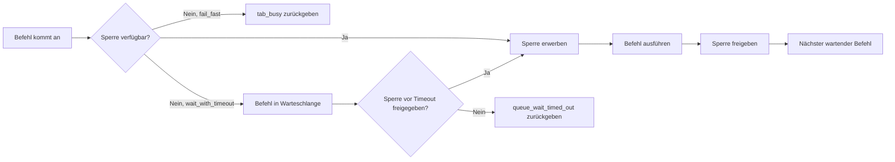

# Tab-Sperrmodell

Otto serialisiert die Befehlsausführung pro Tab-Sitzung und erlaubt parallele Ausführung über verschiedene Tab-Sitzungen hinweg. Dieses Modell gibt jedem Tab eine FIFO-Ausführungswarteschlange und vermeidet unnötige Blockierung zwischen unabhängigen Seiten.

## Kerngarantien

- Gleiche-Tab-Befehle werden in FIFO-Reihenfolge ausgeführt (geschlüsselt nach `targetNodeId:tabSessionId`).
- Cross-Tab-Befehle werden parallel ausgeführt.
- Jeder angenommene Befehl erzeugt ein deterministisches Terminalergebnis (`result` oder `error`).

## Sperrlebenszyklus



Sperrschlüssel sind `targetNodeId:tabSessionId`. Nur ein Controller kann zu einer Zeit eine Sperre für einen bestimmten Schlüssel halten. Leasing-Ablauf gibt Sperren automatisch frei; Sperrereignisse enthalten Leasing-Metadaten (`lockOwnerControllerId`, `lockLeaseMs`, `lockExpiresAt`) für Beobachtbarkeit.

## Warte-Strategien

| Strategie | Verhalten |
|---|---|
| `fail_fast` (Standard) | Gibt sofort `tab_busy` zurück, wenn die Sperre gehalten wird |
| `wait_with_timeout` | Stellt den Befehl in die Warteschlange; führt aus, wenn die Sperre freigegeben wird oder gibt nach Timeout `queue_wait_timed_out` zurück |

Setzen Sie die Strategie in der Befehlshülle:

```json
{
  "payload": {
    "targetNodeId": "node_local_1",
    "tabSessionId": "ts_abc",
    "action": "command.run",
    "waitPolicy": "wait_with_timeout",
    "timeoutMs": 30000
  }
}
```

## Warteschlangenlimits

| Limit | Beschreibung |
|---|---|
| `OTTO_TAB_QUEUE_LIMIT` | Maximal wartende Befehle pro Tab-Sitzung |
| `OTTO_CONTROLLER_QUEUE_LIMIT` | Maximal wartende Befehle pro Controller-Sitzung |

Das Überschreiten任何一个 Limits gibt `tab_queue_limit_exceeded` zurück.

## Konflikt- und Timeout-Codes

| Code | Ursache | Lösung |
|---|---|---|
| `tab_busy` | Sperre gehalten, `fail_fast`-Strategie | Mit begrenztem Backoff erneut versuchen oder zu `wait_with_timeout` wechseln |
| `tab_locked` | Sperre von konkurrierendem Controller gehalten | Nach Ablauf des Leasings erneut versuchen |
| `queue_wait_timed_out` | Sperre nicht vor `timeoutMs` freigegeben | Timeout erhöhen oder parallele Befehlsanzahl reduzieren |
| `command_timed_out` | Befehlsausführung hat Zeitebudget überschritten | `timeoutMs` erhöhen oder Operationsbereich eingrenzen |
| `tab_queue_limit_exceeded` | Pro-Tab-Warteschlange voll | Parallele Befehle auf dieser Tab-Sitzung reduzieren |
| `lock_conflict` | Konfliktereignissignal | Beobachten und zurückweichen; wird als `event`-Frame neben dem Fehler ausgesendet |

## Nächste Schritte

- [Tab-Verwaltung](./tab-management.md) — verwalteter Tab-Sitzungslebenszyklus und eigentumsbereichsbezogene Bereinigung.
- [Protokollreferenz](./protocol.md) — Befehlshüllenfelder einschließlich `waitPolicy` und `timeoutMs`.
- [Fehlercodes](./error-codes.md) — vollständiger Fehlerkatalog mit Wiederholbarkeit.