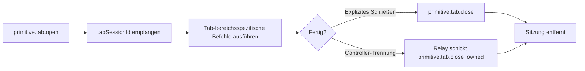

# Tab-Verwaltung

Otto verfolgt Browser-Tabs als verwaltete Sitzungen, die durch `tabSessionId` identifiziert werden. Eigentumsmetadaten auf jeder Sitzung ermöglichen sichere Bereinigung, wenn ein Controller getrennt wird.

## Tab-Sitzungslebenszyklus

## Primitive Tab-Aktionen

| Aktion | Beschreibung |
|---|---|
| `primitive.tab.open` | Neuen verwalteten Tab öffnen; gibt `tabSessionId` zurück |
| `primitive.tab.close` | Verwalteten Tab explizit nach `tabSessionId` schließen |
| `primitive.tab.navigate` | Verwalteten Tab zu einer neuen URL navigieren |
| `primitive.tab.query` | Verwalteten Tab-Zustand abfragen |
| `primitive.tab.close_owned` | Interne Relay-Aktion: Alle Tabs schließen, die einer Controller-Identität gehören |

## Eigentumsregeln

- Relay injiziert interne Eigentumsmetadaten beim Weiterleiten von `primitive.tab.open` von einem Controller.
- Eigentumsmetadaten sind relayeigen und vom Controller nicht modifizierbar.
- Wenn ein Controller getrennt wird oder der Heartbeat-Timeout eintritt, schickt Relay `primitive.tab.close_owned` an verbundene Nodes mit der `clientId` des getrennten Controllers.
- Node-Laufzeit schließt nur Tabs, die dieser Controller-Identität gehören. Tabs, die anderen Controllern gehören, werden nicht beeinflusst.

## Veraltete Sitzungsursachen und Wiederherstellung

| Ursache | Wiederherstellung |
|---|---|
| Manuelles Tab-Schließen im Browser | Neuen verwalteten Tab mit `primitive.tab.open` öffnen |
| Erweiterungs-Neuladen oder -Neustart | Neuen verwalteten Tab öffnen; vorherige Sitzungen sind ungültig |
| Gecachte `tabSessionId` nach Wiederverbindung | Gecachten Wert verwerfen; neue Sitzung öffnen |
| Controller-Trennung und -Bereinigung | Neuen verwalteten Tab nach Wiederverbindung öffnen |

Nach dem Öffnen eines neuen Tabs verwenden Sie immer die neue `tabSessionId` für nachfolgende Befehle.

## MV3 URL-Commit-Rennen

Chrome MV3 Service-Worker-Tabs veröffentlichen möglicherweise nicht sofort eine festgeschriebene URL, nachdem `primitive.tab.open` abgeschlossen ist. Otto-Laufzeit verwendet begrenzte Abstimmung vor strengem Seitenabgleich, um falsche `site_mismatch` oder `tab_url_not_ready`-Ergebnisse zu vermeiden.

Wenn `tab_url_not_ready` zurückgegeben wird, versuchen Sie es nach einer kurzen Verzögerung erneut.

## Tab-Automatisierungsgruppen

Otto verfolgtTabs, die durch Automatisierungsworkflows geöffnet wurden, in einer Chrome-Tab-Gruppe (`automationGroupId`). Die Initialisierung ist gegen Einmalflug geschützt, um doppelte Gruppenerstellung bei gleichzeitigen `primitive.tab.open`-Aufrufen zu verhindern.

## Nächste Schritte

- [Tab-Sperrmodell](./tab-lock-model.md) — pro-Tab FIFO-Ausführung und Warte-Strategien.
- [Protokollreferenz](./protocol.md) — Tab-Eigentums- und Bereinigungssemantik.
- [Erweiterte Fehlerbehebung](./guides/troubleshooting-advanced.md) — Veraltete Sitzungsfehlerbehebung.