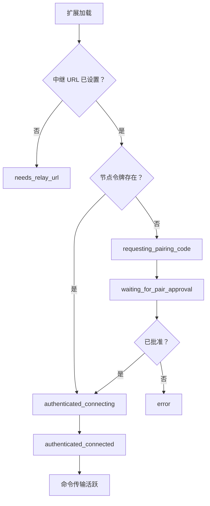

# 扩展运行时

本页解释扩展如何在 MV3 约束下保持命令执行的确定性。当你需要理解配对状态、传输行为、监听器路由和命令运行时保证时阅读此页。

## 权威源码路径

| 关注点 | 源码 |
|---|---|
| 后台编排 | `extension/entrypoints/background.ts`、`extension/src/runtime/background-bootstrap.ts` |
| WebSocket 传输 | `extension/src/runtime/offscreen-client.ts` |
| 命令执行 | `extension/src/runtime/command-executor.ts`、`extension/src/runtime/command-runtime.ts` |
| 监听器运行时 | `extension/src/runtime/network-intercept/listener.ts`、`extension/src/runtime/listener-managers.ts` |
| 弹窗引导 UI | `extension/src/runtime/popup-ui.ts`、`extension/src/runtime/onboarding/ui.ts` |

## 运行时组合

Otto 使用拆分运行时将持久传输关注点与命令执行关注点分离。

| 领域 | 文件 | 职责 |
|---|---|---|
| 后台编排 | `background.ts`、`background-bootstrap.ts` | 启动、维护、分发、重放安全 |
| 传输 | `offscreen-client.ts` | 中继 WebSocket 认证、心跳、重连、出站排队 |
| 命令执行 | `command-executor.ts`、`command-runtime.ts` | 原始操作、站点命令解析、认证预检 |
| 监听器运行时 | `network-intercept/listener.ts`、`listener-managers.ts` | 拦截生命周期和共享的每标签页调试器状态 |
| DOM 脚本辅助器 | `page-dom-query.ts` | 深层 Shadow DOM 查询辅助器安装 |

## 配对和认证流程

后台确保扩展存储中存在持久的节点身份，在缺少节点凭据时获取配对挑战，并保持引导状态与弹窗和选项页面同步。一旦配对被控制器工作流批准，节点令牌被存储，离屏页面认证与中继的 WebSocket 会话。

| 状态 | 含义 |
|---|---|
| `needs_relay_url` | 中继 URL 缺失或无效 |
| `requesting_pairing_code` | 正在等待获取挑战 |
| `waiting_for_pair_approval` | 挑战存在，正在等待 CLI 批准 |
| `authenticated_disconnected` | 节点令牌存在，正在等待显式的 Connect 操作 |
| `authenticated_connecting` | 令牌存在，WebSocket 尚未完全就绪 |
| `authenticated_connected` | 认证确认，命令传输活跃 |
| `error` | 最近一次认证或套接字故障，已呈现以供恢复 |

弹窗/选项引导现在使用显式连接控制：

- **Connect** 保存中继 URL 并触发设置刷新以及离屏重连。
- **Disconnect** 关闭离屏套接字并抑制重连尝试，直到再次请求 Connect。
- 中继 URL 输入标准化不再在输入或保存时注入查询参数；`role=node` 仅在 WebSocket 连接时追加（若缺失）。

弹窗或选项中的 Connect 操作等待 keep-warm 维护完成后再报告成功。该维护包括配对协调、离屏确保和徽章同步。当刷新被拒绝时，过期令牌会被自动清除。

## 命令执行路径

当中继发送 `command` 帧时，离屏将其转发给后台，后台执行，并通过离屏将终端信封返回给中继。如果 WebSocket 连接在中途断开，离屏会缓冲出站终端信封并在重连认证后刷新。

重放安全通过后台级别的去重（以 `idempotencyKey` 或 `requestId` 回退为键）强制执行，使重试的帧返回缓存的结果而非重新执行副作用。

### 站点命令编排

命令在最早可能的点失败，使失败保持确定：

1. 解析站点包和命令元数据。
2. 短暂等待已提交的标签页 URL，然后验证站点匹配。
3. 当声明式输入元数据（`inputFields`、`inputAtLeastOneOf`）存在时，进行验证和净化。
4. 当命令需要认证且 `authMode` 允许检查时，运行认证预检。
5. 如果在自动模式下未认证，运行登录导航交接并返回 `manual_login_required`。
6. 配置后在执行路径前强制执行 `preloadHost`。
7. 等待有界页面就绪（`document.readyState === complete`）。
8. 执行 `command.run`（`execute`）或 `command.test`（`test`，带 execute 回退）。

`tab_url_not_ready`、`site_mismatch` 和 `preload_host_mismatch` 是有意的早期失败信号，保护命令处理程序免于在无效页面上下文中运行。

### 内容提取原语

`primitive.dom.extract_distilled_html` 和 `primitive.dom.extract_markdown` 通过 `chrome.scripting.executeScript({ files: [...] })` 加载打包的扩展资源库文件。这避免了脚本执行间的作用域不稳定，并保持库加载跨标签页的确定性。

`primitive.page.screenshot` 支持 `mode=viewport`（标签页捕获 API）和 `mode=full_page`（CDP `Page.captureScreenshot`）。两种模式都返回终端 base64 负载以及尺寸和字节元数据。过大的截图在执行有界画质降低后返回确定性 `screenshot_too_large` 错误。

## 监听器基础设施

监听器生命周期是通用的：订阅和取消订阅行为类似终端命令，而异步更新稍后发出并通过原始订阅 `requestId` 进行关联。运行时提供 `network.http_intercept`，由 `chrome.debugger` CDP 域支持。

网络拦截支持 `network`、`fetch` 和 `hybrid` 捕获模式。混合模式包含有界跨源重复抑制。敏感头部在更新发出前被脱敏。暂停的 Fetch 请求始终由运行时继续，以避免锁定标签页流量。

命令模块拥有流解析策略。运行时可在将更新转发到中继之前通过命令拥有的适配器（例如 `streamAdapter=reddit.chat.v1`）路由原始监听器更新，将站点特定逻辑隔离在传输基础设施之外。

命令启动的拦截使用 `ctx.startNetworkInterception(options?)`。这些句柄是命令作用域的，非中继流式传输，并且始终在 `finally` 中拆除以保持生命周期确定，即使在命令执行抛出异常时也是如此。

## MV3 弹性和传输行为

MV3 Service Worker 的生命周期本质上是间歇性的。Otto 依赖离屏 WebSocket 所有权加上 keep-warm 维护：

- 离屏创建受单次执行保护并容忍良性的重复创建竞态。
- 重连使用有界指数退避并带抖动。
- 后台维护工作串行化以防止重叠的启动和 keep-warm 任务。
- 出站队列有界，使临时的中继中断不会导致无界内存增长。

## 焦点模拟

命令通过 `requiresDebuggerFocus: true` 选择加入调试器焦点模拟。运行时仅在站点验证成功后启用焦点模拟。某些命令流在后台标签页中当回调节奏被节流时会卡住；焦点模拟是针对性缓解手段，在不强制所有命令进入调试器模式的情况下提高进度可靠性。

激活错误：`debugger_focus_unavailable`、`debugger_focus_conflict`、`debugger_focus_permission_denied`、`debugger_focus_attach_failed`、`debugger_focus_command_failed`。

当拦截在同一标签页上活跃时，运行时复用现有调试器附加而非要求第二个附加。分离按所有者划分，使共享路径不会破坏同级功能。如果外部 DevTools 持有附加，激活会以确定性冲突样式错误失败。

## 本地开发日志流

当 `localDevLogStreamingEnabled` 在扩展存储中设置时，扩展事件作为结构化节点日志排队，在 WebSocket 认证后刷新，并通过中继日志 API 作为 `source=node` 实时流式传输。敏感值仍受入口脱敏约束；扩展发送器不得包含凭据。

调试日志传输与监听器更新传输有意分开。在背压下，调试刷新可限流或丢弃，而监听器更新在数据平面路径上继续。

## 存储和所有权边界

| 存储范围 | 运行时数据 |
|---|---|
| `chrome.storage.local` | 跨浏览器重启的持久节点状态：`nodeId`、中继 URL、节点令牌、配对元数据 |
| `chrome.storage.session` | 可重建的运行时状态：`tabSessions`、`tabSessionOwners`、自动化分组 id、重放账本 — 在引导期间协调 |

受管理标签页映射按 `tabSessionId` 持久化。中继创建的标签页的控制器所有权元数据在会话存储中跟踪，以实现确定性的基于所有者的清理。自动化分组初始化受单次执行保护，以避免并发 `primitive.tab.open` 调用导致重复分组创建。

兼容性行为：运行时接受来自命令顶层字段或嵌套负载字段的 `tabSessionId`，在标签页查找失败时清理过期映射，并确保 `primitive.tab.close_owned` 仅关闭由提供的 `controllerClientId` 拥有的会话。

## 下一步

- [命令参考](./commands.md) — 操作面和执行约定。
- [监听器开发](./guides/listener-development.md) — 支持流的命令集成。
- [配对与认证](./guides/pairing-auth.md) — 节点身份和令牌生命周期。
