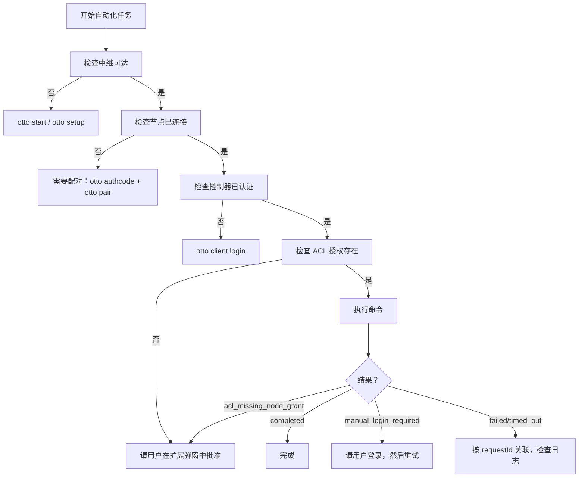

# For Agents

本节内容面向以编程方式操作 Otto 的 AI 代理、LLM 和自动化系统。如果你是开发者，请从[快速开始](../quickstart.md)开始。

## 范围

本节涵盖：

- 如何在操作前验证 Otto 的能力
- 哪些来源是权威的
- 自动化期间的约束
- 如何确定性地处理故障
- 如何使用 MCP 服务器进行编程式访问
- 如何向代理框架注册 Otto
- 如何使用 Otto Skill 包

端到端自动化手册见[自动化指南](./automation-guide.md)。

## 权威来源

| 主题 | 来源 |
|---|---|
| 协议约定 | `packages/shared-protocol/src/index.ts` |
| 中继路由和认证 | `packages/relay/src/index.ts` |
| CLI 命令结构 | `packages/cli/src/index.ts`、`packages/cli/src/cli/*.ts` |
| 扩展运行时 | `extension/entrypoints/background.ts`、`extension/src/runtime/` |
| 可用命令 | `extension/src/commands/` |

文档权威 URL：

- 协议参考：`/protocol`
- CLI 参考：`/cli`
- 命令参考：`/commands`
- 错误码：`/error-codes`

## 决策流程



## 约束

以下行为是不变式；不要试图绕过它们：

- **绝不自动化凭据提交。** 当站点需要登录时，返回 `manual_login_required` 并要求人工在浏览器中认证。
- **绝不绕过 ACL。** 如果返回 `acl_missing_node_grant`，请人工在扩展弹窗中批准控制器访问。不要尝试注入 ACL 授权。
- **始终使用 `targetNodeId`。** 如果只有一个节点连接，CLI 自动选择它。有多个节点时，显式传入 `--node-id`。
- **绝不在日志中暴露密钥。** 不要在任何输出面打印 `OTTO_TOKEN_SECRET`、控制器客户端密钥或节点令牌。
- **保持负载有界。** 不要尝试无界页面抓取循环或无限流会话。

## 命令健康检查

在任何自动化任务前，验证全栈可达：

```bash
otto commands list --json
```

成功响应确认：中继运行中、节点已连接、控制器已认证、ACL 授权活跃。如果失败，遵循上面的[决策流程](#决策流程)。

## 故障处理

| 错误码 | 推荐操作 |
|---|---|
| `manual_login_required` | 暂停并要求人工在浏览器中登录站点，然后重试 |
| `acl_missing_node_grant` | 暂停并要求人工在扩展弹窗中批准控制器访问，然后重试 |
| `node_offline` | 等待节点重连或重新配对；不要无限循环 |
| `tab_url_not_ready` | 短暂延迟后重试（2-5 秒） |
| `site_mismatch` | 使用 `primitive.tab.open` 打开一个正确 URL 的新标签页，然后重试 |
| `replay_rejected` | 不要重放；生成带有新 `replayNonce` 的新命令 |
| `forbidden_action` | 验证控制器令牌作用域；如果无法扩大作用域则升级 |
| `rate_limited` | 退避后重试；未经操作员批准不增加 `OTTO_RATE_LIMIT_PER_MIN` |

对于所有故障：首先使用 `otto logs list --request-id <id> --source all` 按 `requestId` 关联。

## 机器可读输出

所有支持 `--json` 的 Otto CLI 命令发出确定性的结构化输出。在自动化工作流中使用 `--json`：

```bash
otto commands list --json
otto test reddit.com getFeed --json
otto logs list --source all --latest 100 --json
otto setup --non-interactive
```

`otto setup --non-interactive` 始终输出 JSON，不含 TTY 格式化。

## 相关页面

- [自动化指南](./automation-guide.md) — 含代码示例的端到端代理手册。
- [MCP 服务器](./mcp-server.md) — MCP 服务器文档和工具列表。
- [代理安装](./agent-setup.md) — 向代理框架注册 Otto。
- [Skills](./skills.md) — 用于代理工作流的 Otto Skill 包。
- [错误码](../error-codes.md) — 完整错误码目录。
- [代码片段](../snippets.md) — 常用代理模式的可运行代码示例。
- [llms.txt](/llms.txt) — 面向 LLM 上下文的机器可读项目摘要。
