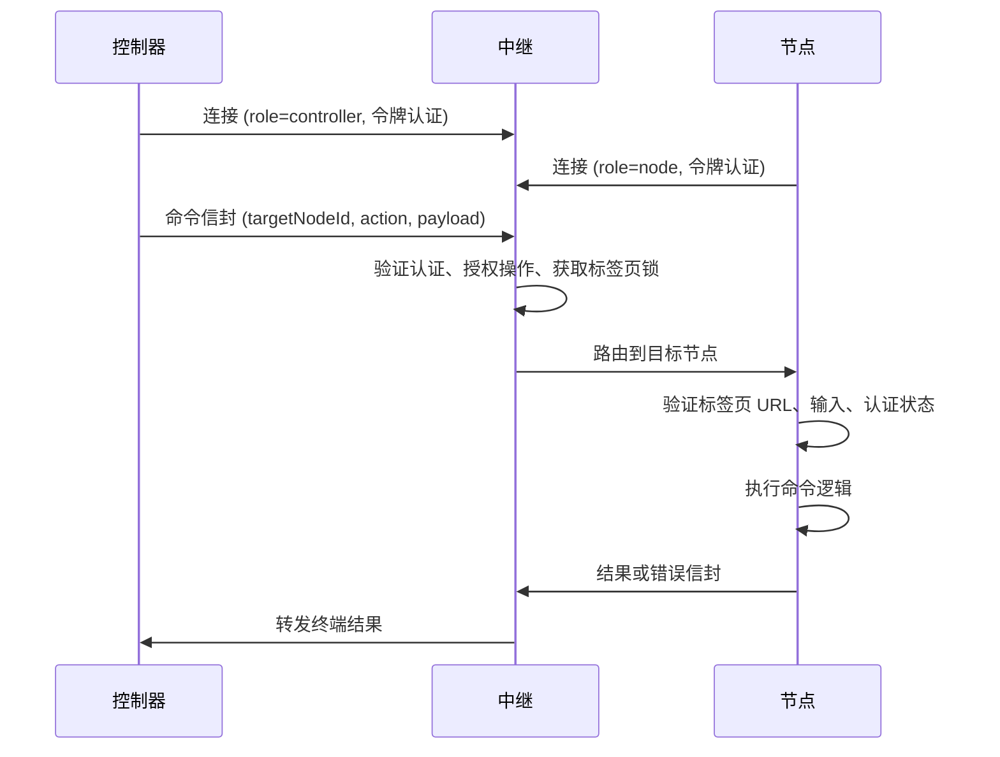

# Otto 架构

Otto 是一个远程浏览器自动化系统，具有清晰的角色边界：控制器发出命令，中继代理信任和路由，扩展节点执行浏览器工作。本页解释这些部分如何协作、平台提供哪些保证以及实现权限的归属。

## 系统角色

| 组件 | 主要职责 | 存在原因 |
|---|---|---|
| **控制器** | 命令创建和用户工作流 | 将自动化意图保持在浏览器运行时之外 |
| **中继** | 认证、路由、锁定、脱敏、终态化 | 中心化策略执行点 |
| **节点（扩展）** | 站点感知执行和监听器捕获 | 在靠近目标标签页的位置执行浏览器操作 |

这种划分是有意的。控制面关注点（认证、路由、审计）留在中继。执行面关注点（标签页访问、DOM、网络）留在扩展节点。

## 命令生命周期

对于站点命令，节点运行时在调用命令逻辑之前执行以下序列：

1. 解析站点包和命令元数据。
2. 根据声明的站点范围验证活跃标签页 URL。
3. 验证和净化声明的输入元数据（`inputFields`，可选的 `inputAtLeastOneOf`）。
4. 如果 `requiresAuth`，运行 `checkLogin` 和可选的 `gotoLogin`（无凭据自动化）。
5. 在需要时通过自动导航确保 `preloadHost`。
6. 调用命令 `execute` 并返回结构化输出。

此序列的存在是为了以明确的错误码提前失败，防止命令处理程序在模糊的页面状态下运行。

## 运行时模型（MV3）

扩展使用 Chrome MV3 拆分运行时，使 WebSocket 连续性不依赖 Service Worker 的运行时间。

| 组件 | 文件 | 职责 |
|---|---|---|
| 后台脚本 | `background.ts` | 命令编排和浏览器 API 访问 |
| 离屏客户端 | `offscreen-client.ts` | 持久化中继 WebSocket 和心跳 |

流处理也按职责拆分：

- **监听器传输** — 通用、与站点无关。捕获原始网络事件。
- **站点命令适配器** — 将原始负载解析为共享域对象。
- **传输去重** — 抑制等价的混合跨源响应重复。
- **适配器去重** — 抑制来自站点负载的语义重放重复。

## 平台保证

| 保证 | 效果 |
|---|---|
| `targetNodeId` 必填 | 命令有意路由，从不通过隐式默认值 |
| 终端结果保留 | 每个命令以 `completed`、`failed`、`timed_out` 或 `cancelled` 结束 |
| 每标签页串行 / 跨标签页并行 | 防止冲突的标签页变更而不牺牲吞吐量 |
| 入口前脱敏 | 敏感值在持久化和流分发之前进行遮蔽 |
| 站点限域执行 | 命令逻辑不会针对错误域名运行 |
| 无凭据自动化 | `requiresAuth` 命令使用 `manual_login_required` 交接 |

## 安装和所有权边界

`otto setup` 配置控制器端。控制器偏好和令牌存储在 `~/.otto/config.json`。

扩展中继 URL、配对码状态和节点凭据存储在 `chrome.storage.*` 中，由扩展拥有。这些存储可能指向同一中继主机，但它们保持角色限域（`controller` vs `node`）。

安装对终端用户是发布驱动的：扩展构件来自发布资源，带校验和验证。非交互模式输出机器可读 JSON；交互式 TTY 模式提供面向人的引导输出。

## 权威源码

| 关注点 | 路径 |
|---|---|
| 协议约定 | `packages/shared-protocol/src/index.ts` |
| 中继路由和锁 | `packages/relay/src/index.ts` |
| CLI UX 和信封 | `packages/cli/src/index.ts` |
| 扩展后台编排 | `extension/entrypoints/background.ts` |
| 离屏传输生命周期 | `extension/src/runtime/offscreen-client.ts` |

## 下一步

- [配对和认证](./pairing-auth.md) — 令牌和配对生命周期的详细信息。
- [扩展运行时](../extension-runtime.md) — MV3 运行时组成和命令执行路径。
- [协议参考](../protocol.md) — 信封约定、消息族、路由保证。
