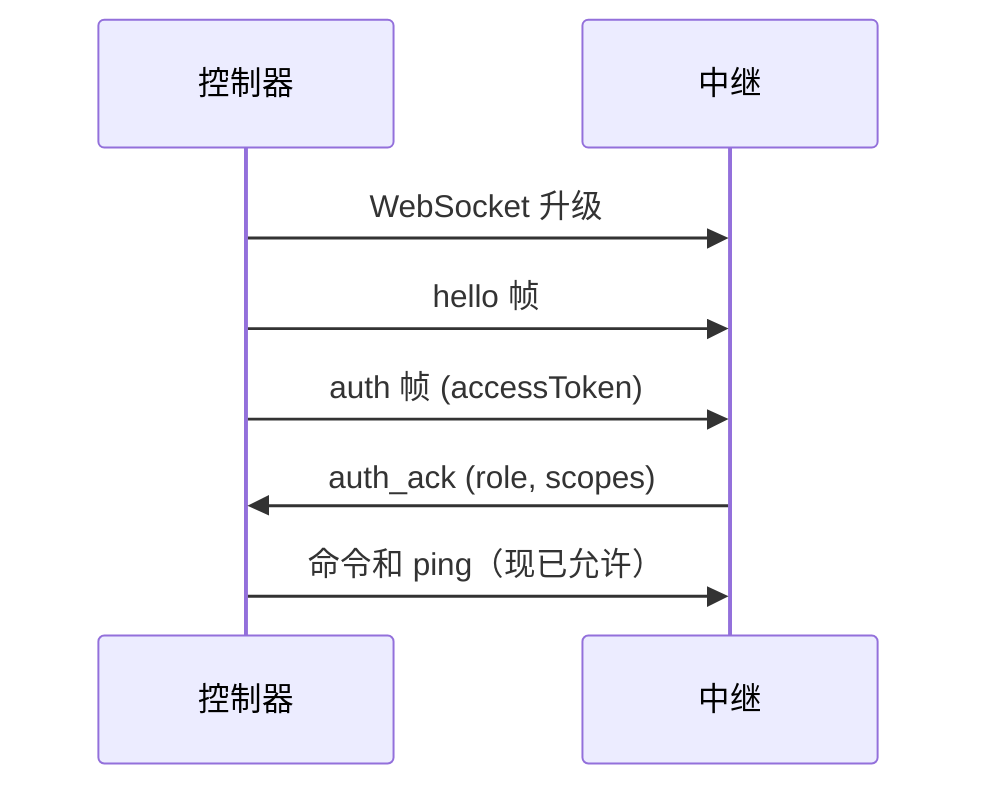

# 控制器实现

本指南解释如何基于 Otto 中继协议实现自定义控制器客户端。完成本指南后，你的控制器将能够正确进行认证、向节点路由命令、处理流会话以及管理令牌生命周期。

## 开始之前

- 阅读[架构](./architecture.md)以了解系统角色和命令生命周期。
- 阅读[配对和认证](./pairing-auth.md)以了解令牌流程。
- 有一个运行中的中继（`otto start`）可供测试。

## 必需能力

你的控制器必须处理：

1. **令牌生命周期** — 注册客户端、交换凭据、在过期前刷新令牌。
2. **WebSocket 认证序列** — `hello` → `auth` → 等待 `auth_ack` 后再发送命令。
3. **请求关联** — 每个信封使用唯一的 `requestId`；按该 ID 关联响应。
4. **确定性流拆除** — 显式取消订阅；对进行中的流命令发送 `command_cancel`。
5. **心跳** — 发送 `ping`/`pong` 以保持长期会话活跃。

缺少其中任何一项通常会导致在重连或长期流下的不稳定自动化。

## HTTP 引导

在启动 WebSocket 流量之前，先通过 HTTP 建立控制器身份和令牌状态。

| 用途 | 端点 |
|---|---|
| 注册控制器客户端 | `POST /api/controller/register` |
| 用凭据交换令牌对 | `POST /api/controller/token` |
| 发现已连接节点 | `GET /api/nodes/connected` |
| 刷新令牌对 | `POST /api/auth/refresh` |

### 注册客户端

```http
POST /api/controller/register
Content-Type: application/json

{"name": "my-controller", "description": "automation worker"}
```

```json
{
  "clientId": "clt_abc123",
  "clientSecret": "cs_xxx",
  "createdAt": 1776162000000
}
```

:::warning
安全存储 `clientSecret`。中继仅存储加盐哈希 — 注册后无法恢复密钥。
:::

### 获取访问令牌

```http
POST /api/controller/token
Content-Type: application/json

{"clientId": "clt_abc123", "clientSecret": "cs_xxx"}
```

```json
{
  "clientId": "clt_abc123",
  "controllerId": "ctl_123",
  "accessToken": "<jwt>",
  "refreshToken": "<refresh>"
}
```

### 发现已连接节点

```http
GET /api/nodes/connected
Authorization: Bearer <accessToken>
```

```json
{
  "nodes": [{"nodeId": "node_local_1"}]
}
```

### 刷新令牌

```http
POST /api/auth/refresh
Content-Type: application/json

{"refreshToken": "<refresh>"}
```

```json
{
  "accessToken": "<new-jwt>",
  "refreshToken": "<new-refresh>"
}
```

## WebSocket 认证序列

HTTP 引导后，WebSocket 握手必须遵循以下严格顺序：



**Hello 帧：**

```json
{
  "protocolVersion": "1.0",
  "messageType": "hello",
  "requestId": "req_hello_1",
  "timestamp": "2026-04-14T13:10:00.000Z",
  "senderRole": "controller",
  "payload": {"role": "controller", "capabilities": ["commands", "logs"]}
}
```

**Auth 帧：**

```json
{
  "protocolVersion": "1.0",
  "messageType": "auth",
  "requestId": "req_auth_1",
  "timestamp": "2026-04-14T13:10:00.020Z",
  "senderRole": "controller",
  "payload": {"accessToken": "<jwt>"}
}
```

**Ping 帧（心跳，约每 30 秒发送一次）：**

```json
{
  "protocolVersion": "1.0",
  "messageType": "ping",
  "requestId": "req_ping_1",
  "timestamp": "2026-04-14T13:10:08.000Z",
  "senderRole": "controller",
  "payload": {"ts": 1776162608000}
}
```

未认证的客户端不能发送命令、锁或订阅帧。

## 命令信封

| 字段 | 必填 | 说明 |
|---|---|---|
| `targetNodeId` | 是 | 中继路由键；绝不省略 |
| `action` | 是 | 命令操作（例如 `command.run`） |
| `payload` | 是 | 操作负载 |
| `replayNonce` | 是 | 重放保护；每次请求使用唯一值 |
| `tabSessionId` | 取决于 | 标签页作用域操作必需 |
| `waitPolicy` | 可选 | `fail_fast` 或 `wait_with_timeout` |
| `timeoutMs` | 可选 | 命令超时，毫秒 |

## 监听器和流式传输

流式传输使用两阶段流程：

1. **命令阶段** — 发送 `command.test`；收到带 `stream.listeners` 的结果信封。
2. **监听器阶段** — 按清单条目订阅；处理与订阅 `requestId` 关联的异步 `listener_update` 事件。

**订阅帧示例：**

```json
{
  "protocolVersion": "1.0",
  "messageType": "command",
  "requestId": "req_subscribe_1",
  "senderRole": "controller",
  "payload": {
    "targetNodeId": "node_local_1",
    "action": "listener.subscribe",
    "payload": {
      "listener": "network.http_intercept",
      "options": { "tabSessionId": "ts_abc", "site": "reddit.com", "mode": "network" }
    }
  }
}
```

**拆除**必须是显式的：
- 以原始订阅 `requestId` 发送 `listener.unsubscribe`。
- 对进行中的流命令以原始流命令 `requestId` 发送 `command_cancel`。

:::tip
在整个流会话期间保持 WebSocket 心跳活跃。过时的控制器被中继视为断连并清理。
:::

## ACL 和节点定位

`targetNodeId` 始终是必填的。节点所有者按控制器客户端控制 ACL 授权。缺失授权以 `acl_missing_node_grant` 确定性失败。通过中继 ACL 端点或 `otto client` CLI 命令授予访问权限。

## 重试指南

| 故障类型 | 重试策略 |
|---|---|
| `invalid_access_token` | 刷新令牌，然后重试一次 |
| `lock_conflict` / `lock_timeout` | 有界退避，然后重试 |
| 验证错误 | 不要重试；修复请求 |
| `acl_missing_node_grant` | 不要重试；向节点所有者请求授权 |

在适用的情况下使用幂等键，使安全重试返回缓存的终端结果而不是重复副作用。

## 下一步

- [协议参考](../protocol.md) — 完整信封约定、消息族、路由保证。
- [中继 API](../relay-api.md) — 所有 HTTP 端点。
- [可复用代码片段](../snippets.md) — 可复制 curl 和 WebSocket 示例。
- [错误码](../error-codes.md) — 含修复方法的错误码表。
