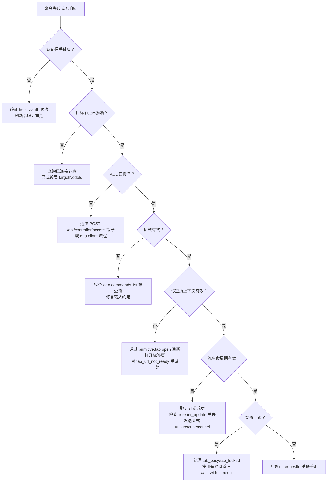

# 控制器故障排查决策树

当控制器发出的命令失败或无响应时使用此决策树。按顺序通过每个门控 — 大多数故障在第一个条件不满足的门控处解决。

## 决策门控

### 1. 认证握手健康？

- 预期：中继在 `hello` 和 `auth` 帧后以 `auth_ack` 响应。
- 如果没有 `auth_ack`：验证 `hello` → `auth` 顺序；确认 `accessToken` 有效且未过期。
- 在 `invalid_access_token` 上：使用 `otto client login` 刷新令牌，然后重连。

### 2. 目标节点已解析？

- 预期：`targetNodeId` 匹配已连接的节点。
- 运行 `otto commands list`（或 `GET /api/nodes/connected`）查看已连接节点。
- 确保每个命令信封上显式设置 `targetNodeId`。

### 3. ACL 已授予？

- 预期：控制器客户端拥有目标节点的 ACL 授权。
- 在 `acl_missing_node_grant` 上：使用节点持有者令牌发送 `POST /api/controller/access`，或使用中继管理员 ACL 流程。

### 4. 负载有效？

- 预期：操作和负载与 `command.list` 中的命令描述符匹配。
- 运行 `otto commands list --site <site>` 检视输入约定。
- 修复未知键、缺失的必填字段或类型不匹配。

### 5. 标签页上下文有效？

- 预期：`tabSessionId` 引用一个活跃的受管理标签页，其提交的 URL 与命令站点匹配。
- 如果过期：运行 `otto cmd --action primitive.tab.open` 创建新会话。
- 在 `tab_url_not_ready` 上：短暂延迟后重试一次。

### 6. 流生命周期有效？

- 预期：`command.test` 返回 `stream.listeners`；订阅命令返回终端结果；`listener_update` 事件与订阅 `requestId` 关联。
- 验证 unsubscribe 或 `command_cancel` 拆除是显式的。

### 7. 竞争问题？

- 预期：标签页锁无冲突获取。
- 在 `tab_busy` 或 `tab_locked` 上：以有界退避重试，或设置 `waitPolicy: wait_with_timeout`。

## 下一步

- [requestId 关联手册](./requestid-correlation-runbook.md) — 当决策树无法解决故障时跨组件追踪。
- [错误码](../error-codes.md) — 完整错误码参考。
- [可复用代码片段](../snippets.md) — 每个 HTTP 门控的 curl 命令。
