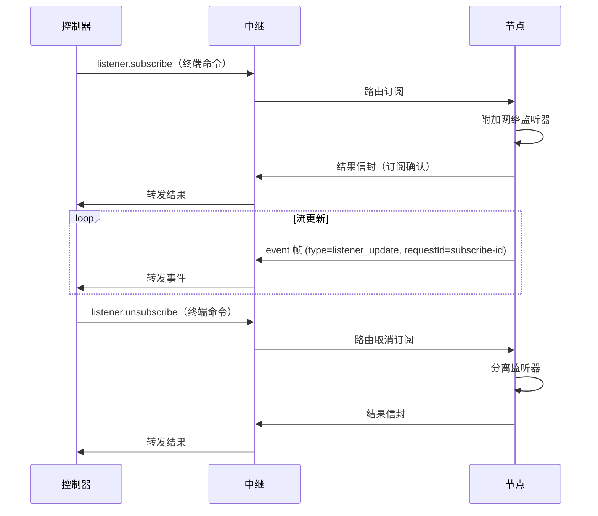

# 监听器开发

本指南涵盖命令模块的基于监听器的流集成。关键设计规则是关注点分离：运行时拥有传输生命周期和安全性，而命令模块拥有站点特定的负载解析和流塑形。

## 核心不变式

保持运行时监听器基础设施通用且与站点无关。保持命令适配器逻辑站点特定。

## 开始之前

- 熟悉[命令编写](./command-authoring.md)和 `test(ctx, input, helpers)` 钩子。
- 了解目标站点的网络请求模式（URL、MIME 类型、主机）。

## 监听器生命周期



`listener.subscribe` 和 `listener.unsubscribe` 是返回正常结果或错误信封的终端命令。流数据以 `event` 帧异步发出，`payload.type=listener_update`，通过原始订阅 `requestId` 关联。

## network.http_intercept 选项

| 选项 | 必填 | 描述 |
|---|---|---|
| `tabSessionId` | 是 | 受管理会话目标 |
| `site` | 是 | 监听器的站点范围 |
| `mode` | 否 | `network` \| `fetch` \| `hybrid`（默认：`network`） |
| `urlPatterns` | 否 | 要捕获的 URL glob 模式 |
| `requestHostAllowlist` | 否 | 请求主机允许列表 |
| `includeBody` | 否 | 在更新中包含响应正文 |
| `includeHeaders` | 否 | 包含脱敏后的请求/响应头部 |
| `maxBodyBytes` | 否 | 每次更新的最大响应正文字节数（默认：`256000`） |
| `mimeTypes` | 否 | MIME 类型前缀允许列表 |
| `streamAdapter` | 否 | 命令端解析的适配器提示 |

:::tip
当目标站点可能对同一 API 同时使用 `fetch` 或 `XMLHttpRequest` 时，使用 `--mode hybrid`。混合模式从两个面捕获并使用传输级去重。
:::

## 流适配器指南

适配器模块将原始传输负载映射到共享域对象（例如 `chat.message`、`content.post`）：

- 将原始负载映射到共享域类型。
- 仅当安全且操作上有用时附加 `originalEntity`。
- 保持对象紧凑以避免续持流期间的跨上下文序列化压力。
- 在订阅选项中使用 `streamAdapter` 提示来标识要使用的适配器。

## 去重

重复抑制是有意分层的：

1. **传输去重** — 运行时抑制等价的混合跨面响应重复（同一响应通过 `fetch` 和 `network` 两次捕获）。
2. **适配器去重** — 命令适配器抑制来自重放站点负载的语义重复。

不要跳过任何一层：传输重复和语义重复是不同的故障模式。

## 回退策略

如果有界流探测无法确认流量，返回回退元数据并使用执行回退辅助器，而不是将流状态保持模糊：

```typescript
// 在 test() 钩子中：探测失败
const bufferedResult = await helpers.execute(input);
return {
  ready: false,
  fallback: { strategy: 'command_poll', reason: 'intercept_probe_unavailable' },
  bufferedResult
};
```

## 验证成功

在调试命令流管道之前，使用 `otto listener subscribe-network` 验证原始网络捕获：

```bash
otto listener subscribe-network \
  --tab-session <tabSessionId> \
  --site example.com \
  --pattern 'https://api.example.com/events*' \
  --mode network \
  --max-body-bytes 200000
```

预期输出：来自目标 API 的流式 JSON `listener_update` 事件。

## 下一步

- [命令编写模板](./command-authoring-templates.md) — 流命令测试钩子模板。
- [日志与调试](../logging-debugging.md) — 流诊断和故障排查手册。
- [otto listener CLI 参考](../cli/listener.md) — 完整 subscribe-network 选项。
