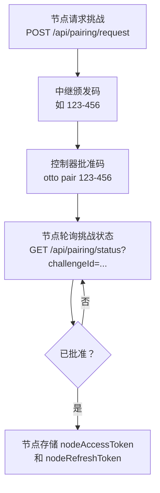

# 配对和认证

Otto 使用两个独立的信任流程：一个**节点配对流程**在扩展节点和中继之间建立信任关系，以及一个**控制器客户端流程**用于长期控制器身份。两个流程最终都以访问/刷新令牌对的形式进行 WebSocket 会话认证。

## 权威源码

| 关注点 | 路径 |
|---|---|
| 配对、令牌、刷新和撤销端点 | `packages/relay/src/index.ts` |
| CLI 认证、配对、撤销和客户端命令 | `packages/cli/src/index.ts` |
| 扩展配对轮询和令牌注入 | `extension/src/runtime/background-bootstrap.ts` |

## 节点配对流程

配对建立受信任的节点-控制器关系，而不共享原始凭据。节点请求挑战，中继颁发短期批准码，控制器批准该码，节点轮询挑战状态直到批准的令牌材料可用。

在扩展引导 UI 中，中继传输现由用户驱动：输入中继 URL 不会自动连接。使用 **Connect** 启动传输和配对状态刷新，使用 **Disconnect** 关闭传输而不清除已存储的节点令牌。



| 步骤 | 端点 | 说明 |
|---|---|---|
| 节点请求挑战 | `POST /api/pairing/request` | 负载：`{ nodeId }` |
| 控制器查看待处理项 | `GET /api/pairing/pending` | 可选的可视化步骤 |
| 控制器批准码 | `POST /api/pairing/approve` | 负载：`{ code }` |
| 节点检查状态 | `GET /api/pairing/status?challengeId=...` | 批准后，节点存储令牌 |

与此流程对应的 CLI 命令：

```bash
# 列出来自已连接节点的待处理认证码
otto authcode

# 批准一个码并在本地存储控制器令牌
otto pair 123-456

# 撤销刷新令牌并清除本地控制器认证
otto revoke
```

当 relay 返回 `invalid_access_token` 时，CLI 自动尝试访问令牌刷新。仅当刷新令牌也失败或已被撤销时才需要手动重新配对。

### 挑战恢复语义

扩展在启动时自动处理孤立或过期的挑战状态：

- **孤立元数据** — `pairingChallengeId` 存在但 `pairingCode` 缺失：清除过期键并请求新的挑战。
- **本地时钟过期** — `pairingExpiresAt <= now`：清除过期键并立即重新发起挑战。
- **中继找不到挑战** — `GET /api/pairing/status` 返回 `404`：视为过期并重新发起。
- **中转中继错误** — `5xx` 响应：以有界退避重试，然后重置并重新发起。
- **中继返回 `expired` 状态** — 立即触发挑战重新发起。

这使引导流程在浏览器或中继重启后不会卡在"等待挑战"状态。

## 控制器客户端流程

控制器客户端可以独立于节点配对注册。这是长期控制器身份的推荐模型。

| 阶段 | 端点 | 说明 |
|---|---|---|
| 注册客户端 | `POST /api/controller/register` | 返回一次性 `clientSecret` 和稳定的 `clientId` |
| 交换凭据 | `POST /api/controller/token` | 负载：`{ clientId, clientSecret }`；返回访问/刷新令牌 |
| 授予节点访问权限 | `POST /api/controller/access` | 需要节点持有者令牌；节点拥有的 ACL 决定 |

```bash
# 注册新控制器客户端
otto client register --name "my-laptop" --description "Primary workstation controller"

# 用凭据交换令牌
otto client login

# 检查当前客户端状态和密钥解析来源
otto client status

# 从中继移除特定客户端
otto client remove --client-id <id>

# 移除所有已注册客户端
otto client remove --all

# 清除本地凭据而不从中继移除
otto client forget
```

### 密钥处理

- CLI 在可用时将客户端密钥存储在操作系统密钥链中（跨平台，通过 keytar）。
- 回退环境变量：`OTTO_CONTROLLER_CLIENT_SECRET`。
- `OTTO_CONTROLLER_CLIENT_SECRET` 优先于密钥链查找。
- 中继在静态存储中仅存储加盐的客户端密钥哈希 — 绝不存储明文密钥。

### 控制器移除行为

- `POST /api/controller/remove` 以 `{ clientId }` 撤销控制器记录，并立即移除 ACL 授权、刷新会话和活跃的控制器套接字。
- `POST /api/controller/remove-all` 对所有已注册客户端应用相同语义。
- 完全清除后重复批量移除是幂等的（`removedCount: 0`）。

新注册的控制器客户端开始时无任何节点授权（默认最小权限）。中继在每个针对节点的命令上强制执行 ACL，在访问被拒绝时返回 `acl_missing_node_grant`。

### 测试流自注册

当没有本地身份或令牌时，`otto test` 自动自注册控制器：

- 默认名称：`otto-tester`；描述：`Auto-registered controller for otto test flows.`
- 使用默认值时无交互提示。
- 自动注册的控制器默认在运行后保留。
- 使用 `--cleanup-test-controller` 在完成后移除它。

## WebSocket 认证流程

在 `hello` 之后，每个客户端发送带有 `{ accessToken }` 的 `auth` 帧。中继验证签名和声明（`iss`、`aud`、角色、可选的节点绑定），然后以包含有效角色和作用域的 `auth_ack` 响应。

未认证的客户端不能发送命令、锁或订阅帧。

## 刷新流程

刷新可通过 HTTP 或 WebSocket 执行：

- HTTP：`POST /api/auth/refresh` 以 `{ refreshToken }` — 返回新访问令牌并轮换刷新令牌。
- WebSocket：带有相同令牌负载的 `refresh` 帧。

中继在运行时存储中持久化刷新会话，使有效会话在中继重启后得以保留。

| 令牌 | 默认有效期 | 配置环境变量 |
|---|---|---|
| 访问令牌 | 15 分钟 | `OTTO_TOKEN_TTL_MINUTES` |
| 刷新令牌 | 30 天 | `OTTO_REFRESH_TTL_DAYS` |

## 撤销流程

`POST /api/auth/revoke` 以 `{ refreshToken }` 返回 `{ revoked: boolean }`。撤销后，该刷新令牌不能再签发访问令牌。`otto revoke` 封装此操作并同时清除本地控制器凭据。

## 声明和轮换

访问令牌包含签发者、受众、角色、身份绑定和操作作用域。中继在每次验证时验证签发者和受众。密钥轮换使用双密钥验证，在受控密钥切换期间使用 `OTTO_TOKEN_SECRET` 和可选的 `OTTO_TOKEN_PREVIOUS_SECRET`，不会立即导致会话失效。

:::note
中继认证控制 API 访问。命令 `requiresAuth` 控制网站会话前置条件。这两者是独立的 — 有效的中继令牌并不意味着扩展已登录目标网站。
:::

## 下一步

- [控制器实现](./controller-implementation.md) — 基于中继协议构建自定义控制器。
- [错误码](../error-codes.md) — 认证错误码和修复方法。
- [中继 API](../relay-api.md) — 完整端点参考。
