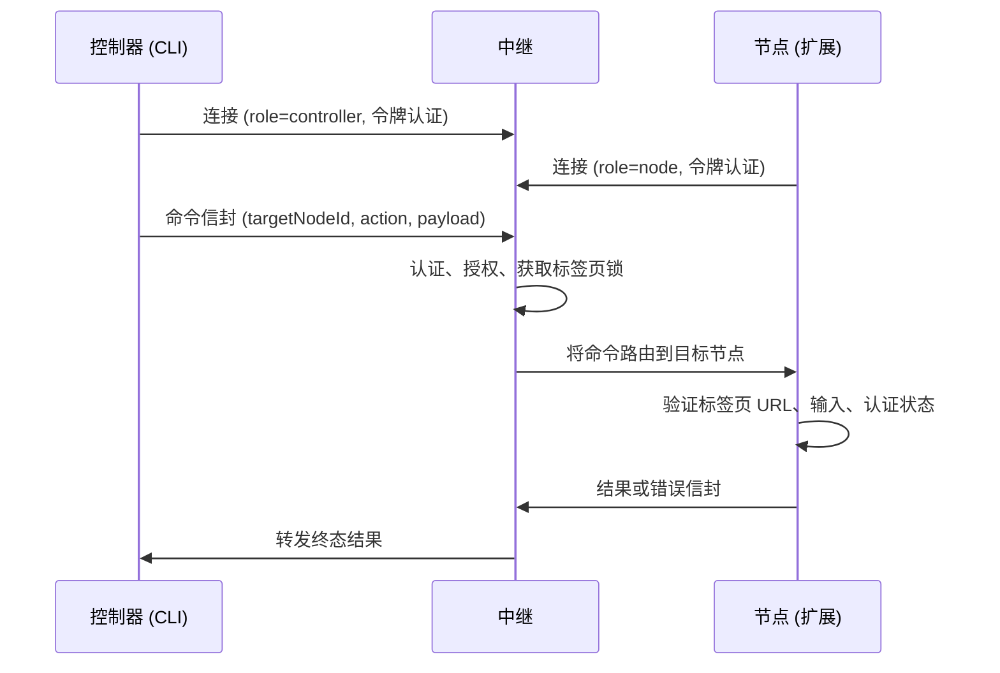

# Otto 概述

Otto 是一个远程浏览器自动化平台，用于通过 CLI 命令针对另一台机器上的浏览器执行操作。命令从控制器 CLI 经过中央中继守护进程流转到执行命令的浏览器扩展节点。

## 三个组件如何协同工作

| 组件 | 包 | 职责 |
|---|---|---|
| **控制器** | `@telepat/otto` | 通过 WebSocket 发出命令并接收结果 |
| **中继** | `@telepat/otto-relay` | 认证、路由、单标签页序列化、持久化日志 |
| **浏览器节点** | `@telepat/otto-extension` | 执行浏览器操作的 Chrome MV3 扩展 |

## Otto 能做什么

- **原始浏览器操作** — `primitive.tab.*` 用于标签页生命周期，`primitive.dom.extract_text` 用于内容提取。
- **特定网站命令执行** — `command.run` 和 `command.test`，通过 `command.list` 实现运行时发现。
- **流式输出** — 命令原生网络拦截和实时更新推送。
- **引导配置** — `otto setup` 处理中继守护进程就绪、带校验和验证的扩展构件下载及 Chrome 导入。
- **确定性结果** — 每条命令产生 `completed`、`failed`、`timed_out` 或 `cancelled` 之一。

## 运行时拓扑

1. 控制器以 `role=controller` 通过 WebSocket 连接到中继。
2. 扩展节点以 `role=node` 通过 WebSocket 连接到中继。
3. 中继强制令牌认证并通过 `targetNodeId` 路由命令。
4. 节点执行命令并返回结果或错误。
5. 中继将终态结果转发回原始控制器。

## 扩展运行时模型

Otto 使用 Chrome MV3 分离运行时：

| 组件 | 文件 | 职责 |
|---|---|---|
| 后台脚本 | `background.ts` | 命令执行和浏览器 API 访问 |
| 离屏客户端 | `offscreen-client.ts` | 持久化中继 WebSocket 和心跳 |

流式所有权：传输监听器是通用且与网站无关的。网站命令模块将原始监听器负载解析为领域对象。去重在传输层（跨源混合响应）和命令适配器层（语义重复）各运行一次。

## 关键不变量

- 所有命令路由都需要 `targetNodeId`。
- 终态命令结果有保证：`completed`、`failed`、`timed_out` 或 `cancelled`。
- 单标签页操作序列化（FIFO 队列）；跨标签页操作可并行。
- 敏感值在日志持久化或流式传输之前会被脱敏。
- 命令只在 URL 匹配声明网站范围的标签页上运行。
- 声明的命令输入元数据在执行前经过验证。
- `requiresAuth` 命令从不自动提交凭据；手动登录交接使用 `manual_login_required`。

## 配置和设置所有权

`otto setup` 是面向控制器的引导配置。它将偏好和令牌存储在 `~/.otto/config.json`，从发布构件（带校验和验证）中获取扩展，并在完成之前确保中继守护进程就绪。

扩展设置由扩展自身管理。节点中继 URL、配对挑战和节点令牌持久化在 `chrome.storage.*` 中，独立于 CLI 配置文件。

控制器和扩展可以指向同一中继主机，但使用不同的 WebSocket 角色（`controller` 和 `node`）。这一边界是故意设计的。

## 数据来源

| 领域 | 路径 |
|---|---|
| 协议契约 | `packages/shared-protocol/src/index.ts` |
| 中继路由与锁 | `packages/relay/src/index.ts` |
| CLI 入口点 | `packages/cli/src/index.ts` |
| 扩展后台 | `extension/entrypoints/background.ts` |
| 扩展离屏 | `extension/src/runtime/offscreen-client.ts` |
| 命令包 | `extension/src/commands/` |

## 下一步

- [安装 Otto](./installation.md) — 全局安装或 monorepo 开发路径。
- [快速开始](./quickstart.md) — 启动中继、配对节点、运行第一条命令。
- [架构](./architecture.md) — 深入了解系统角色和命令生命周期。
