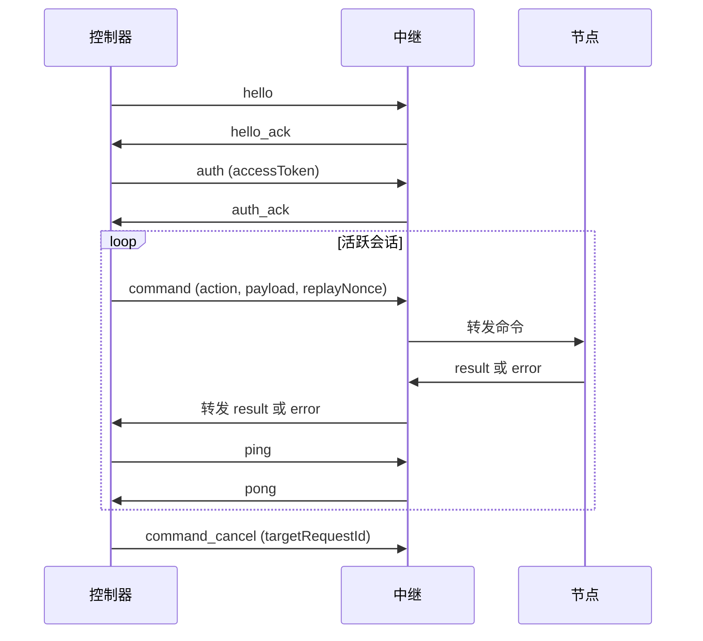

# 协议参考

本页涵盖线路级行为和命令路由保证。如果你在实现产品工作流，请先从[架构](./guides/architecture.md)和[控制器实现指南](./guides/controller-implementation.md)开始，然后将本页作为严格的约定参考。

当前协议类型定义在 `packages/shared-protocol/src/index.ts`。

## 权威源码路径

| 关注点 | 源码 |
|---|---|
| 共享信封和负载约定 | `packages/shared-protocol/src/index.ts` |
| 中继协议处理和路由 | `packages/relay/src/index.ts` |
| 控制器信封发送 | `packages/cli/src/index.ts` |

## 消息流

## 信封约定

每个 WebSocket 帧使用统一信封形状以实现稳定的跨组件关联。

| 字段 | 描述 |
|---|---|
| `protocolVersion` | 当前为 `1.0` |
| `messageType` | 帧族：`hello`、`auth`、`command`、`result`、`event` 等。 |
| `requestId` | 控制器、中继和节点间的主要关联键 |
| `timestamp` | ISO-8601；在重放偏差窗口内强制执行 |
| `senderRole` | `controller`、`relay` 或 `node` |
| `payload` | 特定于消息的对象 |

## 消息族

| 族 | 用途 |
|---|---|
| `hello` / `hello_ack` | 角色和能力协商 |
| `auth` / `auth_ack` | 访问令牌认证 |
| `refresh` / `refresh_ack` | 访问令牌续期 |
| `command` | 控制器发出的操作 |
| `result` / `error` | 终端结果 |
| `event` | 进度和监听器更新 |
| `ping` / `pong` | 会话保活 |
| `tab_lock` / `tab_unlock` | 锁生命周期信号 |
| `command_cancel` | 显式流或命令取消 |

## 监听器生命周期

`listener.subscribe` 和 `listener.unsubscribe` 各自返回正常的终端结果（`result` 或 `error`）。流式数据稍后作为 `event` 帧传输，关联到原始订阅 `requestId`。

| 操作 | 必填负载 | 终端行为 |
|---|---|---|
| `listener.subscribe` | `listener`、可选的 `options` | 立即 `result` 或 `error` |
| `listener.unsubscribe` | `targetRequestId` | 立即 `result` 或 `error` |

成功取消订阅后，对该订阅 `requestId` 的后续更新将被拒绝，返回 `listener_not_found`。

### network.http_intercept 选项

| 选项 | 必填 | 描述 |
|---|---|---|
| `tabSessionId` | 是 | 必须解析到活跃的受管理会话 |
| `site` | 是 | 规范化为小写；根据标签页 URL 验证 |
| `urlPatterns` | 否 | Glob 过滤器 |
| `requestHostAllowlist` | 否 | 显式跨主机允许列表 |
| `mode` | 否 | `network`、`fetch` 或 `hybrid`（默认 `network`） |
| `includeBody` | 否 | 默认 `true` |
| `includeHeaders` | 否 | 默认 `false`；敏感头部会被脱敏 |
| `maxBodyBytes` | 否 | 默认 `256000`；仅支持正数值 |
| `mimeTypes` | 否 | MIME 前缀允许列表 |
| `streamAdapter` | 否 | 命令拥有的适配器提示 |
| `selfUserId` | 否 | 命令拥有的上下文值 |

### 监听器更新形状

监听器更新是 `messageType=event` 帧，其中 `payload.type=listener_update`，`requestId` 等于原始订阅请求。`payload.data` 携带原始传输负载或命令拥有的共享域对象。

共享对象鉴别器：`chat.message`、`chat.typing`、`chat.participant`、`chat.message_deleted`、`content.article`、`content.post`、`content.post_comment`。

## 命令约定

每个 `command` 负载必须标识目标节点并包含重放保护字段。

| 字段 | 必填 | 描述 |
|---|---|---|
| `targetNodeId` | 是 | 协议不变式要求 |
| `tabSessionId` | 条件 | 标签页作用域操作必需 |
| `action` | 是 | 操作 ID，包括命令和监听器操作 |
| `payload` | 是 | 特定于操作的数据 |
| `timeoutMs` | 否 | 中继超时预算 |
| `waitPolicy` | 否 | `fail_fast` 或 `wait_with_timeout` |
| `idempotencyKey` | 否 | 运行时重放去重键 |
| `replayNonce` | 是 | 接收所必需 |

### 命令操作

| 操作 | 描述 |
|---|---|
| `command.list` | 公告站点命令元数据 |
| `command.run` | 执行命令逻辑 |
| `command.test` | 执行测试钩子；未声明时回退到 `execute` |
| `command.reddit_feed` | `command.run` 的旧版别名，`site=reddit.com, command=getFeed` |
| `primitive.tab.open` | 打开受管理标签页 |
| `primitive.tab.close` | 关闭受管理标签页 |
| `primitive.tab.navigate` | 导航受管理标签页 |
| `primitive.tab.query` | 查询受管理标签页状态 |
| `primitive.dom.extract_text` | 从标签页提取可见文本 |
| `primitive.dom.extract_html` | 提取页面 HTML |
| `primitive.dom.extract_clean_html` | 提取带语义属性、已移除脚本/样式的 DOM |
| `primitive.dom.extract_distilled_html` | 提取蒸馏 HTML（可读性） |
| `primitive.dom.extract_markdown` | 提取 Markdown 表示 |
| `primitive.page.screenshot` | 对标签页或 URL 截图 |

### command.list 描述符元数据

`command.list` 返回命令描述符，包含可供控制器用于验证、预加载行为和超时计划的命令元数据。

| 字段 | 必填 | 描述 |
|---|---|---|
| `site` | 是 | 命令有效的站点范围 |
| `id` | 是 | 站点范围内的命令 id |
| `displayName` | 是 | 人类可读的命令名称 |
| `description` | 是 | 命令摘要 |
| `requiresAuth` | 否 | 指示可能需要手动登录交接 |
| `preloadHost` | 否 | 用于自动打开流程的首选 URL 主机 |
| `inputFields` | 否 | 用于命令输入验证的输入模式 |
| `timeoutPolicy` | 否 | 为控制器提供的命令超时提示 |

当提供时，`timeoutPolicy` 支持固定和按输入缩放的超时指引：

| `timeoutPolicy` 字段 | 必填 | 描述 |
|---|---|---|
| `defaultMs` | 否 | 此命令的建议默认超时 |
| `scaling.inputField` | 否 | 用于缩放的输入字段名 |
| `scaling.baseMs` | 否 | 缩放前的基础超时预算 |
| `scaling.perUnitMs` | 否 | 每输入单位的额外超时预算 |
| `scaling.minMs` | 否 | 解析后超时的下限 |
| `scaling.maxMs` | 否 | 解析后超时的上限 |

控制器可使用此元数据计算有效的超时预算，同时保留显式的用户提供的超时覆盖。

内容提取也通过一级控制器接口暴露：

- CLI：`otto extract-content [url] --format markdown|distilled_html|clean_html|raw_html|text`（默认 markdown）
- MCP：`otto_extract_content` 工具，带 `format` 选择器和共享目标（`url` 或 `tabSession`）

这些接口映射到上述原始 DOM 操作，为代理和 CLI 用户提供统一的整合面。

`command.test` 可能在 `result.payload.data` 中返回 `stream` 清单。控制器应在同一已认证的 WebSocket 上保持后续订阅流量，维护心跳（`ping`/`pong`）用于长会话，并在关闭活跃流测试时使用 `command_cancel` 针对原始测试 `requestId`。

## 路由、排队和可靠性

- 中继将每个命令路由到恰好一个节点会话，并跟踪 `requestId` 所有权，使结果始终返回给原始控制器。
- 同一标签页的工作（`targetNodeId:tabSessionId`）是 FIFO；跨标签页工作是并行的。
- 队列深度限制按每个标签页和每个控制器强制执行。
- 在 `wait_with_timeout` 下等待的命令可能以 `queue_wait_timed_out` 终止。
- 超时窗口产生终端超时结果；节点断连产生 `node_disconnected`；锁竞争产生 `lock_conflict`。
- 重放 nonce 和时间戳偏差窗口在入口处强制执行。
- 控制器断连清理会清除其拥有的排队工作，并触发按所有者划分的标签页清理。

## 标签页所有权和清理

- 中继在转发控制器创建的标签页打开命令时注入内部标签页所有权元数据。
- 节点按 `tabSessionId` 存储所有权。
- 当控制器断连或心跳超时时，中继向已连接节点分发 `primitive.tab.close_owned`，仅关闭由该控制器身份拥有的标签页。
- 锁键为 `targetNodeId:tabSessionId`；同一时间只有一个控制器可以持有锁。
- 租约过期自动释放锁。锁事件包含租约元数据（`lockOwnerControllerId`、`lockLeaseMs`、`lockExpiresAt`）以供观测。

## 版本管理

当前版本：`1.0`。优先使用加法式变更；破坏性变更需要新的主版本号。

`command.reddit_feed` 别名在迁移到 `command.run` 期间保留。

## 下一步

- [中继 API 参考](./relay-api.md) — HTTP 端点约定。
- [可复用代码片段](./snippets.md) — 可运行的帧示例。
- [控制器实现指南](./guides/controller-implementation.md) — 完整引导和命令流程。
