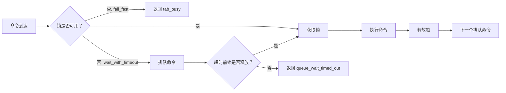

# 标签页锁模型

Otto 对每个标签页会话的命令执行进行序列化，同时允许不同标签页会话之间并行执行。该模型为每个标签页提供 FIFO 执行队列，同时避免独立站点之间不必要的阻塞。

## 核心保证

- 同标签页命令按 FIFO 顺序执行（以 `targetNodeId:tabSessionId` 为键）。
- 跨标签页命令并行执行。
- 每个被接受的命令产生确定性的终端结果（`result` 或 `error`）。

## 锁生命周期



锁键为 `targetNodeId:tabSessionId`。同一时间只有一个控制器可以持有给定键的锁。租约过期自动释放锁；锁事件包含租约元数据（`lockOwnerControllerId`、`lockLeaseMs`、`lockExpiresAt`）以供观测。

## 等待策略

| 策略 | 行为 |
|---|---|
| `fail_fast`（默认） | 如果锁被持有，立即返回 `tab_busy` |
| `wait_with_timeout` | 将命令排队；锁释放后执行，或超时返回 `queue_wait_timed_out` |

在命令信封中设置策略：

```json
{
  "payload": {
    "targetNodeId": "node_local_1",
    "tabSessionId": "ts_abc",
    "action": "command.run",
    "waitPolicy": "wait_with_timeout",
    "timeoutMs": 30000
  }
}
```

## 队列限制

| 限制 | 描述 |
|---|---|
| `OTTO_TAB_QUEUE_LIMIT` | 每个标签页会话的最大排队命令数 |
| `OTTO_CONTROLLER_QUEUE_LIMIT` | 每个控制器会话的最大排队命令数 |

超过任一限制将返回 `tab_queue_limit_exceeded`。

## 冲突与超时码

| 码 | 原因 | 解决方案 |
|---|---|---|
| `tab_busy` | 锁被持有，`fail_fast` 策略 | 使用有界退避重试，或切换到 `wait_with_timeout` |
| `tab_locked` | 锁被竞争控制器持有 | 租约过期后重试 |
| `queue_wait_timed_out` | 锁在 `timeoutMs` 之前未释放 | 增加超时或减少并发命令量 |
| `command_timed_out` | 命令执行超出时间预算 | 增加 `timeoutMs` 或缩小操作范围 |
| `tab_queue_limit_exceeded` | 每个标签页的队列已满 | 减少该标签页会话上的并发命令 |
| `lock_conflict` | 竞争事件信号 | 观察并退避；作为 `event` 帧随错误一同发出 |

## 下一步

- [标签页管理](./tab-management.md) — 受管理标签页会话生命周期和基于所有者的清理。
- [协议参考](./protocol.md) — 命令信封字段，包括 `waitPolicy` 和 `timeoutMs`。
- [错误码](./error-codes.md) — 完整的错误目录及可重试性。
