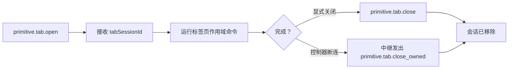

# 标签页管理

Otto 将浏览器标签页作为以 `tabSessionId` 标识的受管理会话来跟踪。每个会话上的所有权元数据使得在控制器断连时能够安全地清理。

## 标签页会话生命周期

## 原始标签页操作

| 操作 | 描述 |
|---|---|
| `primitive.tab.open` | 打开一个新的受管理标签页；返回 `tabSessionId` |
| `primitive.tab.close` | 按 `tabSessionId` 显式关闭受管理标签页 |
| `primitive.tab.navigate` | 将受管理标签页导航到新 URL |
| `primitive.tab.query` | 查询受管理标签页状态 |
| `primitive.tab.close_owned` | 内部中继操作：关闭由某个控制器身份拥有的所有标签页 |

## 所有权规则

- 中继在转发来自控制器的 `primitive.tab.open` 时注入内部所有者元数据。
- 所有者元数据由中继拥有，控制器不可修改。
- 当控制器断连或心跳超时时，中继向已连接节点分发 `primitive.tab.close_owned`，携带断连控制器的 `clientId`。
- 节点运行时仅关闭由该控制器身份拥有的标签页。其他控制器拥有的标签页不受影响。

## 过期会话的原因与恢复

| 原因 | 恢复方式 |
|---|---|
| 在浏览器中手动关闭标签页 | 使用 `primitive.tab.open` 打开新的受管理标签页 |
| 扩展重新加载或重启 | 打开新的受管理标签页；之前的会话已失效 |
| 重连后缓存了 `tabSessionId` | 丢弃缓存值；打开新会话 |
| 控制器断连并清理 | 重连后打开新的受管理标签页 |

打开新标签页后，始终使用新的 `tabSessionId` 进行后续命令。

## MV3 URL 提交竞态

Chrome MV3 Service Worker 标签页在 `primitive.tab.open` 完成后可能不会立即暴露已提交的 URL。Otto 运行时在严格站点匹配之前使用有界轮询，以避免错误的 `site_mismatch` 或 `tab_url_not_ready` 结果。

如果返回 `tab_url_not_ready`，短暂延迟后重试。

## 标签页自动化分组

Otto 将通过自动化工作流打开的标签页跟踪在一个 Chrome 标签页组（`automationGroupId`）中。初始化采用单次执行保护，以防止并发 `primitive.tab.open` 调用时创建重复分组。

## 下一步

- [标签页锁模型](./tab-lock-model.md) — 每个标签页的 FIFO 执行和等待策略。
- [协议参考](./protocol.md) — 标签页所有权和清理语义。
- [高级故障排查](./guides/troubleshooting-advanced.md) — 过期会话错误解决方案。
